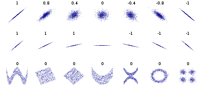



```{webr}
#| setup: true
#| message: false
#| exercise: 
#|  - ex_1
#|  - ex_2

library(gapminder)
library(dplyr)
library(ggplot2)
library(GGally)

data('gapminder', package = 'gapminder')
```

# Analiza korelacji

## Wprowadzenie

### Podstawowe pojęcia

-   Analiza korelacji służy do "wychwycenia" czy zachodzi związek pomiędzy dwiema (lub więcej) zmiennymi.

-   Miarą korelacji jest **współczynnik korelacji**

-   Współczynnik korelacji dostarcza informacji o tym jaka jest **siła związku** (*wartość współczynnika*) oraz jaki jest **kierunek związku** (*znak*).

-   Dla każdego współczynnika korelacji należy także obliczyć jego *istotność statystyczną*, stosujac jeden z testów istotności przeznaczonych dla współczynników korelacji.

    -   Hipoteza zerowa: $H_0: \rho_{x,y} = 0$ (brak korelacji)
    -   Hipoteza alternatywna: $H_A: \rho_{x,y} \neq 0$ (test dwustronny), $H_A: \rho_{x,y} < 0$ lub $H_A: \rho_{x,y} > 0$ (testy jednostronne)

-   Zależność między zmiennymi może mieć charakter **liniowy** lub **krzywoliniowy**.

### Korelacja a przyczynowość

-   Korelacja nie wskazuje na istnienie związku przyczynowo-skutkowego pomiędzy zmiennymi.

-   Innymi słowy: Istnienie korelacji liczbowej nie potwierdza, że jedno zjawisko powoduje drugie.

    -   A może powodować B
    -   B może powodować A
    -   A lub B może być wywołane przez C
    -   Zależność między A i B może być przypadkowa.

-   <http://www.tylervigen.com/spurious-correlations>

### Kilka ważnych informacji

-   **Najważniejsza jest istotność korelacji**. Niepotrzebna nam korelacja nawet bardzo wysoka, jeśli nie jest istotna statystycznie.
-   Wartość współczynnika nawet bliska 0 nie zawsze oznacza brak zależności. Może oznaczać jedynie brak zależności liniowej.
-   Wielkość współczynnika podlega wpływom wartości skrajnych i odstających.

### Korelacja liniowa

-   Miarą korelacji liniowej jest **współczynnik korelacji Pearsona**.

-   Współczynniki korelacji przyjmują wartości z przedziału od -1,00 do +1,00.

    -   **Wartość -1,00** - reprezentuje doskonałą korelację **ujemną** (współzależność pomiędzy zmiennymi kształtująca się w taki sposób, że gdy wartości jednej zmiennej wykazują tendencję rosnącą, wówczas wartości drugiej zmiennej wykazują tendencję malejącą)

    -   **wartość +1,00** - reprezentuje doskonałą korelacją **dodatnią** (współzależność pomiędzy zmiennymi przedstawia się w taki sposób, że gdy wartości jednej zmiennej wykazują tendencję wzrastającą, wówczas wartości drugiej zmiennej także wykazują tendencję wzrastającą).

    -   **Wartość 0.00** wyraża **brak korelacji**.

{width="539"}

### Jak silna jest korelacja?

Do opisu i interpretacji istotnej korelacji pomocne może być przyjęcie pewnej skali określającą siłę związku. Nie ma jednej przyjętej skali. Poniżej przedstawiam jedną z nich:

Skala odnosi się do **wartości bezwzględnej** współczynnika - znak mówi tylko o kierunku związku.

-   poniżej 0,1 - brak korelacji lub korelacja nieistotna
-   0,1 do 0,3 - korelacja słaba
-   0,3 do 0,5 - korelacja przeciętna
-   0,5 do 0,7 - korelacja wysoka
-   0,7 do 0,9 - korelacja bardzo wysoka
-   powyżej 0,9 - korelacja prawie pełna

## Demonstracja dla współczynnika korelacji liniowej

```{r}
#| warning: false
#| message: false
#| eval: FALSE
install.packages("TeachingDemos")
library("TeachingDemos")
put.points.demo(x = NULL, y = NULL, lsline = TRUE)

#Używając opcji Add Point dodaj punkty w oknie wykresu
#Zwróć uwagę jak zmienia się wartość współczynnika korelacji (r). 
```

Zgadnij wartość współczynnika korelacji - <https://gallery.shinyapps.io/correlation_game/>

## Testy korelacji

-   test korelacji liniowej Pearsona

    -   stosowany gdy zmienne mają zależność liniową
    -   zmienne mają rozkład normalny

-   test korelacji rang Spearmana

    -   stosowany gdy naruszone jest założenie o normalności rozkładu (np. gdy istnieją wartości odstające)

## Korelacja liniowa

```{r}
set.seed(25)
x = rnorm(1000)
y = x + rnorm(1000)
df = data.frame(x, y)
```

```{r}
#| warning: false
#| message: false

library(ggplot2)
ggplot(df, aes(x, y)) + geom_point() + stat_smooth(method = lm)
```

### Zbadanie normalności rozkładu

```{r}
ggplot(df) + 
  geom_histogram(aes(x = x), col = "darkblue", fill = "darkblue") + 
  geom_histogram(aes(x = y), col = "lightblue", fill = "lightblue", alpha = 0.7) + 
theme_bw()
```

```{r}
shapiro.test(x)
```

```{r}
shapiro.test(y)
```

Dla obu zmiennych test Shapiro-Wilka nie daje podstaw do odrzucenia hipotezy o normalności rozkładu (p = 0,330 dla x oraz p = 0,583 dla y). Możemy zatem zastosować współczynnik korelacji liniowej Pearsona.

### Współczynnik korelacji

```{r}
cor(df$x, df$y,
    use = "complete.obs",
    method = "pearson")
```

```{r}
cor(df$x, df$y,
    use = "complete.obs",
    method = "spearman")
```

> Która metoda korelacji powinna zostać użyta - korelacja liniowa Pearsona, czy korelacja rang Spearmana? Dlaczego?

:::: {.callout-tip title="Odpowiedź" collapse="true"}
Dane wygenerowano z rozkładu normalnego, test Shapiro-Wilka nie daje podstaw do odrzucenia hipotezy o normalności, a na wykresie rozrzutu zależność jest liniowa i nie ma wartości odstających. Wszystkie założenia współczynnika **Pearsona** są spełnione, więc jego używamy.

Oba współczynniki są tu niemal identyczne (0,680 i 0,664) - przy zależności liniowej i rozkładzie normalnym dają zbliżony wynik, więc wybór nie ma dużego znaczenia. Inaczej będzie w kolejnym przykładzie.
::::

### Testy korelacji

```{r}
cor.test(df$x, df$y,
    method = "pearson")
```

### Jak czytać wynik testu korelacji

```         
	Pearson's product-moment correlation          <- (1) metoda
data:  x and y                                   <- (2) porównywane zmienne
t = 29.263, df = 998, p-value < 2.2e-16          <- (3) statystyka i p-value
alternative hypothesis: true correlation is not equal to 0
95 percent confidence interval:                  <- (4) przedział ufności dla współczynnika
 0.6447237 0.7115721
sample estimates:                                <- (5) wartość współczynnika
     cor 
0.679556 
```

1.  **Metoda** - *product-moment* to współczynnik Pearsona; dla Spearmana zobaczysz *Spearman's rank correlation rho*.
2.  **Dane** - które dwie zmienne zostały porównane.
3.  **p-value** - odpowiada na pytanie, czy korelacja jest **istotna statystycznie**, czyli czy różni się od zera.
4.  **Przedział ufności** - zakres, w jakim mieści się współczynnik korelacji w populacji. Jeśli obejmuje zero, korelacja nie jest istotna.
5.  **sample estimates** - **wartość współczynnika korelacji**. To właśnie ta liczba mówi o **sile** związku; p-value mówi tylko, czy związek w ogóle istnieje.

> **Uwaga na duże próby.** Przy dużej liczbie obserwacji istotna statystycznie okazuje się nawet bardzo słaba korelacja. Przy tysiącu obserwacji nawet współczynnik rzędu 0,07 miałby p < 0,05, choć praktycznie oznaczałby brak związku. Dlatego **zawsze** podaje się wartość współczynnika, a nie samo p-value.

### Jak opisać wynik w raporcie

> Stwierdzono istotną statystycznie, dodatnią korelację między zmiennymi x oraz y; r = 0,68; 95% CI [0,64; 0,71]; p < 0,001.

Przy współczynniku Spearmana zamiast `r` podajemy `rho`, a zamiast przedziału ufności - liczebność próby.

Wynik testu korelacji wskazuje na istnienie istotnej korelacji między zmienną x oraz y.

## Analiza korelacji - przykład

```{r}
#| warning: false
#| message: false

library(gapminder)
gapminder2007 = subset(gapminder, year == 2007)
gapminder2007_s = gapminder2007[c(4, 5, 6)]
```

**Czy pomiędzy zmiennymi w zbiorze gapminder2007_s można dostrzec zależności liniowe?**

```{r}
library(ggplot2)
ggplot(gapminder2007_s, aes(lifeExp, gdpPercap)) + geom_point()
```

### Współczynnik korelacji

```{r}
cor(gapminder2007_s$lifeExp, gapminder2007_s$gdpPercap,
    use = "complete.obs",
    method = "pearson")
```

```{r}
cor(gapminder2007_s$lifeExp, gapminder2007_s$gdpPercap, 
    use = "complete.obs",
    method = "spearman")
```

> Która metoda korelacji powinna zostać użyta - korelacja liniowa Pearsona, czy korelacja rang Spearmana? Dlaczego?

:::: {.callout-tip title="Odpowiedź" collapse="true"}
Należy użyć korelacji rang **Spearmana**. Rozkład zmiennej *gdpPercap* jest silnie prawoskośny (patrz rozdział *Rozkłady danych*), występują w nim wartości skrajne, a na wykresie rozrzutu zależność nie jest liniowa, lecz wygięta - przy niskim PKB długość życia rośnie szybko, a przy wysokim prawie się nie zmienia.

Widać tu, dlaczego ten wybór ma znaczenie:

| Metoda | Współczynnik |
|--------|--------------|
| Pearsona | 0,679 |
| Spearmana | 0,857 |

Współczynnik Pearsona mierzy wyłącznie **liniową** część związku, więc przy zależności wygiętej zaniża jego siłę. Spearman, oparty na rangach, wykrywa każdą zależność **monotoniczną** - i pokazuje, że związek jest w istocie bardzo silny.
::::

### Testy korelacji

```{r}
cor.test(gapminder2007_s$lifeExp, gapminder2007_s$gdpPercap, 
         method = "pearson")
```

```{r}
cor.test(gapminder2007_s$lifeExp, gapminder2007_s$gdpPercap,
         method = "spearman")
```

Oba testy wskazują na istotną statystycznie korelację, ale wartości współczynników wyraźnie się różnią (0,679 wobec 0,857) - z przyczyn omówionych w odpowiedzi powyżej właściwy jest tu współczynnik Spearmana.

> Używając danych z pakietu gapminder dla roku 1987 zwizualizuj relację pomiędzy populacją a oczekiwaną długością życia. Wylicz korelację i wykonaj odpowiedni test. Co oznacza jego wynik?

```{webr}
#| exercise: ex_1

```

:::: {.solution exercise="ex_1"}
::: {.callout-tip title="Solution" collapse="false"}
Rozwiązanie:

W przykładzie należy obliczyć współczynnik korelacji Spearmana. Wynik wskazuje na brak korelacji między zmiennymi. Współczynnik korelacji nie jest istotny statystycznie.

``` r
gapminder87 <- filter(gapminder, year == 1987)
ggplot(gapminder87, aes(pop, lifeExp)) + geom_point()
cor.test(gapminder87$lifeExp, gapminder87$pop,
         method = "spearman")
```
:::
::::

## Określanie korelacji dla wielu zmiennych

### Macierz wykresów korelacji

```{r}
pairs(~lifeExp+gdpPercap+pop, data=gapminder2007_s, main="Macierz wykresów rozrzutu")
```

### Macierz współczynników korelacji

Funkcja `cor()` pozwala na obliczenie macierzy współczynników korelacji. Podaje ona wartość współczynnika, ale nie wskazuje, czy wynik jest istotny statystycznie.

Funkcja `rcorr()` z pakietu `Hmisc` wyświetla zarówno macierz współczynników korelacji, jak i wartość p wskazującą czy wynik jest istotny statystycznie.

```{r}
cor_spearman = cor(gapminder2007_s, 
                   use = "complete.obs",
                   method = "spearman")
round(cor_spearman , 4)
```

W poniższym przykładzie pierwsza macierz zawiera współczynnik korelacji, druga liczbę obiektów a trzecia wartość poziomu istotności p. Wartość jest istotna statystycznie jeśli p jest mniejsze od założonego poziomu istotności (np. 0,05)

```{r}
#| warning: false
#| message: false
library(Hmisc)
kor <- rcorr(as.matrix(gapminder2007_s), type = "spearman")
kor
```

## Wizualizacja korelacji

-   Funkcja `corrplot()` z pakietu `corrplot`

```{r}
#| warning: false
#| message: false

library("corrplot")
kor <- rcorr(as.matrix(gapminder2007_s), type = "spearman")
corrplot(kor$r)
```

```{r}
corrplot(kor$r, type = "upper", order = "hclust", 
         tl.col = "black", tl.srt = 45)
```

```{r}
corrplot.mixed(kor$r, order="hclust", tl.col="black")
```

```{r}
#| warning: false
#| message: false
library(RColorBrewer)
corrplot(kor$r, type="upper", order="hclust", col=brewer.pal(n=8, name="RdYlBu"))
```

-   Funckja `scatterplotMatrix()` z pakietu `car`

```{r}
#| warning: false
#| message: false
library(car)
scatterplotMatrix(~lifeExp+gdpPercap+pop, data=gapminder2007_s)
```

-   Funkcja `chart.Correlation()` z pakietu `PerformanceAnalytics`

```{r}
#| warning: false
#| message: false
library(PerformanceAnalytics)
chart.Correlation(gapminder2007_s, histogram=TRUE, pch=19, method = "spearman")
```

-   Funkcja `pairs.panels()` z pakietu `psych`

Współczynnik korelacji ("pearson", "spearman") definiowany jest poprzez argument method.

```{r}
#| warning: false
#| message: false
library(psych)
pairs.panels(gapminder2007_s, scale=TRUE, method="spearman")
```

-   Funkcja `ggcorr()` i `ggpairs()` z pakietu `GGally`

Argument *method* składa się z dwóch elementów: pierwszy określa sposób działania przy braku danych ("everything", "all.obs", "complete.obs", "na.or.complete" or "pairwise.complete.obs"), drugi - współczynnik korelacji ("pearson", "kendall" or "spearman"). Domyślna opcja to `c("pairwise", "pearson")`.

```{r}
#| warning: false
#| message: false
library(GGally)
ggcorr(gapminder2007_s, method = c("pairwise", "spearman"), nbreaks=8, palette='RdGy', label=TRUE, label_size=5, label_color='white')
```

Współczynnik korelacji liniowej Pearsona

```{r}
#| warning: false
#| message: false
library(GGally)
ggpairs(gapminder2007_s) 
```

Współczynnik korelacji rang Spearmana

```{r}
#| warning: false
#| message: false
library(GGally)
ggpairs(gapminder2007_s, 
        upper = list(continuous = wrap(ggally_cor, method = "spearman")))
```

> Używając danych `gapminder` z pakietu gapminder wyselekcjonuj dane dla roku 1987 oraz zachowaj tylko kolumny lifeExp, gdpPercap, pop.  Zwizualizuj w postaci macierzy wykresów rozrzutu relację pomiędzy tymi trzema zmiennymi. Wylicz korelację. Co oznacza wynik?

```{webr}
#| exercise: ex_2

```

:::: {.solution exercise="ex_2"}
::: {.callout-tip title="Solution" collapse="false"}
Rozwiązanie:

Uwaga! W rozwiązaniu wykorzystano funkcję ggpairs z biblioteki GGally. Biblioteka `PerformanceAnalytics` nie może zostać wykorzystana w interaktywnym edytorze.

``` r
gapminder87 <- gapminder |> 
filter(year == 1987) |> 
select(lifeExp, gdpPercap, pop)

library(GGally)
ggpairs(gapminder87, 
        upper = list(continuous = wrap(ggally_cor, method = "spearman")))
```
:::
::::
