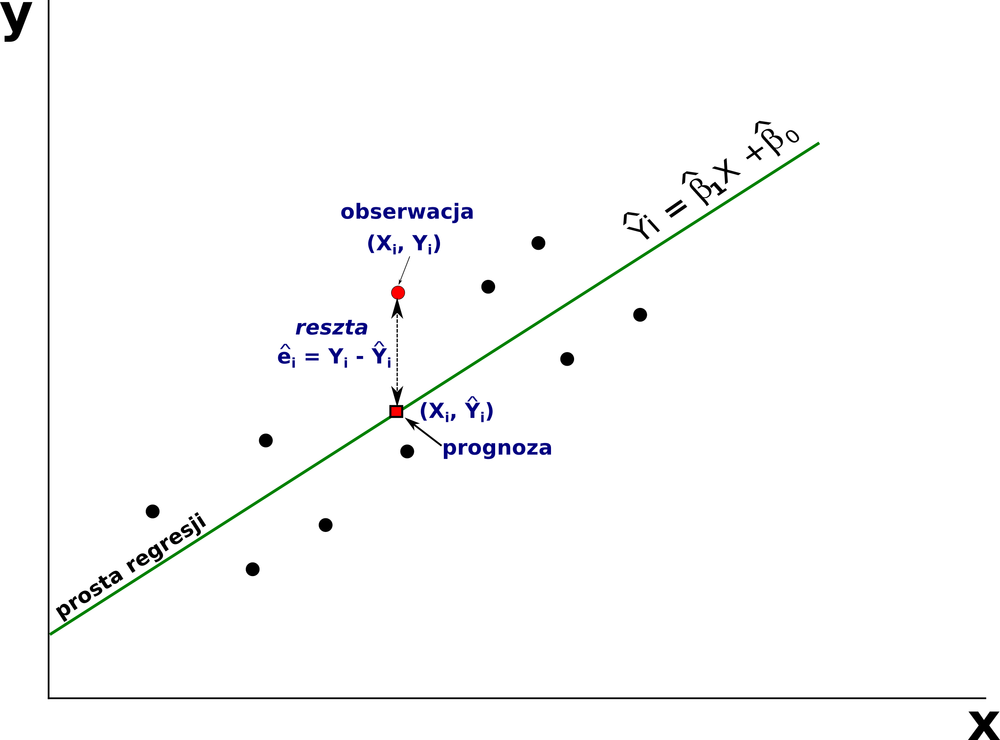



```{webr}
#| setup: true
#| exercise: 
#|  - ex_1
#|  - ex_2


```

# Analiza regresji

Główną ideą regresji jest wyjaśnianie, przewidywanie, prognozowanie danych dla pewnej zmiennej (określanej jako zmienna zależna, objaśniana, wyjaśniana) na podstawie innych zmiennych (zmienne niezależne, predyktory, zmienne objaśniające, zmienne wyjaśniające).

Budowa liniowego modelu zależności między dwoma zmiennymi składa się z trzech etapów:

1.  Określenie czy między zmiennymi istnieje zależność.

    -   wykonanie wykresu rozrzutu
    -   współczynnik korelacji

2.  Budowa modelu.

3.  Analiza wyników modelu (w tym ocena dopasowania modelu).

Po zbudowaniu modelu oraz ocenie dopasowania modelu można go wykorzystać do wykonania **predykcji**.

## Podstawowe pojęcia

-   **Analiza regresji** tworzy funkcję matematyczną opisującą zależność pomiędzy badanymi zmiennymi: zmienną zależną, którą chcemy przewidywać na podstawie zmiennych niezależnych.

-   **Zmienna zależna** (inaczej *zmienna objaśniana, zmienna wyjaśniana, zmienna przewidywana*) - zmienna, której wartość chcemy przewidywać na podstawie modelu. W modelu może być tylko jedna zmienna zależna.

-   **Zmienne niezależne** (inaczej *predyktory, zmienne objaśniające, zmienne wyjaśniające*) - zmienne używane w modelu do oszacowania wartości zmiennej zależnej. W modelu może być wiele zmiennych niezależnych.

-   **Model regresyjny** - model, który będzie z założonym błędem statystycznym przewidywał wartość, poziom danej cechy.

    -   W praktyce zawsze występuje pewna wielkość błędu oszacowania. Ideą regresji jest zminimalizowanie tego błędu oszacowania do tego stopnia, aby model był przydatny w swoich prognozach
    -   Model regresyjny możemy zawsze zbudować, jednakże tylko te modele będą "wartościowe", w których błąd oszacowania będzie relatywnie niski.

-   **Model regresji liniowej** to model, który zakłada liniową zależność między zmienną zależną a zmienną niezależną. Pozwala on na przewidywanie wartości zmiennej zależnej na podstawie wartości zmiennej niezależnej.

-   **Metoda najmniejszych kwadratów błędów** - metoda, która ma na celu dopasowanie do zebranych danych takiej linii (dla regresji liniowej), która jest do nich najlepiej dopasowana - tzn. dla której suma kwadratów błędów będzie najniższa.

## Regresja liniowa

-   Najprostszym wariantem regresji jest regresja liniowa.
-   W regresji liniowej zakłada się, że zależność pomiędzy zmienną objaśnianą ($y$), a objaśniająca ($x$) jest zależnością liniową.
-   W regresji liniowej zakłada się, że wzrostowi jednej zmiennej (zmienna objaśniająca) towarzyszy wzrost lub spadek drugiej zmiennej.

Regresja liniowa opisywana jest wzorem:

$$y_i = \alpha + \beta x_i + \varepsilon_i$$

-   $y$ - zmienna zależna (zmienna wyjaśniana, przewidywana)
-   $\alpha$ - wyraz wolny
-   $\beta$ - współczynnik kierunkowy dla zmiennej $x$ (mówiący o nachyleniu prostej regresji)
-   $x$ - zmienna niezależna (predyktor, zmienna wyjaśniająca)
-   $\varepsilon$ - błąd losowy

Równanie to opisuje oczekiwaną średnią wartość zmiennej $y$ jako liniowej kombinacji zmiennej (lub zmiennych) $x$.

## Metoda najmniejszych kwadratów

-   Wyznaczenie modelu regresji liniowej (linii regresji) sprowadza się do obliczenia współczynników linii prostej (współczynników regresji: $\beta$ oraz $\alpha$ (wyraz wolny)). W tym celu wykorzystuje się **metodę najmniejszych kwadratów błędu** (nazywaną też metodą najmniejszych kwadratów).

-   Metoda najmniejszych kwadratów jest jedną z najważniejszych i najstarszych metod obliczeniowych w statystyce.

-   Metoda ta ma na celu dopasowanie do zebranych danych, takiej linii prostej (model liniowy), która jest do nich najlepiej dopasowana - tzn. dla której suma kwadratów błędów będzie najniższa.

    -   Metoda dopasowuje taką linię do zebranych danych, aby ogólny błąd oszacowania (dla wszystkich danych) był jak najmniejszy.

-   Metoda najmniejszych kwadratów nie jest odporna na wartości odstające w zbiorze danych. Powodem tego jest fakt, że wartość odstająca "pociąga" za sobą linię regresji. Gdyby nie było wartości odstającej linia byłaby inna, zdecydowanie lepiej dopasowana do wszystkich innych obserwacji, a tak wartość odstająca zmienia kierunek linii i powoduje, że model traci swoją "moc przewidywania" dla pozostałych obserwacji.

{width="550"}

### Założenia regresji liniowej

Aby wyniki modelu (a zwłaszcza poziomy istotności współczynników i przedziały ufności) były wiarygodne, muszą być spełnione cztery założenia:

1.  **Liniowość** - zależność między zmienną zależną a każdą ze zmiennych niezależnych jest liniowa. Sprawdzamy ją na wykresie rozrzutu przed budową modelu oraz na wykresie reszt wobec wartości dopasowanych.

2.  **Stała wariancja reszt** (homoskedastyczność) - rozrzut reszt jest podobny dla małych i dużych wartości przewidywanych. Na wykresie reszt wobec wartości dopasowanych punkty powinny tworzyć poziomą "chmurę" o stałej szerokości, bez kształtu lejka.

3.  **Niezależność reszt** - reszty nie są ze sobą powiązane. Założenie to bywa naruszone dla danych uporządkowanych w czasie lub w przestrzeni (a dane o stacjach pomiarowych są danymi przestrzennymi!).

4.  **Normalność rozkładu reszt** - potrzebna do wnioskowania o współczynnikach. Sprawdzamy ją histogramem reszt oraz wykresem kwantylowym.

Uwaga: założenia dotyczą **reszt modelu**, a nie rozkładów samych zmiennych.

**Interaktywna wizualizacja regresji liniowej**

-   [https://observablehq.com/\@yizhe-ang/interactive-visualization-of-linear-regression](https://observablehq.com/@yizhe-ang/interactive-visualization-of-linear-regression)

## Predykcja

-   Znając wzór modelu regresji (znając współczynniki modelu) możemy oszacować wartości zmiennej zależnej (zmiennej objaśnianej, $y$) na podstawie wartości predyktora (zmienna objaśniająca, $x$) podstawiając odpowiednią wartość $x$ do uzyskanego wzoru. Dlatego też mówimy, że analiza regresji służy do przewidywania wartości jednej zmiennej na podstawie innych.

## Analiza regresji liniowej w R

### Formuły w R

W R równanie modelu regresji opisywane jest za pomocą tzw. **FORMUŁY**

-   Formuła to symboliczny opis zależności między zmiennymi

-   Wykorzystywana jest przez różne funkcje w R (np. `lm()`, `aggregate()`) oraz wykresy.

-   Ogólna postać to: ***LewaStrona \~ PrawaStrona***

    -   lewa strona formuły najczęściej składa się z jednej zmiennej, prawa strona formuły może składać się z jednej lub kilku zmiennych.

-   w równaniach regresji formuła ma postać: zmiennaObjaśniana \~ zmiennaObjaśniajaca

Jeśli zmiennych objaśniających jest więcej to rozdziela się je znakiem +

zmiennaObjaśniana \~ zm1 + zm2 ... + zmN

**Przykład**

```{r}
#| eval: false
y ~ x #czytamy y zależy od x 
```

**Kilka uwag o konstruowaniu formuł w R:**

-   nazwy zmiennych pojawiające się w formułach powinny być widoczne w środowisku R lub być nazwami kolumn ramki danych

-   znak - (minus) przed zmienną oznacza usunięcie zmiennej z formuły

-   $-1$ oznacza usunięcie z formuły wyrazu wolnego, to samo otrzymamy dodając do formuły "+0"

-   $+1$ - oznacza dodanie do formuły wyrazu wolnego

-   w formułach można wykorzystywać funkcje matematyczne i inne funkcje programu R

```{r}
#| eval: false
y ~ log(x)
log(y) ~ x
```

-   Jeśli w formule chcemy użyć znaku $+$ jako arytmetycznego działania musimy użyć funkcji `I()`. Argumenty tej funkcji traktowane są jako działania arytmetyczne a nie elementy formuły.

```{r}
#| eval: false

y ~ a + b # y zależy od a oraz od b 
y ~ I(a + b) # y zależy od wyniku dodawania wartości a do b 
```

-   '.' (kropka) oznacza, że badamy zależność y od wszystkich innych zmiennych

```{r}
#| eval: false
y ~. # y od wszystkich pozostałych zmiennych 
y ~. -1  # y od wszystkich pozostałych zmiennych bez wyrazu wolnego 
```

-   zastosowanie formuł, gdy zmienne są kolumnami ramki danych

```{r}
#| eval: false
#obliczenie średniej wartości zmiennej x względem grup g dla danych zawartych w ramce danych df
aggregate(x~g, data = df, FUN = mean)

#skonstruowanie modelu liniowego zależności zmiennej y od wszystkich pozostałych zmiennych w ramce danych df
lm(y ~ ., data = df)
```

### Funkcja `lm()`

W R do budowy modelu liniowego służy funkcja `lm()`

```{r}
#| eval: false
lm(formula, data, subset, weights, na.action,
   method = "qr", model = TRUE, x = FALSE, y = FALSE, qr = TRUE,
   singular.ok = TRUE, contrasts = NULL, offset, ...)
```

Wpisz `?lm` aby sprawdzić co oznaczają poszczególne elementy funkcji `lm()`

## Przykład: Zależność między sumą opadów a maksymalną temperaturą powietrza we wrześniu.

```{r}
pomiary_pol = read.csv("dane/pomiary_pol.csv")
pomiary_wlkp = subset(pomiary_pol, wojewodztwo == "wielkopolskie")
head(pomiary_wlkp)
```

### Określenie zależności między sumą opadów, a maksymalną temperaturą powietrza we wrześniu

Uwaga! Zmienną zależną zawsze zaznaczamy na osi $y$, a zmienną niezależną na osi $x$.

```{r}
library(ggplot2)
ggplot(pomiary_wlkp, aes(x = tmax_9, y = annual_precip)) + 
  geom_point() + 
  labs(x = "Temperatura września [C]", y = "Suma opadów [mm]") + 
  theme_bw()
```

```{r}
cor(x = pomiary_wlkp$tmax_9, y = pomiary_wlkp$annual_precip, use = "complete.obs", method = "pearson")
```

> Jaka jest zależność między sumą opadów, a temperaturą maksymalną we wrześniu?

## Budowa modelu

W R do budowy modelu liniowego służy funkcja `lm()`. Do obowiązkowych argumentów funkcji należą:

-   *formula* - opisuje równanie modelu liniowego
-   *data* - wskazuje zbiór danych, zawierający dane wejściowe -zmienne objaśniające.

Funkcja `lm()` dopasowuje model liniowy, wyznacza oceny współczynników $\beta$ oraz wylicza wartości reszt. Wynikiem działania funkcji jest obiekt klasy *lm*, który będzie przechowywał informacje o dopasowanym modelu.

**Model zależności między sumą opadów, a maksymalną temperaturą powietrza we wrześniu**

```{r}
lm1 = lm(annual_precip ~ tmax_9, data = pomiary_wlkp)
```

### Wyniki modelu

Funkcja `lm()` dopasowuje model liniowy, wyznacza oceny współczynników $\beta$ oraz wylicza wartości reszt. Wynikiem działania funkcji jest obiekt klasy *lm*, który będzie przechowywał informacje o dopasowanym modelu. Do ważniejszych informacji należą:

-   *coefficients* - wartości dopasowanych współczynników modelu
-   *residuals* - wektor reszt (różnica dla wartości obserwowanej i oszacowanej przez model)
-   *fitted.values* - wektor ocen modelu\
-   *call* - formuła użyta do budowy modelu
-   *model* - ramka danych użyta do budowy modelu

```{r}
#| eval: false
str(lm1) 
```

#### Współczynniki modelu

```{r}
lm1
```

```{r}
lm1$coefficients
```

W wyniku modelu otrzymamy wartości dwóch współczynników regresji:

-   współczynnika mówiącego o nachyleniu prostej regresji (tzw. współczynnik kierunkowy $\beta$ - określa o ile jednostek przeciętnie wzrośnie (lub zmaleje gdy współczynnik ten ma wartość ujemną) wartość zmiennej zależnej (objaśnianej, przewidywanej), gdy wartość zmiennej niezależnej (objaśniającej, predyktorów) wzrośnie o jedną jednostkę.

-   wyraz wolny - Intercept ($\alpha$)

Podstawiając współczynniki do równania regresji liniowej

$$y_i = \alpha + \beta x_i + \varepsilon_i$$ otrzymamy

$$y_i = 1357.90 + (-43.75)x_i + \varepsilon_i$$ 


### Podsumowanie wyników z modelu

```{r}
summary(lm1)
```

Podsumowanie wyników modelu regresji składa się z kilku elementów:

-   formuły użytej do budowy modelu (*Call*)

-   statystyk reszt (*Residuals*) - reszty wyznacza się jako różnicę wartości obserwowanej oraz wartości oszacowanej z modelu.

-   współczynników modelu (*Coefficients*)

-   wyników mających na celu ocenę jakości uzyskanego modelu (*Residual standard error, Multiple R-square, Adjusted R-squared*)

-   **formuła użyta do budowy modelu (*Call*)**

```{r}
lm1$call
```

-   **statystyki reszt (*Residuals*)**

Do oceny poprawności dopasowania modelu wykorzystuje się reszty (tzw.*residua*). Reszty wyznacza się jako różnicę wartości obserwowanej $y$ a wartości oszacowanej z modelu $\hat{y}$ .

$reszta = y - \hat{y}$

-   $reszty > 0$ -\> $y > \hat{y}$ - wartość obserwowana ($y$) jest większa od wartości wyliczonej z modelu \hat{y}

-   $reszty < 0$ -\> $y < \hat{y}$ - wartość obserwowana ($y$) jest mniejsza od wartości wyliczonej z modelu \hat{y}

-   Statystyki reszt: Min - minimum, 1Q - pierwszy kwartyl, Median - mediana, 3Q - trzeci kwartyl, Max - maksimum.

    -   Duże odchylenia mediany od 0 mogą świadczyć o zależności nieliniowej.
    -   Średnia wartość błędu powinna być równa 0 - oznacza to, że błędy dodatnie i ujemne się równoważą

Interpretacja wyników:

-   50% odchyleń mieści się w zakresie -10.28 do 9.170 mm

-   mediana ma wartość -2.32, jest to niewielkie odchylenie biorąc pod uwagę zakres zmiennej *annual_precip* (509.5-631.2mm)

-   **Współczynniki**

```{r}
smr = summary(lm1)
smr$coefficients
```

Tabela współczynniki zawiera następujące informacje dla każdego współczynnika:

-   *Estimate* - oceny wartości współczynników równania regresji\
-   *Std.Error* - błąd standardowy oceny współczynnika, czyli odchylenie standardowe jego rozkładu z próby. Mówi, jak dokładnie udało się oszacować dany współczynnik - im mniejszy, tym ocena pewniejsza.
-   *t-value* – wartość statystyki t
-   *p-value* – poziom istotności dla współczynnika

Interpretacja:

-   Błąd standardowy pozwala wyznaczyć przedział ufności dla współczynnika. Przedział $\pm 1$ błąd standardowy odpowiada w przybliżeniu 68% poziomowi ufności; w praktyce podaje się przedział 95%, który dla tego modelu wynosi od 1275,03 do 1440,77 dla wyrazu wolnego oraz od -48,18 do -39,32 dla współczynnika kierunkowego:

```{r}
confint(lm1)
```


-   Oba współczynniki są bardzo wysoce istotne statystycznie. Wartość p przy współczynniku to prawdopodobieństwo uzyskania co najmniej tak dużej (co do wartości bezwzględnej) statystyki $t$ **przy założeniu, że prawdziwy współczynnik wynosi 0**. Wynosi ona 9.413732e-41 dla współczynnika kierunkowego oraz 1.038079e-64 dla wyrazu wolnego - w obu przypadkach jest znikomo mała, więc hipotezę o zerowym współczynniku odrzucamy. Dla współczynnika kierunkowego oznacza to, że zależność między *tmax_9* a *annual_precip* jest istotna statystycznie.

-   **Residual standard error (błąd standardowy reszt; standardowy błąd oceny)**

-   Odchylenie standardowe reszt modelu, wyrażone w jednostkach zmiennej zależnej (tu: mm). Przy założeniu normalności reszt około 68% obserwacji odchyla się od wartości przewidywanej o nie więcej niż 1 błąd standardowy reszt.\

-   Pokazuje o ile przeciętnie wartości empiryczne odchylają się od wartości teoretycznych (wynikających ze zbudowanego modelu)

```         
Residual standard error: 13.45 on 132 degrees of freedom
```

Reszty modelu odchylają się od wartości przewidywanych przeciętnie o 13,45 mm - przy średniej rocznej sumie opadów rzędu 570 mm to około 2,4%, czyli model jest dobrze dopasowany.

Uwaga: *Residual standard error* opisuje rozrzut reszt w danych uczących, a nie niepewność prognozy dla nowej obserwacji. Przedział, w którym z zadanym prawdopodobieństwem znajdzie się nowa obserwacja, nazywamy **przedziałem predykcji** i wyznaczamy go tak:

```{r}
#| eval: false
predict(lm1, newdata = data.frame(tmax_9 = 18), interval = "prediction")
```

-   **Multiple R-Squared, Adjusted R-Squared**

-   Przy ocenie dopasowania modelu należy zwrócić uwagę na wartość R2 przedstawiającą procent wariancji wyjaśnionej przez model, tzn. ***jaki procent zmienności zmiennej zależnej (objaśnianej) jest uwarunkowany zmiennością zmiennej niezależnej (objaśniającej)***.

-   Im wyższa wartość współczynnika R2 (maksymalnie to 1) tym lepsze dopasowanie modelu do danych.

-   Niestety również im więcej zmiennych w modelu tym wyższa jest wartość współczynnika R2. Aby uwzględnić liczbę zmiennych w modelu stosuje się modyfikację współczynnika R2, tzw. Zmodyfikowany R2 (ang. Adjusted R2)

Zatem: 74.29% zmienności zmiennej *annual_precip* (sumy opadów) jest wyjaśniona przez zmienność zmiennej *tmax_9* (maksymalna temperatura powietrza we wrześniu).

```         
Multiple R-squared:  0.7429,    Adjusted R-squared:  0.7409 
```

### p-value {.unnumbered}

– wartość poziomu istotności całego modelu Model jest wysoko istotny

```         
F-statistic: 381.4 on 1 and 132 DF,  p-value: < 2.2e-16
```

### Informacje zawarte w obiekcie klasy lm

Stworzenie ramki danych zawierającej wyniki modelu

```{r}
#ramka danych zawierająca dane użyte do budowy modelu
model_df <- lm1$model
```

```{r}
#reszty - różnica między wartością obserwowaną Y a wartością oszacowaną z modelu Ŷ. 
model_df$reszty <- lm1$residuals
```

```{r}
#wartości oszacowane przez model
model_df$fitted <-  lm1$fitted.values
```

```{r}
head(model_df)
```

## Wizualizacja wyników modelu

```{r}
library(broom); library(ggplot2)
lm1_df = augment(lm1, se_fit = TRUE)
ggplot(lm1_df, aes(tmax_9, annual_precip)) + 
    geom_ribbon(aes(ymin = .fitted - 1.96 * .se.fit, 
                    ymax = .fitted + 1.96 * .se.fit), alpha = 0.2) +
    geom_line(aes(tmax_9, .fitted)) + geom_point() + theme_bw()
```

Wykorzystując informacje zawarte w obiekcie lm można wykonać wykres rozrzutu wartości obserwowanych, względem wartości obliczonych z modelu lub też przeanalizować rozkład reszt.

-   Histogram reszt z modelu

```{r}
library(ggplot2)
ggplot(model_df, aes(x = reszty)) + 
  geom_histogram() +
  theme_bw()
```

-   Wykres rozrzutu: wartości dopasowane vs. wartości obserwowane

```{r}
ggplot(model_df, aes(x = fitted, y = annual_precip)) + 
  geom_point() + 
  labs(x = "wartości dopasowane", y = "wartości obserwowane") + 
  xlim(500, 650) + ylim(500, 650) + 
  coord_fixed(ratio=1) + 
  theme_bw()
```

### Diagnostyka modelu

R udostępnia zestaw czterech standardowych wykresów diagnostycznych dla obiektu klasy *lm*:

```{r}
#| fig-width: 8
#| fig-height: 8
par(mfrow = c(2, 2))
plot(lm1)
par(mfrow = c(1, 1))
```

Jak je czytać:

-   **Residuals vs Fitted** - sprawdza liniowość i stałość wariancji. Czerwona linia powinna przebiegać poziomo wokół zera, a rozrzut punktów być równomierny.
-   **Q-Q Residuals** - sprawdza normalność reszt. Punkty powinny układać się blisko linii przerywanej; odstępstwa na końcach wskazują na wartości skrajne.
-   **Scale-Location** - druga kontrola stałości wariancji; linia powinna być pozioma.
-   **Residuals vs Leverage** - wskazuje obserwacje o dużym wpływie na model. Punkty wychodzące poza linie odległości Cooka warto sprawdzić, bo mogą samodzielnie zmieniać wynik modelu.

Normalność reszt można też sprawdzić formalnie testem Shapiro-Wilka:

```{r}
shapiro.test(residuals(lm1))
```

> Pytanie: jaki wniosek wynika z wykresu Residuals vs Fitted dla modelu lm1? Czy założenie stałej wariancji reszt jest spełnione?

## Predykcja

Mając dopasowany model liniowy możemy zastosować go do predykcji wartości $y$ dla zadanych wartości $x$. W poniższym przykładzie zastosujemy model liniowy do predykcji wartości sum opadów w województwie wielkopolskim na podstawie wartości maksymalnej temperatury powietrza.

Obiekt `lm1` zawiera liniowy model zależności pomiędzy sum opadów, a maksymalną temperaturą powietrza. Równanie regresji ma postać:

$$y_i = 1357.90 + (-43.75)x_i + \varepsilon_i$$

Jeśli np. wartość $x_i$ wynosi 18, to używając powyższego równania możemy obliczyć $\hat{y}_i$:

$$\hat{y}_i = 1357.90 - 43.75 \times 18 = 570.4$$

Pomijamy tu błąd losowy ($\varepsilon_i$), ponieważ jego wartość oczekiwana wynosi 0 - równanie daje nam **przewidywaną średnią** wartość zmiennej zależnej, którą oznaczamy $\hat{y}$.

Innymi słowy: model regresji liniowej dla maksymalnej temperatury powietrza we wrześniu (tmax_9) równej 18 C przewiduje roczną sumę opadów równą 570,4 mm.

**Uwaga! Model wolno stosować tylko w zakresie wartości, na których został zbudowany.** W danych dla województwa wielkopolskiego zmienna *tmax_9* przyjmuje wartości od 17,2 do 19,6 C, a *annual_precip* od 509,5 do 631,3 mm. Podstawienie wartości spoza tego zakresu (tzw. **ekstrapolacja**) daje wyniki pozbawione sensu - model dla 30 C przewidziałby 45 mm opadu rocznie, a dla 10 C aż 920 mm, choć w żadnej z 134 stacji nie zanotowano wartości poza przedziałem 509-631 mm. Model opisuje zależność tylko tam, gdzie miał dane.

Powyższą wartość możemy także obliczyć jako

```{r}
lm1$coefficients[[1]] + lm1$coefficients[[2]] * 18
```

Do wykonania predykcji w R służy funkcja `predict()`. W funkcji tej musimy podać 2 argumenty: 1) obiekt modelu; 2) zbiór danych zawierający zmienne zależne (objaśniające). Nazwy kolumn muszą być zgodne z nazwami zmiennych zależnych użytych do budowy modelu.

Predykcja może także zostać wykonana dla wybranych wartości.

```{r}
#new to data.frame zawierajaca zmienne niezależne (objasniajace)
new <- data.frame(tmax_9 = c(18))
p <- predict(lm1, new)
p
```

```{r}
predict(lm1, newdata = data.frame(tmax_9 = seq(17.5, 19.5, 0.5)))
```

> Używając modelu lm1 wykonaj predykcję dla wartości tmax_9 równej 17,5; 18; 19 oraz 19,5 C.

```{webr}
#| exercise: ex_1

# wczytanie danych
pomiary_pol = read.csv("dane/pomiary_pol.csv")
pomiary_wlkp = subset(pomiary_pol, wojewodztwo == "wielkopolskie")

#budowa modelu
lm1 = lm(annual_precip ~ tmax_9, data = pomiary_wlkp)

#predykcja

```

:::: {.solution exercise="ex_1"}
::: {.callout-tip title="Solution" collapse="false"}
Rozwiązanie:

``` r
predict(lm1, newdata = data.frame(tmax_9 = c(17.5, 18, 19, 19.5)))
```

Wynik: 592,3; 570,4; 526,7 oraz 504,8 mm. Wraz ze wzrostem maksymalnej temperatury września model przewiduje **mniejszą** roczną sumę opadów - zgodnie z ujemnym znakiem współczynnika kierunkowego (-43,75). Każdy stopień wzrostu temperatury to przeciętnie o 43,75 mm opadu mniej.
:::
::::

### Jak opisać wynik modelu w raporcie

> Zbudowano model regresji liniowej opisujący roczną sumę opadów w funkcji maksymalnej temperatury powietrza we wrześniu dla 134 stacji w województwie wielkopolskim. Model okazał się istotny statystycznie; F(1; 132) = 381,4; p < 0,001 i wyjaśnia 74,3% zmienności sumy opadów (R² = 0,743). Wzrost temperatury maksymalnej o 1 °C wiąże się ze spadkiem rocznej sumy opadów średnio o 43,75 mm (95% CI [-48,18; -39,32]; p < 0,001).

Opis modelu powinien zawierać: czego dotyczy model i na jakich danych powstał, jego istotność i dopasowanie (R²) oraz **interpretację współczynnika kierunkowego w jednostkach zmiennych** - to ostatnie jest dla czytelnika najważniejsze, a najczęściej pomijane.

### Zadanie: znajdź błąd

> Student zbudował model przewidujący roczną sumę opadów na podstawie maksymalnej temperatury września dla województwa wielkopolskiego, gdzie temperatura ta mieści się w przedziale 17,2-19,6 °C. Następnie wykonał predykcję dla 30 °C i otrzymał 45 mm. W raporcie napisał: „model przewiduje, że przy temperaturze 30 °C roczna suma opadów wyniesie 45 mm". Na czym polega błąd?

:::: {.callout-tip title="Odpowiedź" collapse="true"}
To **ekstrapolacja** - podstawienie wartości spoza zakresu, na którym model został zbudowany. Model opisuje zależność tylko tam, gdzie miał dane: między 17,2 a 19,6 °C. Poza tym zakresem nic nie wiemy o tym, czy zależność nadal jest liniowa - a model mimo to posłusznie poda jakąś liczbę.

Że wynik jest bezsensowny, widać też po samej wartości: w żadnej ze 134 stacji roczna suma opadów nie spadła poniżej 509 mm, a model „przewiduje" 45 mm. Przed wykonaniem predykcji zawsze warto sprawdzić zakres danych: `range(pomiary_wlkp$tmax_9)`.
::::

## Regresja wielokrotna

W modelu regresji możemy mieć tylko jedną zmienną zależną i wiele zmiennych niezależnych.

```{r}
lm2 = lm(annual_precip ~ tmax_9 + tmin_9, data = pomiary_wlkp)
summary(lm2)
```

**Jak czytać współczynniki w modelu wielokrotnym.** Współczynnik przy danej zmiennej mówi, o ile przeciętnie zmieni się zmienna zależna, gdy ta zmienna wzrośnie o jednostkę, **przy pozostałych zmiennych utrzymanych na stałym poziomie**. To zastrzeżenie jest istotne: w modelu `lm2` współczynnik przy *tmax_9* wynosi -50,75, podczas gdy w modelu `lm1` z jedną zmienną wynosił -43,75. Różnica wynika z tego, że obie temperatury są ze sobą powiązane - w modelu wielokrotnym każdy współczynnik opisuje "własny" wkład swojej zmiennej, po odjęciu tego, co wyjaśnia druga.

Zwróć uwagę, że współczynniki mają **przeciwne znaki**: wyższa temperatura maksymalna września wiąże się z mniejszą sumą opadów, a wyższa temperatura minimalna - z większą.

**Ocena dopasowania.** Model `lm2` wyjaśnia 82,9% zmienności rocznej sumy opadów ($R^2 = 0{,}8286$) wobec 74,3% dla modelu `lm1`. Przy porównywaniu modeli o różnej liczbie zmiennych patrzymy jednak na **skorygowany** $R^2$ (*Adjusted R-squared*), który uwzględnia liczbę predyktorów: 0,8260 wobec 0,7409. Model wielokrotny jest więc lepszy nie tylko dlatego, że ma więcej zmiennych.

> Używając wyników modelu lm2: 1) Sformułuj równanie regresji liniowej wielokrotnej; 2) W jakim stopniu model wyjaśnia zmienną zależną (annual_precip)? 3) Wykonaj predykcję dla wartości tmax_9 równych 18C i 19C oraz wartości tmin_9 równych 9C i 10C.

```{webr}
#| exercise: ex_2
# wczytanie danych
pomiary_pol = read.csv("dane/pomiary_pol.csv")
pomiary_wlkp = subset(pomiary_pol, wojewodztwo == "wielkopolskie")

#budowa modelu
lm2 = lm(annual_precip ~ tmax_9 + tmin_9, data = pomiary_wlkp)

#predykcja

```

:::: {.solution exercise="ex_2"}
::: {.callout-tip title="Solution" collapse="false"}
Rozwiązanie:

**1) Równanie regresji wielokrotnej:**

$$\hat{y} = 1270{,}33 - 50{,}75 \cdot tmax\_9 + 23{,}76 \cdot tmin\_9$$

**2) Dopasowanie modelu:** $R^2 = 0{,}8286$, czyli model wyjaśnia 82,9% zmienności rocznej sumy opadów (skorygowany $R^2 = 0{,}8260$). Oba predyktory są istotne statystycznie (p \< 0,001). Dla porównania model `lm1` z jedną zmienną wyjaśniał 74,3% - dodanie temperatury minimalnej istotnie poprawiło model.

**3) Predykcja:**

``` r
predict(lm2, newdata = data.frame(tmax_9 = c(18, 19), tmin_9 = c(9, 10)))
```
:::
::::

## Porównanie modeli

Kryterium informacyjne AIC pozwala porównać modele liniowe (im niższa wartość, tym lepiej).

```{r}
AIC(lm1, lm2)
```

**Interpretacja.** Kryterium AIC łączy dopasowanie modelu z karą za liczbę parametrów - dlatego pozwala uczciwie porównać modele o różnej liczbie zmiennych. Interesuje nas tylko **różnica** wartości, nie sama wielkość liczby; im niższe AIC, tym lepszy model.

| Model | Zmienne | df | AIC |
|-------|---------|----|-----|
| lm1 | tmax_9 | 3 | 1080,86 |
| lm2 | tmax_9 + tmin_9 | 4 | 1028,49 |

Model `lm2` ma AIC niższe o 52,4, co jest różnicą bardzo dużą (przyjmuje się, że różnica powyżej 10 wyraźnie wskazuje na lepszy model). Dodanie temperatury minimalnej września poprawiło model na tyle, że opłaciło się to mimo dodatkowego parametru. Wniosek jest zgodny ze skorygowanym $R^2$.

**Ważne:** AIC wolno porównywać tylko dla modeli zbudowanych na **tym samym zbiorze obserwacji** i z tą samą zmienną zależną. Jeśli jeden z modeli użyje zmiennej z brakami danych, funkcja `lm()` pominie część obserwacji i wartości AIC przestaną być porównywalne. Liczbę obserwacji sprawdzimy funkcją `nobs()`:

```{r}
nobs(lm1)
nobs(lm2)
```


