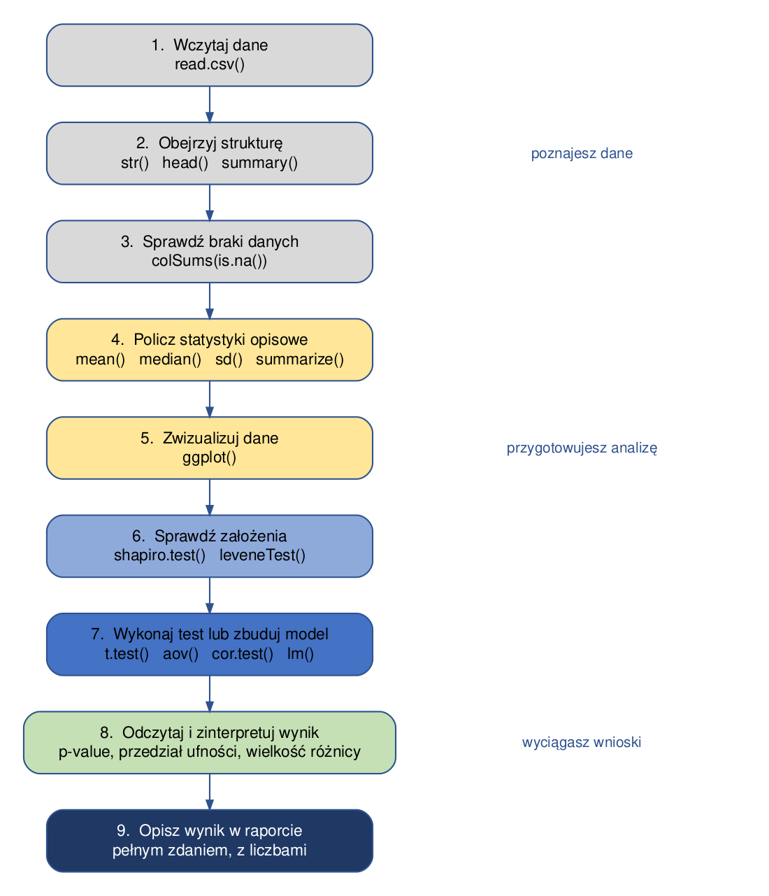



```{webr}
#| setup: true
#| exercise:
#|  - ex_1
#|  - ex_2
#|  - ex_3

library(gapminder)
data('gapminder', package = 'gapminder')
```

# Wprowadzenie do pracy w R

Ten rozdział opisuje, **jak zorganizować pracę** na ćwiczeniach: gdzie trzymać pliki, jak wczytywać dane i jak zapisywać wyniki. Nawyki wyrobione w tym miejscu oszczędzają później bardzo dużo czasu - większość problemów, na jakie natykają się studenci w trakcie semestru, to problemy ze ścieżkami do plików, a nie ze statystyką.

## Przebieg ćwiczenia

Niemal każde ćwiczenie ma ten sam przebieg. Warto mieć go przed oczami: porządkuje pracę i pomaga zorientować się, na jakim etapie analizy jesteśmy.

{width="480"}

Kolejne rozdziały skryptu rozwijają poszczególne kroki tego schematu: kroki 1-3 omawia rozdział *Przetwarzanie danych w R*, krok 4 - *Statystyki opisowe*, krok 5 - rozdziały o wizualizacji, a kroki 6-8 - rozdziały o testach statystycznych.

## Projekt RStudio

Pracę nad ćwiczeniami najwygodniej prowadzić w **projekcie RStudio**. Projekt to zwykły folder z dodatkowym plikiem o rozszerzeniu `.Rproj`, który mówi RStudio: *to jest katalog roboczy tej pracy*.

**Dlaczego warto.** Po otwarciu projektu katalog roboczy ustawia się automatycznie na folder projektu. Dzięki temu w kodzie można używać **ścieżek względnych** (`dane/pomiary_pol.csv`) zamiast bezwzględnych (`C:/Users/Anna/Documents/studia/.../pomiary_pol.csv`). Kod zadziała wtedy także na innym komputerze - na przykład na komputerze w sali ćwiczeniowej albo u osoby, z którą robisz projekt zespołowy.

**Jak założyć projekt:** *File → New Project → New Directory → New Project*, a następnie podaj nazwę folderu i miejsce na dysku.

Proponowana struktura folderów:

```
cwiczenia_statystyka/
├── cwiczenia_statystyka.Rproj   <- plik projektu; otwieraj pracę przez niego
├── dane/                        <- pliki z danymi (csv, txt, rds)
├── out/                         <- wyniki: wykresy, tabele, zapisane obiekty
└── analiza.qmd                  <- dokument z kodem i opisem
```

Przy takiej strukturze wczytanie danych wygląda zawsze tak samo:

```{r}
#| eval: false
pomiary <- read.csv("dane/pomiary_pol.csv")
```

## Dokument Quarto

**Na ćwiczeniach pracujemy w dokumentach Quarto**, a nie w zwykłych skryptach `.R`. Dokument Quarto łączy w jednym pliku trzy rzeczy: **tekst** (opis tego, co robisz i jakie wnioski wyciągasz), **kod** oraz **wyniki** - tabele i wykresy. Dzięki temu rozwiązane zadanie jest od razu gotowym sprawozdaniem, a nie zbiorem poleceń, do których trzeba dopisywać komentarz z pamięci.

### Jak utworzyć dokument

*File → New File → Quarto Document*, a następnie podaj tytuł i autora. Plik zapisz w folderze projektu z rozszerzeniem `.qmd`.

### Z czego składa się dokument

Dokument ma trzy rodzaje zawartości:

**1. Nagłówek YAML** - na samej górze, między liniami `---`. Określa tytuł, autora i format wynikowy:

```         
---
title: "Statystyki opisowe - ćwiczenie 3"
author: "Jan Kowalski"
format: html
---
```

**2. Tekst** - zwykły tekst z prostym formatowaniem:

```         
## To jest nagłówek

Tekst zwykły, **pogrubiony**, *kursywa*, `nazwa funkcji`.

- element listy
- kolejny element
```

**3. Bloki kodu** - fragmenty R, które Quarto wykona przy generowaniu dokumentu. Blok zaczyna się i kończy trzema znakami akcentu, a na początku podajemy język w nawiasie klamrowym:

````         
```{{r}}
pomiary <- read.csv("dane/pomiary_pol.csv")
mean(pomiary$annual_tavg, na.rm = TRUE)
```
````

Nowy blok kodu wstawisz skrótem **Ctrl+Alt+I** (macOS: Cmd+Option+I) albo przyciskiem *+C* nad edytorem.

### Jak uruchamiać kod

W trakcie pracy nie trzeba generować całego dokumentu po każdej zmianie:

| Czynność | Skrót |
|----------|-------|
| uruchom bieżącą linię | Ctrl+Enter |
| uruchom cały blok kodu | Ctrl+Shift+Enter (albo zielona strzałka przy bloku) |
| uruchom wszystkie bloki powyżej | przycisk ze strzałką w dół przy bloku |

Wynik pojawia się pod blokiem - w dokumencie, a nie w osobnym oknie.

### Jak wygenerować dokument

Przycisk **Render** nad edytorem (albo Ctrl+Shift+K) tworzy plik HTML z całym dokumentem: tekstem, kodem i wynikami. To ten plik oddajesz jako rozwiązanie zadania.

> **Ważne.** Przy generowaniu Quarto uruchamia dokument **od początku, w czystej sesji R**. Jeśli kod działa w konsoli, ale dokument nie chce się wygenerować, przyczyną prawie zawsze jest to, że korzystasz z obiektu utworzonego wcześniej „ręcznie" w konsoli, a nie w jednym z bloków. Dobry nawyk: od czasu do czasu wyczyść środowisko (miotełka w panelu *Environment*) i uruchom dokument od nowa.

### Przydatne opcje bloków

Opcje zapisujemy wewnątrz bloku, w linii zaczynającej się od `#|`:

````         
```{{r}}
#| echo: false     # pokaż wynik, ale ukryj kod
#| eval: false     # pokaż kod, ale go nie wykonuj
#| message: false  # ukryj komunikaty (np. przy wczytywaniu pakietu)
#| warning: false  # ukryj ostrzeżenia
```
````

Opcja `message: false` przydaje się przy `library(dplyr)`, które wypisuje kilka linii informacji niepotrzebnych w sprawozdaniu.

## Katalog roboczy

**Katalog roboczy** to folder, względem którego R szuka plików. Sprawdzamy go funkcją `getwd()`:

```{r}
#| eval: false
getwd()
```

Katalog można zmienić funkcją `setwd()`, ale w pracy z projektem nie jest to potrzebne:

```{r}
#| eval: false
setwd("C:/Users/Anna/Documents/cwiczenia_statystyka")
```

> **Uwaga.** `setwd()` z pełną ścieżką to najczęstsza przyczyna kodu, który „działa tylko u mnie”. Ścieżka zawiera nazwę użytkownika i układ folderów konkretnego komputera, więc u kogokolwiek innego kod się zatrzyma. Jeśli pracujesz w projekcie, `setwd()` nie jest potrzebne w ogóle.

## Otwieranie plików z danymi

```{r}
#| eval: false
#Otwieranie danych z pliku csv
dane <- read.csv('dane/dane.csv')

#otwieranie danych z pliku txt - wymaga określenia separatora
dane2 <- read.table('dane/dane.txt', sep = " ")
```

Dane w pliku dostępnym tylko w R

```{r}
#| eval: false
australia <- readRDS("dane/dane.rds")
```

Otwieranie środowiska pracy (przydatne, gdy chcemy wczytać kilka obiektów do R)

```{r}
#| eval: false
load("dane/cw1.rda")
```

Po wczytaniu danych **zawsze warto sprawdzić, czy wczytały się poprawnie** - czy liczba kolumn i wierszy się zgadza i czy zmienne mają właściwy typ:

```{r}
#| eval: false
str(dane)      # struktura: typy zmiennych i liczba obserwacji
head(dane)     # kilka pierwszych wierszy
summary(dane)  # podstawowe statystyki i liczba braków danych
```

Jeśli liczby się nie zgadzają (np. cała tabela wczytała się jako jedna kolumna), najczęstszą przyczyną jest zły separator kolumn albo separator dziesiętny - zob. argumenty `sep` oraz `dec` w pomocy funkcji `read.csv()`.

## Dane zawarte w pakietach

```{r}
#| eval: false
data("gapminder", package = "gapminder")
```

## Zapisywanie wyników pracy

### Zapisywanie pojedynczego obiektu (np. ramki danych)

Plik tekstowy może być otworzony w dowolnym oprogramowaniu

```{r}
#| eval: false
write.csv(australia, "out/australia.csv")
```

### Zapisywanie wyników pracy w formacie dostępnym tylko w R

Pojedynczy obiekt

```{r}
#| eval: false
saveRDS(dane, "out/dane.rds")
```

Zapisywanie wybranych obiektów ze środowiska pracy R

```{r}
#| eval: false
save(dane, australia, file = "out/cw1a.rda")
```

Zapisywanie wszystkich obiektów znajdujących się w środowisku pracy R

```{r}
#| eval: false
save.image("out/cw1b.RData")
```

> **Uwaga.** Zapisywanie całego środowiska pracy (`save.image()`) bywa wygodne, ale utrudnia powtórzenie analizy: po ponownym otwarciu nie wiadomo, skąd wzięły się obiekty. Lepszym nawykiem jest zapisanie **kodu**, który te obiekty tworzy - wtedy wynik zawsze da się odtworzyć od zera.

## Pomoc

```{r}
#| eval: false
?nazwaFunkcji
help(nazwaFunkcji)
example(nazwaFunkcji)
args(nazwaFunkcji)
```

Na stronie pomocy najbardziej przydatne są dwie sekcje: **Usage** (jakie argumenty przyjmuje funkcja i jakie mają wartości domyślne) oraz **Examples** na samym dole (gotowe wywołania, które można uruchomić).

## Zadania

> Sprawdź, jaki jest aktualny katalog roboczy, a następnie wyświetl nazwy plików, które się w nim znajdują (funkcja `list.files()`).

```{webr}
#| exercise: ex_1

```

:::: {.solution exercise="ex_1"}
::: {.callout-tip title="Solution" collapse="false"}
Rozwiązanie:

``` r
getwd()
list.files()
```

W edytorze w przeglądarce katalogiem roboczym jest katalog wirtualny, w którym udostępniono pliki z danymi. We własnym projekcie zobaczysz folder projektu.
:::
::::

> Wczytaj zbiór danych `gapminder` z pakietu o tej samej nazwie, a następnie sprawdź: ile ma wierszy i kolumn, jakiego typu są poszczególne zmienne i czy zawiera braki danych.

```{webr}
#| exercise: ex_2

```

:::: {.solution exercise="ex_2"}
::: {.callout-tip title="Solution" collapse="false"}
Rozwiązanie:

``` r
data("gapminder", package = "gapminder")

str(gapminder)       # typy zmiennych, liczba obserwacji
nrow(gapminder)      # liczba wierszy
ncol(gapminder)      # liczba kolumn
summary(gapminder)   # statystyki; braki danych pokazałyby się jako NA's
```

Zbiór ma 1704 wiersze i 6 kolumn. `country` i `continent` są zmiennymi czynnikowymi (factor), pozostałe - liczbowymi. Braków danych nie ma.
:::
::::

> Korzystając ze strony pomocy funkcji `read.csv()` sprawdź, jak wczytać plik, w którym kolumny rozdzielone są średnikiem, a część dziesiętną oddziela przecinek (tak zapisuje pliki csv polska wersja Excela).

```{webr}
#| exercise: ex_3

```

:::: {.solution exercise="ex_3"}
::: {.callout-tip title="Solution" collapse="false"}
Rozwiązanie:

``` r
?read.csv

# wczytanie pliku z separatorem ";" i przecinkiem dziesiętnym:
dane <- read.csv("dane/plik.csv", sep = ";", dec = ",")

# to samo robi gotowy wariant funkcji:
dane <- read.csv2("dane/plik.csv")
```

Jeśli po wczytaniu liczby trafiły do R jako tekst (`chr` zamiast `num` w wyniku `str()`), prawie zawsze przyczyną jest właśnie separator dziesiętny.
:::
::::
