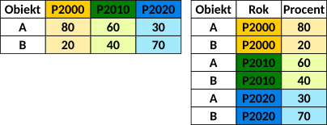



```{webr}
#| setup: true
#| exercise: 
#|  - ex_1
#|  - ex_2
#|  - ex_3
#|  - ex_4
#|  - ex_5
#|  - ex_6
#|  - ex_7
#|  - ex_8
#|  - ex_9
#|  - ex_10
#|  - ex_11
#|  - ex_12
#|  - ex_13
#|  - ex_14
#|  - ex_15

library(gapminder)
library(dplyr)

data('gapminder', package = 'gapminder')
```

# Przetwarzanie danych - dplyr

```{r}
#| label: pakiety
#| include: false
library(gapminder)
library(dplyr)
library(tidyr)
```

W poprzednim rozdziale te same operacje - wybór wierszy i kolumn, sortowanie, tworzenie nowych zmiennych - wykonywaliśmy za pomocą **indeksowania** dostępnego w podstawowym R (`gapminder[gapminder$year == 1952, ]`). Teraz poznamy pakiet `dplyr`, który robi to samo w zapisie czytelniejszym i łatwiejszym do łączenia w dłuższe ciągi operacji (`filter(gapminder, year == 1952)`).

**Czego używać?** Obu zapisów warto się nauczyć: indeksowanie bazowe działa zawsze, bez instalowania czegokolwiek, i spotkasz je w cudzym kodzie oraz w dokumentacji R. W tym skrypcie i w zadaniach używamy jednak `dplyr`, ponieważ przy bardziej złożonych operacjach jest wyraźnie czytelniejszy.

## Pakiety

### Pakiet dplyr

Pakiet `dplyr` wykorzystuje się do podstawowych operacji przetwarzania danych z wykorzystaniem obiektów typu data.frame. Podstawowe funkcje pakietu to:

-   `select()` - tworzenie podzbioru danych poprzez wybór zmiennych na podstawie ich nazw,
-   `filter()` - tworzenie podzbioru danych poprzez wybór wierszy na podstawie określonego warunku,
-   `arrange()` - sortowanie danych,
-   `mutate()` - tworzenie nowych zmiennych na podstawie określenia warunku,
-   `summarize()` - podsumowanie danych, np. poprzez obliczenie statystyk podstawowych.

Pakiet `dplyr` dostarcza także funkcji:

-   do grupowania danych: `group_by()` - pozwala na wykonanie operacji w podziale na grupy.
-   do łączenia dwóch lub więcej obiektów (data.frame): `inner_join()`, `left_join()`, `right_join()`, `full_join()` - w pakiecie `dplyr` nie ma pojedynczej funkcji `join()`, każdy rodzaj łączenia ma własną nazwę

Funkcje pakietu `dplyr` można ze sobą łączyć za pomocą operatora potokowego `|>` (patrz podrozdział *Operatory potokowe*)

Więcej informacji:

-   dokumentacja pakietu: <https://dplyr.tidyverse.org/>
-   podstawowe funkcje pakietu: ["Cheat Sheet"](https://www.rstudio.com/wp-content/uploads/2015/02/data-wrangling-cheatsheet.pdf)

### Pakiet tidyr

Dane wykorzystywane w analizach muszą być przechowywane w tzw. uporządkowany sposób (ang. *tidy data*). Uporządkowane dane to dane, w których:

-   każda zmienna przechowywana jest w osobnej kolumnie.
-   każda obserwacja jest zapisana w osobnym wierszu w tabeli danych
-   każda wartość przechowywana jest w osobnej komórce (tzn. każda komórka przechowuje tylko jedną wartość).

Pakiet `tidyr` zawiera zestaw funkcji, które ułatwiają tworzenie uporządkowanych danych. Uporządkowane dane mogą być przechowywane w dwóch układach: układzie długim i układzie szerokim (więcej informacji w podrozdziale @sec-uklad-danych)

Więcej informacji:

-   dokumentacja: <https://tidyr.tidyverse.org/>\
-   cheat sheet: <https://github.com/rstudio/cheatsheets/blob/main/tidyr.pdf>

```{r}
#| label: wczytanie-danych
#| include: false
data('gapminder', package = 'gapminder')
```

## Przetwarzanie danych z pakietem `dplyr`

### Funkcja `select()`

-   **Wybór kolumn *country*, *year* oraz *pop*.**

```{r}
#| label: select-1
sel1 <- select(gapminder, country, year, pop)
head(sel1)
```

> Ze zbioru danych gapminder proszę wybrać dane dla zmiennych country, year oraz lifeExp.

```{webr}
#| exercise: ex_1

```

::: { .solution exercise="ex_1" }
::: { .callout-tip title="Solution" collapse="false"}
Rozwiązanie:

Wykorzystaj funkcję `select()` z pakietu dplyr

```r
select(gapminder, country, year, lifeExp)     
```
:::
:::

-   **Wybór wszystkich kolumn z wyjątkiem kolumny *kontynent***

```{r}
#| label: select-2

sel2 <- select(gapminder, -continent)
head(sel2)
```

> Ze zbioru danych gapminder proszę wybrać wszystkie kolumny z wyjątkiem continent oraz gdpPercap.

```{webr}
#| exercise: ex_2

```

::: { .solution exercise="ex_2" }
::: { .callout-tip title="Solution" collapse="false"}

Rozwiązanie:

Wykorzystaj funkcję `select()` z pakietu dplyr

```r
select(gapminder, -continent, -gdpPercap)     
```
:::
:::


### Funkcja `filter()`

Funkcja `filter()` służy do tworzenia podzbiorów danych poprzez wybór obserwacji spełniających określone warunki. Warunki są określane za pomocą operatorów logicznych (!=, ==, \>, \<, \>=, \<=, \|, &).

-   **Wybór danych dla roku 2007.**

```{r}
#| label: filter-1

filt1 <- filter(gapminder, year == 2007)
head(filt1)
```

> Wybierz dane dla kontynentu Europa.

```{webr}
#| exercise: ex_3

```

::: { .solution exercise="ex_3" }
::: { .callout-tip title="Solution" collapse="false"}

Rozwiązanie:

Wykorzystaj funkcję `filter()` z pakietu dplyr

```r
filter(gapminder, continent == 'Europe')   
```
:::
:::

> W jaki inny sposób można wybrać dane dla roku 2007?

```{webr}
#| exercise: ex_4

```


-   **Wybór danych dla roku 2007, w których oczekiwana długość trwania życia przekracza 80 lat.**

```{r}
#| label: filter-2

filt2 <- filter(gapminder, year == 2007 & lifeExp > 80)
filt2
```

> Wybór danych dla roku 2007, dla wszystkich kontynentów z wyjątkiem Azji, w których oczekiwana długość trwania życia przekracza 80 lat.

```{webr}
#| exercise: ex_5

```

::: { .solution exercise="ex_5" }
::: { .callout-tip title="Solution" collapse="false"}

Rozwiązanie:

Wykorzystaj funkcję `filter()` z pakietu dplyr

```r
filter(gapminder, continent != 'Asia' & year == 2007 & lifeExp > 80)   
```
:::
:::


### Funkcja `mutate()`

Funkcja `mutate()` służy do tworzenia nowych zmiennych na podstawie określonego wyrażenia

-   **Dodaj kolumnę *abbr_country* zawierającą trzyliterowy kod państwa.**

```{r}
#| label: mutate-1

gap2 <- mutate(gapminder, abbr_country = toupper(substr(country, 1, 3)))
head(gap2)
```

> Co w powyższym poleceniu robi funkcja `substr()` oraz `toupper()`?

> Dodaj do zbioru danych kolumnę pop_mln zawierająca liczbę ludności w milionach.

```{webr}
#| exercise: ex_6

```

::: { .solution exercise="ex_6" }
::: { .callout-tip title="Solution" collapse="false"}

Rozwiązanie:

Wykorzystaj funkcję `mutate()` z pakietu dplyr

```r
ex6 <- mutate(gapminder, pop_mln = pop/1000000)
```
:::
:::

### Funkcja `arrange()`

Funkcja `arrange()` wykorzystywana jest do sortowania danych.

-   **Sortowanie rosnące względem zmiennej *lifeExp***

```{r}
#| label: arrange-1

arr1 <- arrange(gapminder, lifeExp)
head(arr1)
```

-   **Sortowanie malejące względem zmiennej *lifeExp***

```{r}
#| label: arrange-2

arr2 <- arrange(gapminder, desc(lifeExp))
head(arr2)
```

> Posortuj dane malejąco względem zmiennej pop. Pokaż 10 pierwszych wierszy

```{webr}
#| exercise: ex_7

```

::: { .solution exercise="ex_7" }
::: { .callout-tip title="Solution" collapse="false"}

Rozwiązanie:

Wykorzystaj funkcję `arrange()` z pakietu dplyr

```r
ex7 <- arrange(gapminder, desc(pop))
head(ex7, 10)
```
:::
:::


-   **Sortowanie rosnące względem kontynentu (*continent*) oraz oczekiwanej długości trwania życia (*lifeExp*)**

```{r}
#| label: arrange-3
arr3 <- arrange(gapminder, continent, lifeExp)
head(arr3)
```

> Posortuj malejąco względem nazwy państwa oraz rosnąco względem liczby ludności. Pokaż 4 pierwsze wiersze

```{webr}
#| exercise: ex_8

```

::: { .solution exercise="ex_8" }
::: { .callout-tip title="Solution" collapse="false"}

Rozwiązanie:

Wykorzystaj funkcję `arrange()` z pakietu dplyr

```r
ex8 <- arrange(gapminder, desc(country), pop)
head(ex8, 4)
```
:::
:::

### Funkcja `rename()`

Funkcja `rename()` służy do zmiany nazw kolumn. W funkcji `rename()` definiujemy *nowa_nazwa = stara_nazwa*.

-   **Zmiana nazw kolumn na polskie nazwy.**

```{r}
#| label: rename-1
gap2 <- rename(gapminder, panstwo = country, kontynent = continent, rok = year, dlugosc_zycia = lifeExp, ludnosc = pop, PKB = gdpPercap)
names(gap2)
```

> Korzystając ze strony pomocy funkcji `rename()` sprawdź jak zmienić nazwy kolumn w obiekcie gap2 na drukowane litery.

```{webr}
#| exercise: ex_9

```

::: { .solution exercise="ex_9" }
::: { .callout-tip title="Solution" collapse="false"}

Rozwiązanie:

Wykorzystaj funkcję `rename_with()` z pakietu dplyr

```r
rename_with(gapminder, toupper)
```
:::
:::

### Funkcja `summarize()`

Funkcja `summarize()` służy do wykonywania podsumowań statystycznych. Tworzy kolumny z zadanymi statystykami.

-   **Średnia oczekiwana długość trwania życia.**

```{r}
#| label: summarize-1
smr1 <- summarize(gapminder, 
          srednia = mean(lifeExp))
smr1
```

-   **Średnia, minimalna oraz maksymalna oczekiwana długość trwania życia.**

```{r}
#| label: summarize-2
smr2 <- summarize(gapminder, 
          srednia = mean(lifeExp),
          min = min(lifeExp),
          max = max(lifeExp))
smr2
```

> Oblicz średnią, odchylenie standardowe, minimum i maksimum dla zmiennej gdpPercap.

```{webr}
#| exercise: ex_10
```

::: { .solution exercise="ex_10" }
::: { .callout-tip title="Solution" collapse="false"}

Rozwiązanie:

Wykorzystaj funkcję `summarize` z pakietu dplyr

```r
ex10 <- summarize(gapminder, 
          srednia = mean(gdpPercap),
          sd = sd(gdpPercap),
          min = min(gdpPercap),
          max = max(gdpPercap))
ex10
```
:::
:::

### Grupowanie .by

-   argument .by; np. summarize(, .by) - grupowanie dokonywane tylko na potrzeby danej funkcji

```{r}
#| label: grupowanie-1
grp1 = summarize(filt1 ,
                 srednia = mean(lifeExp), 
                 .by = continent)
grp1
```

> Oblicz minimalną i maksymalną długość trwania życia w 2007 roku w podziale na kontynenty.

```{webr}
#| exercise: ex_11
```

::: { .solution exercise="ex_11" }
::: { .callout-tip title="Solution" collapse="false"}

Rozwiązanie:

Wykorzystaj funkcję `summarize` z pakietu dplyr

```r
ex11filt <- filter(gapminder, year == 2007)
ex11 <- summarize(ex11filt,
                 min = min(lifeExp, na.rm = TRUE), 
                 max = max(lifeExp, na.rm = TRUE),
                 .by = continent)
ex11
```
:::
:::


### Funkcja `pull()`

Funkcja `pull()` służy do wyciągania tylko jednej zmiennej

```{r}
#| label: pull-1
life_exp <- pull(gapminder, lifeExp)
head(life_exp)
```

```{r}
#| label: pull-2
continent <- pull(gapminder, continent)
head(continent)
```

> Wybierz ze zbioru danych kolumnę pop.

```{webr}
#| exercise: ex_12
```

::: { .solution exercise="ex_12" }
::: { .callout-tip title="Solution" collapse="false"}

Rozwiązanie:

Wykorzystaj funkcję `pull` z pakietu dplyr

```r
ex12 <- pull(gapminder, pop)
head(ex12)
```
:::
:::


### Operatory potokowe: `|>` oraz `%>%`

**Operator potokowy** (ang. *pipe*) przekazuje wynik działania jednej funkcji jako **pierwszy argument** funkcji następnej. Pozwala to zapisać kilka kolejnych operacji jako jeden czytelny ciąg, bez tworzenia obiektów pośrednich.

W R dostępne są dwa takie operatory:

-   `|>` - **operator natywny**, wbudowany w język R (od wersji 4.1). Nie wymaga żadnego pakietu.
-   `%>%` - operator z pakietu `magrittr`, udostępniany przez `dplyr` oraz cały `tidyverse`. Starszy i bardzo rozpowszechniony - spotkasz go w większości materiałów i przykładów dostępnych w internecie.

W tym skrypcie używamy operatora natywnego `|>`, ale warto znać oba, bo w typowych zastosowaniach działają identycznie.

#### Przykład

Które kraje w roku 1952 miały liczbę ludności powyżej 100 milionów?

Bez operatora potokowego każdą operację wykonujemy osobno, zapisując wynik w nowym obiekcie:

```{r}
#| label: kilka-fnc
f1 <- filter(gapminder, pop > 100000000 & year == 1952)
s1 <- select(f1, country, pop)
a1 <- arrange(s1, pop) # sortowanie danych wzgledem pop
a1
```

Ten sam zapis z operatorem natywnym `|>`. Wynik każdej funkcji jest automatycznie przekazywany do następnej, więc nie powtarzamy nazwy zbioru danych:

```{r}
#| label: operator
df <- gapminder |>                           #wejsciowy zbior danych
  filter(pop > 100000000 & year == 1952) |>  # wybor krajow z pop > 100mln w roku 1952
  select(country, pop) |>                    # wybor kolumn country, pop 
  arrange(pop)                               # sortowanie danych wzgledem pop

df
```

Operator `%>%` daje w tym przypadku dokładnie ten sam wynik - wystarczy podmienić symbol:

```{r}
#| label: operator-magrittr
df2 <- gapminder %>% 
  filter(pop > 100000000 & year == 1952) %>% 
  select(country, pop) %>% 
  arrange(pop)

identical(df, df2)
```

#### Czym różni się `|>` od `%>%`?

Dla typowych potoków, takich jak powyższy, **oba operatory są wymienne**. Różnice ujawniają się w czterech sytuacjach:

**1. Skąd pochodzą.** Operator `|>` jest częścią języka R (od wersji 4.1) i działa bez wczytywania jakiegokolwiek pakietu. Operator `%>%` pochodzi z pakietu `magrittr` i jest dostępny tylko wtedy, gdy wczytamy `dplyr`, `magrittr` albo cały `tidyverse`. Kod z `|>` zadziała więc w każdej instalacji R - także w takiej, w której nie ma zainstalowanego pakietu `dplyr`.

**2. Nawiasy po prawej stronie.** Operator natywny wymaga wywołania funkcji, czyli nawiasów. `magrittr` dopuszcza zapis skrócony:

``` r
c(4, 1, 9) |> sort()     # poprawnie
c(4, 1, 9) |> sort       # BŁĄD: the pipe operator requires a function call as RHS
c(4, 1, 9) %>% sort      # w magrittr taki skrót jest dopuszczalny
```

**3. Przekazanie wartości w inne miejsce niż pierwszy argument.** Domyślnie oba operatory wstawiają wynik jako **pierwszy** argument następnej funkcji. Gdy potrzebujemy go w innym miejscu, używamy tzw. zastępnika (ang. *placeholder*) - i tu operatory różnią się najbardziej:

-   w `%>%` zastępnikiem jest kropka `.`; można jej użyć w dowolnym miejscu i dowolną liczbę razy,
-   w `|>` zastępnikiem jest podkreślnik `_`; można go użyć **tylko raz** i **tylko jako argument nazwany**.

Przykład: funkcja `lm()` (budowa modelu regresji, patrz rozdział *Analiza regresji*) przyjmuje zbiór danych jako argument `data`, a nie jako pierwszy argument:

``` r
pomiary_pol |> lm(annual_precip ~ tmax_9, data = _)    # poprawnie
pomiary_pol |> lm(annual_precip ~ tmax_9, _)           # BŁĄD: zastępnik musi być argumentem nazwanym
pomiary_pol %>% lm(annual_precip ~ tmax_9, data = .)   # odpowiednik w magrittr
```

**4. Szybkość.** `|>` jest przekształcany już na etapie czytania kodu, więc nie wiąże się z wywołaniem dodatkowej funkcji. `%>%` jest zwykłą funkcją, więc działa nieco wolniej. W praktyce ma to znaczenie tylko w potokach powtarzanych bardzo wiele razy.

**Którego używać?** Jeśli nie ma powodu, by postąpić inaczej - `|>`. Operator `%>%` warto znać, bo jest obecny w ogromnej liczbie materiałów i starszych skryptów, a także wtedy, gdy potrzebujemy zastępnika w kilku miejscach jednocześnie.

> Które kraje w 2007 roku miały populację powyżej 100 milionów? Posortuj wynik od krajów z największą liczbą ludności do krajów z najmniejszą liczbą ludności.

```{webr}
#| exercise: ex_13
```

::: { .solution exercise="ex_13" }
::: { .callout-tip title="Solution" collapse="false"}

Rozwiązanie:

```r
ex13 <- gapminder |>  #wejsciowy zbior danych
  filter(pop > 100000000 & year == 2007) |> # wybor krajow z pop > 100mln w roku 2007
  select(country, pop) |> # wybor kolumn country, pop 
  arrange(desc(pop)) # sortowanie danych wzgledem pop

ex13
```
:::
:::

### Łączenie tabel - funkcje `*_join()`

```{r}
x <- data.frame(country = c("Poland", "USA", "Germany"), pop = c(36.82, 333.3, 83.8))

y = data.frame(country = c("Poland", "USA", "Italy"), pop = c(36.82, 333.3, 58.94))
```

```{r}
x
```

```{r}
y
```

-   Funkcja `inner_join(x, y)` zwraca tylko obiekty występujące w obu tabelach

```{r}
#| label: inner-join
inner_df <- inner_join(x, y, by = 'country')
inner_df 
```

-   Funkcja `left_join(x, y)` zachowuje wszystkie obserwacje w x, niezależnie od tego, czy mają swój odpowiednik w tabeli y. Jest to najczęściej używane łączenie, ponieważ gwarantuje, że nie utracimy obserwacji z tabeli podstawowej (x).

```{r}
#| label: left-join
left_df <- left_join(x, y, by = 'country')
left_df
```

-   Funkcja `right_join(x, y)` zachowuje wszystkie obserwacje w y.

```{r}
#| label: right-join
right_df <- right_join(x, y, by = 'country')
right_df
```

-   Funkcja `full_join(x, y)` zwraca wszystkie obiekty z tabeli x oraz z tabeli y.

```{r}
#| label: full-join
full_df <- full_join(x, y, by = 'country')
full_df
```

## Układ danych {#sec-uklad-danych}

Dane w tabeli mogą być zapisywane w układzie **długim** lub **szerokim**.



Zmiana układu danych jest możliwa z użyciem funkcji z pakietu `tidyr`.

```{r}
#| label: tidyr
library(tidyr)
```

-   **Układ długi**

Dane gapminder są zapisane w układzie długim:

```{r}
head(gapminder, 10)
```

-   **Układ szeroki**

Funkcja `pivot_wider()` przekształca dane z formatu długiego w szeroki. Obiekt gapminder_wide w każdej kolumnie przechowuje dane dla jednego roku, a w każdym wierszu dla kraju.

```{r}
#| label: pivot-wider
gapminder2 <- select(gapminder, -continent, 
                    -lifeExp, -gdpPercap)
gapminder_wide <- pivot_wider(gapminder2, 
                             names_from = year, 
                             values_from = pop)

head(gapminder_wide)
```

> Wybierz z danych kolumnę country, lifeExp oraz year i zamień dane na układ szeroki.

```{webr}
#| exercise: ex_14
```

::: { .solution exercise="ex_14" }
::: { .callout-tip title="Solution" collapse="false"}

Rozwiązanie:

```r
ex14 <- gapminder |> 
  select(country, year, lifeExp) |>
pivot_wider(names_from = year, values_from = lifeExp)

ex14
```
:::
:::

-   **Układ szeroki -\> Układ długi**

```{r}
#| label: pivot-longer
gapminder_long <- pivot_longer(gapminder_wide,
                              cols = colnames(gapminder_wide)[-1])
gapminder_long 
```

> Wybierz z danych kolumnę country, gdpPercap oraz year i zamień dane na układ szeroki. Następnie z układu szerokiego zamień dane na układ długi.


```{webr}
#| exercise: ex_15
```

::: { .solution exercise="ex_15" }
::: { .callout-tip title="Solution" collapse="false"}

Rozwiązanie:

```r
ex15_wide <- gapminder |> 
  select(country, year, gdpPercap) |>
pivot_wider(names_from = year, values_from = gdpPercap)

ex15_long <-  pivot_longer(ex15_wide, cols = colnames(ex15_wide)[-1])
```
:::
:::