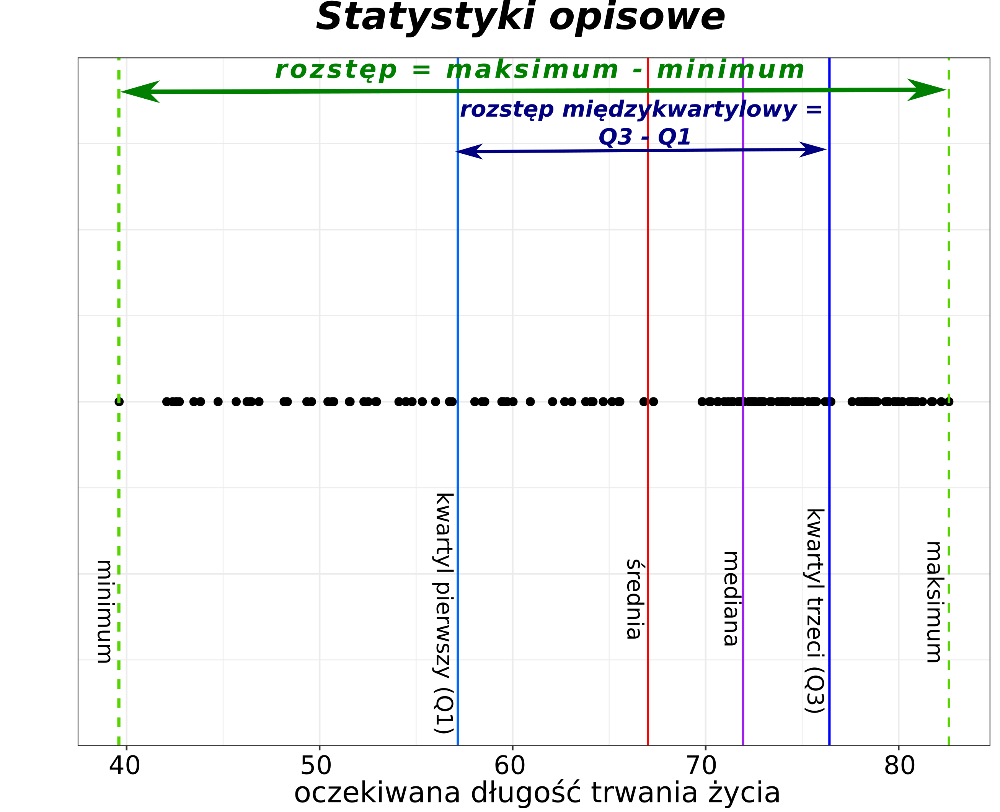
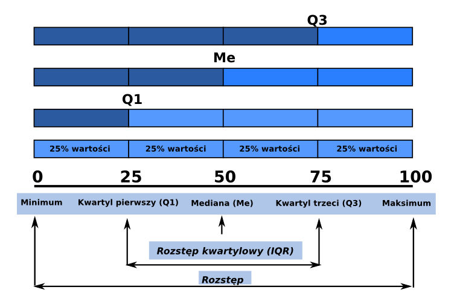



```{webr}
#| setup: true
#| exercise: 
#|  - ex_1
#|  - ex_2
#|  - ex_3
#|  - ex_4
#|  - ex_5
#|  - ex_6
#|  - ex_7
#|  - ex_8
#|  - ex_9
#|  - ex_10
#|  - ex_11
#|  - ex_12
#|  - ex_13
#|  - ex_14
#|  - ex_15
#|  - ex_16
#|  - ex_17
#|  - ex_18

library(gapminder)
library(dplyr)
library(tidyr)

data('gapminder', package = 'gapminder')
dane2007 <- filter(gapminder, year==2007)
```

# Statystyki opisowe

Statystyki opisowe wykorzystuje się do przedstawienia ogólnej charakterystyki danych.

Statystyki opisowe dzielimy na:

1.  **Miary położenia** - określają przeciętny poziom oraz rozmieszczenie wartości zmiennej:

    -   *Miary przeciętne* - np. *średnia arytmetyczna* - charakteryzują średni lub typowy poziom wartości zmiennej; mówią zatem o *przeciętnym* poziomie rozważanej zmiennej;
    -   *Wartość modalna* - wartość najczęściej występująca w zbiorze danych;
    -   *Kwantyle* - dzielą zbiorowość na określone części, np. 4, 10, 100 części.

2.  **Miary rozrzutu** - określają granice zmienności danej zmiennej:

    -   *rozstęp;*
    -   *rozstęp kwartylowy;*
    -   *odchylenie standardowe.*

3.  **Miary asymetrii i koncentracji**.

    -   *skośność;*
    -   *kurtoza.*

{width="500"}

```{r}
#| message: false
#| warning: false
library(gapminder)
library(dplyr)
```

```{r}
data('gapminder', package ='gapminder')
dane2007 <- filter(gapminder, year==2007)
```

## Podstawowe statystyki

Zestaw podstawowych statystyk opisowych obliczany jest za pomocą funkcji `summary()`. Funkcja ta oblicza wartość minimalną, wartość maksymalną, pierwszy i trzeci kwartyl, medianę oraz średnią.

```{r}
summary(dane2007)
```

## Statystyki opisowe: Miary położenia

### Średnia arytmetyczna

-   Obliczana jest jako iloraz sumy liczb i ilości tych liczb.
-   Jest najczęściej używaną miarą charakteryzującą rozkład cechy
-   Wady: czuła na wartości odstające

```{r}
srednia_lifeExp <- mean(dane2007$lifeExp)
srednia_lifeExp 
```

> Obliczyć średnią wartość dla PKB (gdpPercap) w 2007 roku.

```{webr}
#| exercise: ex_1

```

:::: {.solution exercise="ex_1"}
::: {.callout-tip title="Solution" collapse="false"}
Rozwiązanie:

``` r
mean(dane2007$gdpPercap)     
```
:::
::::

> Ile wynosiła średnia oczekiwana długość trwania życia w Azji w roku 2002?

```{webr}
#| exercise: ex_2

```

:::: {.solution exercise="ex_2"}
::: {.callout-tip title="Solution" collapse="false"}
Rozwiązanie:

``` r
asia2002 <- filter(gapminder, continent == 'Asia' & year == 2002) 
mean(asia2002$lifeExp)
```
:::
::::

### Średnia ważona

Stosowana, gdy poszczególne obserwacje mają różną "wagę". W przykładzie poniżej obliczamy średnią oczekiwaną długość trwania życia dla świata, ważąc każdy kraj liczbą jego ludności - w średniej nieważonej Chiny liczyłyby się tyle samo, co Islandia.

```{r}
srednia_w_lifeExp <- weighted.mean(dane2007$lifeExp, dane2007$pop)
srednia_w_lifeExp
mean(dane2007$lifeExp)   # dla porównania: średnia nieważona
```

### Średnia harmoniczna

Stosowana dla wielkości wyrażonych jako iloraz (np. prędkość, czyli droga na jednostkę czasu), gdy uśredniamy je przy stałym liczniku.

Przykład: łódź płynie 1 km z prądem z prędkością 6 km/h i wraca ten sam 1 km przeciw prądowi z prędkością 3,2 km/h. Jaka jest średnia prędkość na całej trasie? Średnia arytmetyczna daje tu zły wynik, ponieważ na odcinku wolniejszym łódź spędziła więcej czasu.

```{r}
harmonic_mean = function(x){
  1 / mean(1 / x)
}
```

```{r}
rzeka = c(6, 3.2) #km/h
harmonic_mean(rzeka)   # średnia prędkość na trasie
mean(rzeka)            # dla porównania: średnia arytmetyczna
```

### Średnia geometryczna

Stosowana dla wielkości zmieniających się multiplikatywnie - stóp wzrostu, indeksów, wskaźników zmiany. Uśrednia się tu nie przyrosty, lecz mnożniki.

Przykład: w pierwszym roku pewna wielkość wzrosła o 2,6392% (mnożnik 1,026392), a w drugim o 1,1959% (mnożnik 1,011959). Jaki był przeciętny roczny wzrost?

```{r}
geometric_mean = function(x){
  n = length(x)
  prod(x) ^ (1 / n)
}
```

```{r}
zmiana <- c(1.026392, 1.011959)
geometric_mean(zmiana)   # przeciętny mnożnik roczny
```

Wynik 1,0192 oznacza przeciętny wzrost o 1,92% rocznie.

### Kwantyle

Kwantyle to wartości cechy, które dzielą analizowany zbiór danych na określone części pod względem liczby jednostek. Części te pozostają w stosunku do siebie w określonych proporcjach:

-   Kwartyle - podział na 4 części:
    -   Kwartyl pierwszy (Q1)
    -   Mediana - kwartyl drugi
    -   Kwartyl trzeci (Q3)
-   Decyle - podział na 10 części
-   Percentyle - podział na 100 części

Funkcja `quantile()` oblicza dowolną wartość kwantyli. Argument *probs* pozwala na zdefiniowanie dowolnych wartości, które mają zostać wyliczone. Argument ten przyjmuje wartości z przedziału od 0 do 1.

{width="500"}

#### Kwartyle

Funkcja `quantile()` domyślnie zwraca wartości kwartyli.

```{r}
kwartyle <- quantile(dane2007$lifeExp)
kwartyle
```

Kwartyle są także obliczane przez funkcję `summary()`, która dodatkowo zwraca także wartości minimalną, maksymalną oraz średnią.

#### Decyle

W poniższym przykładzie *seq(0,1,0.1)* zwraca sekwencję wartości od 0 do 1 z krokiem co 0.1. Odpowiada to podziałowi danych na 10 równych części.

```{r}
decyle <- quantile(dane2007$lifeExp, probs = seq(0, 1, 0.1))
decyle
```

#### Percentyle

W poniższym przykładzie zbiór zostanie podzielony na 100 równych części.

```{r}
percentyle <- quantile(dane2007$lifeExp, probs = seq(0, 1, 0.01))
head(percentyle, 10)
```

#### Dowolne wartości kwantyli

W poniższym przykładzie zostanie wyliczony 5 oraz 95 percentyl.

```{r}
q <- quantile(dane2007$lifeExp, probs = c(0.05, 0.95))
q
```

> Obliczyć decyle dla gdpPercap dla danych z 2007 roku.

```{webr}
#| exercise: ex_3

```

:::: {.solution exercise="ex_3"}
::: {.callout-tip title="Solution" collapse="false"}
Rozwiązanie:

``` r
quantile(dane2007$gdpPercap, probs = seq(0, 1, 0.1))
```
:::
::::

> Obliczyć pierwszy i trzeci kwartyl dla oczekiwanej długości trwania życia w Afryce w 2002 roku.

```{webr}
#| exercise: ex_4

```

:::: {.solution exercise="ex_4"}
::: {.callout-tip title="Solution" collapse="false"}
Rozwiązanie:

``` r
africa2002 <- filter(gapminder, continent == 'Africa' & year == 2002)
quantile(africa2002$lifeExp, probs = c(0.25, 0.75))
```
:::
::::

#### Mediana

Mediana to wartość, która dzieli zbiór danych na 2 równe części. Mediana obliczana jest przez funkcję `median()`.

```{r}
median_lifeExp <- median(dane2007$lifeExp)
median_lifeExp 
```

> Obliczyć medianę dla gdpPercap dla danych z 2007 roku. Porównaj ją ze średnią obliczoną wcześniej. Dlaczego te dwie wartości tak bardzo się różnią i która z nich lepiej opisuje typowy kraj?

```{webr}
#| exercise: ex_5

```

:::: {.solution exercise="ex_5"}
::: {.callout-tip title="Solution" collapse="false"}
Rozwiązanie:

``` r
median(dane2007$gdpPercap)    
```
:::
::::

> Ile wynosiła mediana oczekiwanej długości trwania życia w Afryce w 1952 roku?

```{webr}
#| exercise: ex_6

```

:::: {.solution exercise="ex_6"}
::: {.callout-tip title="Solution" collapse="false"}
Rozwiązanie:

``` r
africa1952 <- filter(gapminder, continent == 'Africa' & year == 1952)
median(africa1952$lifeExp) 
```
:::
::::

**Mediana a średnia arytmetyczna**

-   dla rozkładu symetrycznego mediana oraz średnia będą równe.
-   mediana jest lepszą miarą w przypadku rozkładów skośnych.
-   średnia jest bardziej czuła na wartości odstające.

Podsumowanie: Warto podawać obie wartości.

### Wartość modalna

-   wartość cechy, która w zbiorze danych występuje najczęściej. W R nie ma wbudowanej funkcji do obliczania tej statystyki, ale można ją wyznaczyć z tabeli liczebności:

```{r}
liczebnosci <- table(dane2007$continent)
names(liczebnosci)[which.max(liczebnosci)]
```

-   dla zmiennych ciągłych (np. *lifeExp*) wartość modalna zwykle nie ma sensu, bo prawie każda obserwacja jest inna - mówimy wtedy raczej o *modzie rozkładu*, czyli położeniu szczytu histogramu (patrz rozdział *Rozkłady danych*).

## Statystyki opisowe: Miary rozrzutu

### Minimum i maksimum

```{r}
min_lifeExp <- min(dane2007$lifeExp)
min_lifeExp

max_lifeExp <- max(dane2007$lifeExp)
max_lifeExp
```

```{r}
range(dane2007$lifeExp)
```

> Ile wynosiła najmniejsza i największa oczekiwana długość trwania życia w Afryce w roku 1952?

```{webr}
#| exercise: ex_7

```

:::: {.solution exercise="ex_7"}
::: {.callout-tip title="Solution" collapse="false"}
Rozwiązanie:

``` r
africa1952 <- filter(gapminder, continent == 'Africa' & year == 1952)
range(africa1952$lifeExp)
```
:::
::::

> Oblicz zakres oczekiwanej długości trwania życia w Polsce w latach 1952-2007?

```{webr}
#| exercise: ex_8

```

:::: {.solution exercise="ex_8"}
::: {.callout-tip title="Solution" collapse="false"}
Rozwiązanie:

``` r
# Rozwiazanie 1
pl <- filter(gapminder, country == 'Poland')
range(pl$lifeExp)

# Rozwiazanie 2 
min(pl$lifeExp)
max(pl$lifeExp)
```
:::
::::

> W jakim zakresie zmieniała się oczekiwana długość trwania życia w 2002 roku w krajach azjatyckich z PKB (gdpPercap) przekraczającym 25000?

```{webr}
#| exercise: ex_9

```

:::: {.solution exercise="ex_9"}
::: {.callout-tip title="Solution" collapse="false"}
Rozwiązanie:

``` r
asia2002 <- filter(gapminder, year == 2002 & continent == 'Asia' & gdpPercap > 25000)
range(asia2002$lifeExp)
```
:::
::::

### Rozstęp

-   najprostsza miara zmienności
-   różnica między wartości maksymalną oraz wartością minimalną
-   wrażliwy na wartości odstające

```{r}
range_lifeExp <- max(dane2007$lifeExp) - min(dane2007$lifeExp)
range_lifeExp
```

Uwaga! W R funkcja `range()` zwraca wektor składający się z dwóch wartości - minimalnej oraz maksymalnej, a nie rozstęp (różnicę między tymi wartościami).

> Obliczyć rozstęp dla gdpPercap dla danych z 2007 roku.

```{webr}
#| exercise: ex_10

```

:::: {.solution exercise="ex_10"}
::: {.callout-tip title="Solution" collapse="false"}
Rozwiązanie:

``` r
 max(dane2007$gdpPercap) - min(dane2007$gdpPercap)
```
:::
::::

### Rozstęp kwartylowy

-   różnica między kwartylem trzecim i kwartylem pierwszym

```{r}
IQR_lifeExp <- IQR(dane2007$lifeExp)
IQR_lifeExp
```

> Obliczyć rozstęp kwartylowy dla gdpPercap dla danych z 2007 roku.

```{webr}
#| exercise: ex_11

```

:::: {.solution exercise="ex_11"}
::: {.callout-tip title="Solution" collapse="false"}
Rozwiązanie:

``` r
IQR(dane2007$gdpPercap)   
```
:::
::::

> Obliczyć rozstęp kwartylowy dla oczekiwanej długości trwania życia w Afryce

```{webr}
#| exercise: ex_12

```

:::: {.solution exercise="ex_12"}
::: {.callout-tip title="Solution" collapse="false"}
Rozwiązanie:

``` r
africa <- filter(gapminder, continent == 'Africa')  
IQR(africa$lifeExp)
```
:::
::::

### Wariancja

-   wariancja oraz odchylenie standardowe mierzą jak daleko dane rozchodzą się od średniej.

```{r}
var_lifeExp <- var(dane2007$lifeExp)
var_lifeExp
```

### Odchylenie standardowe

-   obliczane jako pierwiastek z wariancji

-   obok średniej jest jednym z najczęściej stosowanych parametrów statystycznych:

    -   jest obliczane ze wszystkich obserwacji w zbiorze danych
    -   im zbiór danych jest bardziej zróżnicowany tym większe odchylenie standardowe.

-   małe odchylenie standardowe - wartości są blisko średniej

-   duże odchylenie standardowe - wartości są daleko od średniej.

```{r}
sd_lifeExp <- sd(dane2007$lifeExp)
sd_lifeExp 
```

> Jakie była wartość odchylenia standardowego dla gdpPercap w 2007 roku? Porównaj je z odchyleniem standardowym zmiennej lifeExp. Dlaczego porównywanie tych dwóch liczb wprost nie ma sensu?

```{webr}
#| exercise: ex_13

```

:::: {.solution exercise="ex_13"}
::: {.callout-tip title="Solution" collapse="false"}
Rozwiązanie:

``` r
sd(dane2007$gdpPercap)
```
:::
::::

## Opisywanie danych nominalnych

### Częstość

```{r}
table(dane2007$continent)
```

```{r}
table(dane2007$continent) / length(dane2007$continent) * 100
```

> Ile krajów było w 1952 roku na poszczególnych kontynentach?

```{webr}
#| exercise: ex_14

```

:::: {.solution exercise="ex_14"}
::: {.callout-tip title="Solution" collapse="false"}
Rozwiązanie:

``` r
dane1952 <- filter(gapminder, year == 1952)
table(dane1952$continent)
```
:::
::::

## Statystyki w grupach

Pakiet `dplyr` pozwala także na obliczenie statystyk według grup, np. średnia długość trwania życia na poszczególnych kontynentach.

-   Średnia oczekiwana długość życia w 2007 roku według kontynentów.

Obliczenie statystyk w grupach wymaga najpierw pogrupowania danych (funkcja `group_by()`).

```{r}
gapminder2007 <- filter(gapminder, year == 2007)
by_continent <- group_by(gapminder2007, continent)
smr_by_continent <- summarize(by_continent,
                              mean_le = mean(lifeExp))

smr_by_continent
```

Powyższy kod można zapisać zwięźlej z wykorzystaniem operatora potokowego `|>` (patrz podrozdział *Operatory potokowe* w rozdziale *Przetwarzanie danych - dplyr*)

```{r}
mean_by_continent <- gapminder |> 
  filter(year == 2007) |> 
  group_by(continent) |> 
  summarize(mean_le = mean(lifeExp))

mean_by_continent
```

> Oblicz średnią oczekiwaną długość trwania życia w poszczególnych latach. Posortuj wyniki od największej do najmniejszej wartości. Co wynik mówi o zmianie długości życia na świecie w latach 1952-2007?

```{webr}
#| exercise: ex_15

```

:::: {.solution exercise="ex_15"}
::: {.callout-tip title="Solution" collapse="false"}
Rozwiązanie:

``` r
ex15 <- gapminder |> 
  group_by(year) |> 
  summarize(mean_le = mean(lifeExp)) |> 
  arrange(desc(mean_le))
ex15
```
:::
::::

> Jak zmieniało się w poszczególnych latach średnie PKB w Afryce?

```{webr}
#| exercise: ex_16

```

:::: {.solution exercise="ex_16"}
::: {.callout-tip title="Solution" collapse="false"}
Rozwiązanie:

``` r
ex16  <- gapminder |> 
  filter(continent == 'Africa')  |> 
  group_by(year) |> 
  summarize(mean_gpd = mean(gdpPercap))  
ex16
```
:::
::::

-   **Średnia oczekiwana długość życia w podziale na kontynenty oraz lata.**

```{r}
by_continent_year <- group_by(gapminder, continent, year)
smr_by_continent_year <- summarize(by_continent_year,
                              mean_le = mean(lifeExp))

smr_by_continent_year
```

> Oblicz średnią wartość gdpPercap w 2007 roku w podziale na kontynenty.

```{webr}
#| exercise: ex_17

```

:::: {.solution exercise="ex_17"}
::: {.callout-tip title="Solution" collapse="false"}
Rozwiązanie:

``` r
ex17 <- gapminder |> 
  filter(year == 2007) |> 
  group_by(continent) |> 
  summarize(mean_gpd = mean(gdpPercap))  
  
ex17
```
:::
::::

> Oblicz średnią wartość gdpPercap w podziale na poszczególne kontynenty oraz lata. Przedstaw wynik w "układzie szerokim" - każdy wiersz to określony kontynent, a każda kolumna to określony rok.

```{webr}
#| exercise: ex_18

```

:::: {.solution exercise="ex_18"}
::: {.callout-tip title="Solution" collapse="false"}
Rozwiązanie:

``` r
ex18 <- gapminder |> 
 group_by(continent, year) |> 
 summarize(mean_gdp = mean(gdpPercap)) |> 
 pivot_wider(names_from = year, values_from = mean_gdp)
ex18
```
:::
::::

## Braki danych

W R braki danych kodowane są jako `NA` (ang. *Not Available*). Są one częste w rzeczywistych danych - zbiór `pomiary_pol.csv`, z którego korzystamy na ćwiczeniach, ma braki **w każdej kolumnie**. Warto więc wiedzieć, jak się zachowują.

### Braki „zarażają” wyniki

Każde działanie, w którym bierze udział `NA`, daje w wyniku `NA`. Dotyczy to także funkcji statystycznych:

```{r}
NA + 1 
2*NA 
x = c(1,2,NA)
mean(x)
```

Dlatego funkcje statystyczne mają argument `na.rm` (ang. *NA remove*), który każe im pominąć braki:

```{r}
mean(x, na.rm = TRUE)
```

Gdy `mean()`, `sd()` czy `median()` zwracają `NA`, przyczyną prawie zawsze jest brak danych w kolumnie - a nie błąd w kodzie.

### Ile braków jest i gdzie?

Zanim zaczniemy analizę, warto sprawdzić skalę problemu:

```{r}
pomiary_pol <- read.csv("dane/pomiary_pol.csv")

sum(is.na(pomiary_pol$annual_tavg))   # liczba braków w jednej kolumnie
colSums(is.na(pomiary_pol))           # liczba braków w każdej kolumnie
```

Braki pokazuje też `summary()` - w wierszu `NA's` pod statystykami kolumny.

### Jak braki traktują testy i modele

-   **Funkcje statystyczne** (`mean()`, `sd()`, `quantile()`) wymagają `na.rm = TRUE` - inaczej zwrócą `NA`.
-   **Testy statystyczne** i **modele** (`t.test()`, `aov()`, `lm()`, `cor.test()`) pomijają obserwacje z brakami automatycznie i zwykle informują o tym w wyniku - np. *„15 observations deleted due to missingness”*. Zawsze warto ten komunikat przeczytać: mówi on, na ilu obserwacjach faktycznie wykonano analizę.
-   **Funkcja `cor()`** wymaga wskazania sposobu postępowania argumentem `use = "complete.obs"`.

### Usuwanie braków

Wiersze z brakami można usunąć, ale warto robić to świadomie - usuwamy wtedy całą obserwację, także wartości z pozostałych kolumn:

```{r}
pomiary_pelne <- na.omit(pomiary_pol)   # tylko wiersze bez żadnego braku
nrow(pomiary_pol)
nrow(pomiary_pelne)
```

> Sprawdź, w których kolumnach zbioru `pomiary_pol` jest najwięcej braków. Następnie oblicz średnią rocznej sumy opadów (*annual_precip*) raz bez argumentu `na.rm`, a raz z nim. Dlaczego pierwszy wynik jest bezużyteczny?

## Ćwiczenie

Wykorzystując zbiór danych gapminder sformułuj dwa pytania i odpowiedz na nie.
