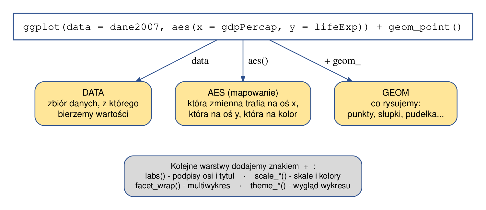



```{webr}
#| setup: true
#| exercise: 
#|  - ex_1
#|  - ex_2

library(gapminder)
library(dplyr)
library(ggplot2)

data('gapminder', package = 'gapminder')
dane2007 <- filter(gapminder, year == 2007)
```

# Wykresy w R

Wizualizacja danych w R: 

-   podstawowa grafika np. `plot(x, y)`, `hist(x)`
-   pakiet `ggplot2`

## Co to jest ggplot2?

-   Pakiet R stworzony przez Hadley Wickham
-   jest implementacją założeń zawartych w książce “Grammar of Graphics” Lelanda Wilkinsona
-   oferuje potężny język graficzny do tworzenia eleganckich i złożonych wykresów.
-   wymagane dane wejściowe to zazwyczaj data.frame
-   wykresy tworzy się funkcją `ggplot()` (w starszych materiałach można spotkać także funkcję `qplot()`, ale od wersji 3.4 pakietu `ggplot2` jest ona wycofywana i nie należy jej już używać)
-   pełna dokumentacja znajduje się na stronie - <https://ggplot2.tidyverse.org/> oraz <https://ggplot2-book.org/>

## Co to jest The Grammar Of Graphics ?

Podstawowa idea: niezależnie określić elementy wykresu i połączyć je w celu stworzenia prawie każdego wykresu jaki chcemy.

Elementy wykresu obejmują:

-   dane (ang. *data*)
-   estetyczne mapowanie (ang. *aesthetic mapping*)
-   obiekty geometryczne (ang. *geometric object*)
-   skale
-   układ współrzędnych
-   faceting

## Elementy wykresów w ggplot2

Wykres tworzony za pomocą pakietu ggplot2 składa się z następujących składowych:

-   **data** - zdefiniowanie zbioru danych, który będzie wyświetlany
-   **aesthetics (aes)** - element, który widzimy (kolor, kształt)
-   **geom** - symbol wyświetlany na wykresie (np. geom_histogram, geom_boxplot, geom_point)
-   **facet** - tworzenie wykresów dla podzbiorów danych

### Estetyczne mapowanie (ang. Aesthetic Mapping)

-   Określane używając funkcji aes()

-   W ggplot aesthetic oznacza “coś co widzimy”. Np:

    -   pozycja na osi x oraz y
    -   kolor
    -   wypełnienie (wewnętrzny kolor obiektu)
    -   kształt (dla obiektów punktowych)
    -   typ linii
    -   rozmiar

Każdy typ geometrii (punkty, linie itp.) akceptuje tylko wybrane elementy (patrz pomoc dla określonych obiektów przestrzennych, np. `?ggplot2::geom_point`)

### Obiekty geometryczne - (ang. Geometic Objects (geom))

Obiekt geometryczny (geom) to symbol jaki wyświetlamy na wykresie: Np:

-   punkty (geom_point)
-   linie (geom_line)
-   określony typ wykresu: geom_boxplot, geom_histogram

Każdy wykres musi mieć określony przynajmniej jeden obiekt geometryczny. Nie ma jednak górnej granicy. Używając znak + można dodawać dowolną ilość obiektów.

Dostępne typy obiektów: `help.search("geom_", package = "ggplot2")`

```{r}
library(ggplot2)
df = data.frame(zmiennaA = c(1:10), 
                zmiennaB = c(3:12),
                grp = c(rep(c("A", "B"), 5)))

ggplot(df, aes(x = zmiennaA, y = zmiennaB, color = grp)) + 
  geom_point(size=2, shape=15)
```

## Budowa wywołania `ggplot()`

Każdy wykres w `ggplot2` powstaje przez połączenie tych samych trzech elementów. Warto zapamiętać ten układ - wszystkie wykresy w kolejnych rozdziałach są jego wariantami.

{width="560"}

Kolejne elementy dokładamy **znakiem `+`**, zawsze w tej samej kolejności: najpierw dane i mapowanie, potem obiekt geometryczny, a na końcu elementy wyglądu (podpisy, skale, motyw). Jeśli wykres nie wychodzi, w pierwszej kolejności sprawdź, czy wszystkie zmienne użyte w `aes()` istnieją w zbiorze danych podanym w `data`.

## Zadania

> Wykonaj wykres rozrzutu przedstawiający zależność między PKB na osobę (`gdpPercap`) a oczekiwaną długością trwania życia (`lifeExp`) dla danych z 2007 roku (obiekt `dane2007`). Wskaż w swoim kodzie, która część odpowiada za **data**, która za **aes**, a która za **geom**.

```{webr}
#| exercise: ex_1

```

:::: {.solution exercise="ex_1"}
::: {.callout-tip title="Solution" collapse="false"}
Rozwiązanie:

``` r
ggplot(data = dane2007, aes(x = gdpPercap, y = lifeExp)) +
  geom_point()
```

-   **data**: `data = dane2007` - zbiór danych,
-   **aes**: `aes(x = gdpPercap, y = lifeExp)` - przypisanie zmiennych do osi,
-   **geom**: `geom_point()` - rysujemy punkty.
:::
::::

> Do wykresu z poprzedniego zadania dodaj kolor punktów zależny od kontynentu. Zastanów się: czy przypisanie koloru należy do `aes()`, czy do `geom_point()`? Sprawdź oba warianty i wyjaśnij różnicę.

```{webr}
#| exercise: ex_2

```

:::: {.solution exercise="ex_2"}
::: {.callout-tip title="Solution" collapse="false"}
Rozwiązanie:

``` r
# kolor ZALEŻNY OD ZMIENNEJ - należy do aes()
ggplot(data = dane2007, aes(x = gdpPercap, y = lifeExp, color = continent)) +
  geom_point()

# kolor STAŁY dla wszystkich punktów - podajemy go w geom_point()
ggplot(data = dane2007, aes(x = gdpPercap, y = lifeExp)) +
  geom_point(color = "red")
```

To jedna z najważniejszych zasad w `ggplot2`: wewnątrz `aes()` umieszczamy to, co ma **zależeć od danych**, a poza `aes()` - to, co ma być **takie samo dla wszystkich obserwacji**. Zapis `geom_point(color = continent)` zakończy się błędem, a `aes(color = "red")` narysuje wszystkie punkty w jednym kolorze i doda mylącą legendę z napisem „red”.
:::
::::
