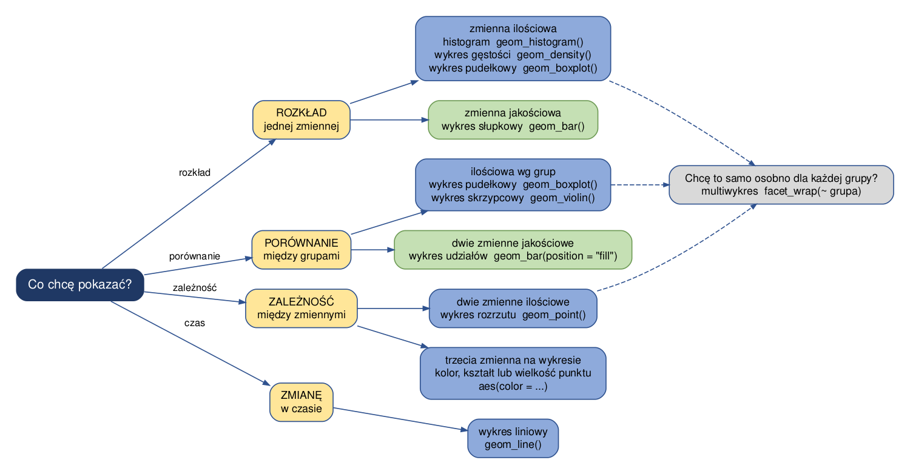
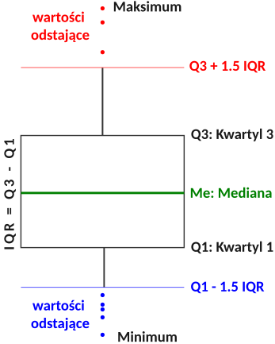



```{webr}
#| setup: true
#| exercise: 
#|  - ex_1
#|  - ex_2
#|  - ex_3
#|  - ex_4
#|  - ex_5
#|  - ex_6
#|  - ex_7
#|  - ex_8
#|  - ex_9
#|  - ex_10
#|  - ex_11
#|  - ex_12
#|  - ex_13
#|  - ex_14
#|  - ex_15

library(gapminder)
library(dplyr)
library(ggplot2)

data('gapminder', package = 'gapminder')
dane2007 <- filter(gapminder, year==2007)
```

# Typy wykresów

## Jaki wykres wybrać?

Wybór wykresu zależy od tego, **co chcemy pokazać** i **jakiego typu są zmienne**. Poniższy schemat prowadzi od pytania do odpowiedniego obiektu geometrycznego.



Niebieskie pola dotyczą zmiennych ilościowych, zielone - jakościowych. Pole szare przypomina, że niemal każdy z tych wykresów można dodatkowo rozbić na podgrupy funkcją `facet_wrap()`.

W tym rozdziale omówione są wszystkie typy wykresów z poniższej tabeli - najpierw te używane najczęściej, a na końcu, w sekcji *Inne typy wykresów*, pozostałe.

| Typ wykresu       | Typ (ang)      | ggplot2                         |
|-------------------|----------------|---------------------------------|
| Histogram         | Histogram      | geom_histogram()                |
| Wykres gęstości   | Density plot   | geom_density()                  |
| Wykres słupkowy   | Bar plot       | geom_bar(), geom_col()          |
| Wykres liniowy    | Line plot      | geom_line()                     |
| Wykres rozrzutu   | Scatter plot   | geom_point()                    |
| Wykres pudełkowy  | Box plot       | geom_boxplot()                  |
| Wykres skrzypcowy | Violin plot    | geom_violin()                   |
| Wykres kropkowy   | Dot plot       | geom_point() + coord_flip()     |
| Heatmapa          | Heatmap        | geom_tile()                     |
| Wykres grzbietowy | Ridgeline plot | ggridges::geom_density_ridges() |
| Dystrybuanta      | CDF plot       | stat_ecdf()                     |
| Wykres udziałów   | Filled bar plot | geom_bar(position = "fill")    |
| Tree map          | Tree map       | treemapify::geom_treemap()      |

```{r}
#| include: false
library(dplyr)
library(gapminder)
library(forcats)
library(ggplot2)
library(ggridges)
library(treemapify)
```

```{r}
data("gapminder", package = "gapminder")
dane2007 <- subset(gapminder, year==2007)
```

## Histogram

-   Graficzny sposób przedstawiania rozkładu liczebności dla wybranej zmiennej.

-   Nazwę *histogram* wprowadził po raz pierwszy Karl Pearson w 1895 roku.

-   Wykres powstaje w dwóch etapach:

    (1) Zakres wartości danych dzielony jest na rozłączne przedziały o równej szerokości,
    (2) Dla każdego przedziału rysowane są słupki o wysokości równej liczbie obserwacji w każdym przedziale.

-   Dobór przedziałów jest istotny. Różne przedziały mogą pokazać różną informację.

-   Pakiet `ggplot2` domyślnie definiuje przedział jako zakres/30. Ustawienia te można zmienić używając parametru \*bins\* (liczba przedziałów) lub \*binwidth\* (szerokość przedziału).

```{r}
#HISTOGRAM
ggplot(dane2007, aes(x = gdpPercap)) + geom_histogram()
```

```{r}
#HISTOGRAM
ggplot(dane2007, aes(x = gdpPercap)) + geom_histogram(bins = 15)
```

```{r}
#HISTOGRAM
ggplot(dane2007, aes(x = gdpPercap)) + geom_histogram(binwidth=10000)
```

> Wykonać histogram dla zmiennej lifeExp dla 2007 roku. Ustawić szerokość przedziałów co 5 lat. Następnie zmień szerokość przedziałów na 1 rok i na 20 lat. Który z trzech histogramów najlepiej pokazuje kształt rozkładu i dlaczego pozostałe dwa są gorsze?

```{webr}
#| exercise: ex_1

```

:::: {.solution exercise="ex_1"}
::: {.callout-tip title="Solution" collapse="false"}
Rozwiązanie:

``` r
ggplot(dane2007, aes(x = lifeExp)) + geom_histogram(binwidth=5)   
```
:::
::::

## Wykres słupkowy

-   wizualizacja danych jakościowych - tj. częstość występowania zmiennej jakościowej (np. liczba państw na danym kontynencie).

```{r}
ggplot(dane2007, aes(x = continent)) + geom_bar()
```

-   wizualizacja danych ilościowych według kategorii - np. PKB na osobę w poszczególnych państwach.

```{r}
gapminder_sel = gapminder |> 
  filter(country %in% c("Poland", "Germany", "Czech Republic", "Slovak Republic") & year == 2007)

ggplot(data = gapminder_sel, aes(x = fct_reorder(as.factor(country), gdpPercap), y = gdpPercap)) +
  geom_col() +
  labs(x = NULL, y = NULL, title = "PKB na osobę (USD, 2007)")
```

-   odwrócenie osi

```{r}
ggplot(data = gapminder_sel, aes(x = fct_reorder(as.factor(country), gdpPercap), y = gdpPercap)) +
  geom_col() +
  labs(x = NULL, y = NULL, title = "PKB na osobę (USD, 2007)") +
  coord_flip()
```

## Wykres liniowy

```{r}
#| message: false
#| warning: false

#Oblicza średnią oczekiwaną długość życia dla poszczególnych lat
library(dplyr)
by_year <- group_by(gapminder, year)
mean_lifeExp_by_year <- summarize(by_year, 
                                  srednia=mean(lifeExp))

#Wykres liniowy
ggplot(data = mean_lifeExp_by_year, aes(x = year, y = srednia)) + geom_line()
```

> Wykonać wykres liniowy pokazujący jak zmieniała się średnia wartość gdpPercap w poszczególnych latach?

```{webr}
#| exercise: ex_2

```

:::: {.solution exercise="ex_2"}
::: {.callout-tip title="Solution" collapse="false"}
Rozwiązanie:

``` r
library(dplyr)
by_year <- group_by(gapminder, year)
mean_gdp_by_year <- summarize(by_year, 
                                  srednia=mean(gdpPercap))

#Wykres liniowy
ggplot(data = mean_gdp_by_year, aes(x = year, y = srednia)) + geom_line()  
```
:::
::::

## Wykres rozrzutu

-   stosowany do pokazania zależności między zmiennymi

```{r}
ggplot(data=dane2007, aes(x=gdpPercap, y=lifeExp)) + geom_point()
```

> Zwizualizować zależność między długością trwania życia a liczbą ludności w 2007 roku.

```{webr}
#| exercise: ex_3

```

:::: {.solution exercise="ex_3"}
::: {.callout-tip title="Solution" collapse="false"}
Rozwiązanie:

``` r
ggplot(data=dane2007, aes(x=lifeExp, y=pop)) + geom_point()   
```
:::
::::

> Wykonać wykres zależności między zmiennymi lifeExp oraz gdpPercap wykorzystując dane gapminder.

```{webr}
#| exercise: ex_4

```

:::: {.solution exercise="ex_4"}
::: {.callout-tip title="Solution" collapse="false"}
Rozwiązanie:

``` r
ggplot(data=gapminder, aes(x=gdpPercap, y=lifeExp)) + geom_point() 
```
:::
::::

## Wizualizacja statystyk opisowych

### Wykres pudełkowy

Obrazuje podstawowe statystyki opisowe oraz wartości odstające :

-   dolny kwartyl (Q1) - dolna krawędź pudełka
-   mediana - linia środkowa
-   górny kwartyl (Q3) - górna krawędź pudełka
-   wąsy (linie pionowe) sięgają do najbardziej skrajnej obserwacji, która **mieści się** w odległości 1,5\*IQR od krawędzi pudełka: górny wąs w górę od Q3, dolny w dół od Q1. Wąs jest więc zwykle **krótszy** niż 1,5\*IQR, a jego długość zależy od danych.
-   punkty poza wąsami oznaczają wartości odstające, tj. takie, które leżą dalej niż 1,5\*IQR od krawędzi pudełka



```{r}
ggplot(data = gapminder, aes(x = year, y = lifeExp, group = year)) + geom_boxplot()
```

> Wykonaj wykres pudełkowy w podziale na lata dla zmiennej gdpPercap.

```{webr}
#| exercise: ex_5

```

:::: {.solution exercise="ex_5"}
::: {.callout-tip title="Solution" collapse="false"}
Rozwiązanie:

``` r
ggplot(data = gapminder, aes(x = year, y = gdpPercap, group = year)) + geom_boxplot()  
```
:::
::::

> Wykonaj wykres pudełkowy w podziale na kontynenty dla zmiennej gdpPercap. Wykorzystaj zbiór danych gapminder. Na którym kontynencie zróżnicowanie PKB jest największe? Co oznaczają pojedyncze punkty widoczne powyżej wąsów?

```{webr}
#| exercise: ex_6

```

:::: {.solution exercise="ex_6"}
::: {.callout-tip title="Solution" collapse="false"}
Rozwiązanie:

``` r
ggplot(data = gapminder, aes(x = continent, y = gdpPercap)) + geom_boxplot() 
```
:::
::::

## `stat_summary`

Funkcja `stat_summary` pozwala na wizualizację dowolnych statystyk opisowych bez konieczności wcześniejszego obliczania ich z wykorzystaniem np. funkcji `dplyr::summarize()`.

-   **wizualizacja średnich wartości zmiennej lifeExp w poszczególnych latach**

```{r}
ggplot(data = gapminder, aes(x = year, y = lifeExp)) + 
  stat_summary(fun = "mean", geom = "line")
```

> Wykonaj wykres pokazujący jak zmieniała się wartość średnia PKB na osobę (zmienna gdpPercap) w latach 1952-2007.

```{webr}
#| exercise: ex_7

```

:::: {.solution exercise="ex_7"}
::: {.callout-tip title="Solution" collapse="false"}
Rozwiązanie:

``` r
ggplot(data = gapminder, aes(x = year, y = gdpPercap)) + 
  stat_summary(fun = "mean", geom = "line")    
```
:::
::::

-   **wizualizacja mediany dla zmiennej lifeExp w poszczególnych latach**

```{r}
ggplot(data = gapminder, aes(x = year, y = lifeExp)) + 
  stat_summary(fun = "median", geom = "line")
```

-   **wizualizacja wartości średniej (punkt), oraz minimalnej i maksymalnej**

obiekt geometryczny *pointrange* wymaga zdefiniowania 3 funkcji: określającej położenie punktu (argument *fun*), oraz "wąsów" (argumenty *fun.min* oraz *fun.max*)

```{r}
ggplot(data = gapminder, aes(x = year, y = lifeExp)) +
  stat_summary(fun = mean,
               geom = "pointrange",
               fun.min = min,
               fun.max = max)
```

> Wykonaj wykres pokazujący jak zmieniała się wartość średnia, minimalna oraz maksymalna PKB na osobę (zmienna gdpPercap) w latach 1952-2007.

```{webr}
#| exercise: ex_8

```

:::: {.solution exercise="ex_8"}
::: {.callout-tip title="Solution" collapse="false"}
Rozwiązanie:

``` r
ggplot(data = gapminder, aes(x = year, y = gdpPercap)) +
  stat_summary(fun = mean,
               geom = "pointrange",
               fun.min = min,
               fun.max = max)
```
:::
::::

-   **wizualizacja wartości średnich +/- odchylenie standardowe**

```{r}
ggplot(data = gapminder, aes(x = year, y = lifeExp)) +
  stat_summary(fun = mean,
               geom = "pointrange",
               fun.max = function(x) mean(x) + sd(x),
               fun.min = function(x) mean(x) - sd(x))
```

> Wykonaj wykres pokazujący wartości średnie $\pm$ odchylenie standardowe dla zmiennej gdpPercap.

```{webr}
#| exercise: ex_9

```

:::: {.solution exercise="ex_9"}
::: {.callout-tip title="Solution" collapse="false"}
Rozwiązanie:

``` r
ggplot(data = gapminder, aes(x = year, y = gdpPercap)) +
  stat_summary(fun = mean,
               geom = "pointrange",
               fun.max = function(x) mean(x) + sd(x),
               fun.min = function(x) mean(x) - sd(x))  
```
:::
::::

-   **przebieg minimalnych i maksymalnych wartości lifeExp w latach 1952 - 2007**

```{r}
ggplot(gapminder, aes(x = year, y = lifeExp)) +
  stat_summary(fun = mean, geom = "ribbon", fill = "blue", 
               fun.min = min, fun.max = max)
```

## Warstwy - łączenie różnych typów wykresów

Pakiet `ggplot2` pozwala także na łączenie ze sobą różnych typów wykresów.

-   **wizualizacja średniej zmienności oczekiwanej długości trwania życia w latach 1952-2007**

```{r}
#| message: false
#| warning: false

#Oblicza średnią oczekiwaną długość życia dla poszczególnych lat
library(dplyr)
by_year <- group_by(gapminder, year)
mean_lifeExp_by_year <- summarize(by_year, 
                                  srednia=mean(lifeExp))

#Wykres liniowy
ggplot(data = mean_lifeExp_by_year, aes(x = year, y = srednia)) + 
  geom_line() + 
  geom_point()
```

> Zwizualizuj średnią zmienność PKB na osobę (zmienna gdpPercap) w latach 1952-2007

```{webr}
#| exercise: ex_10

```

:::: {.solution exercise="ex_10"}
::: {.callout-tip title="Solution" collapse="false"}
Rozwiązanie:

``` r
by_year <- group_by(gapminder, year)
mean_gdp_by_year <- summarize(by_year, 
                                  srednia=mean(gdpPercap))

#Wykres liniowy
ggplot(data = mean_gdp_by_year, aes(x = year, y = srednia)) + 
  geom_line() + 
  geom_point()    
```
:::
::::

-   **dodanie wartości średniej (czerwony punkt) do wykresu pudełkowego**

```{r}
ggplot(data = dane2007, aes(x = continent, y = lifeExp)) + 
  geom_boxplot() + 
  stat_summary(fun =mean, geom="point", shape=20, size=5, color="red", fill="red") 
```

> Wykonaj wykres pudełkowy dla zmiennej gdpPercap w podziale na lata oraz dodaj do wykresu punkt oznaczający średnią wartość.

```{webr}
#| exercise: ex_11

```

:::: {.solution exercise="ex_11"}
::: {.callout-tip title="Solution" collapse="false"}
Rozwiązanie:

``` r
ggplot(data = gapminder, aes(x = year, y = gdpPercap, group = year)) + 
geom_boxplot() + 
stat_summary(fun =mean, geom="point", shape=20, size=5, color="red", fill="red") 
```
:::
::::

-   **dodanie wartości obserwacji do wykresu pudełkowego**

```{r}
ggplot(data = dane2007, aes(x = continent, y = lifeExp)) +
  geom_boxplot() +
  geom_point()
```

```{r}
ggplot(data = dane2007, aes(x = continent, y = lifeExp)) +
  geom_boxplot() +
  geom_jitter()
```

> Wykonaj wykres pudełkowy dla zmiennej lifeExp w podziale na lata. Dodaj do wykresu punkty oznaczające poszczególne obserwacje.

```{webr}
#| exercise: ex_12

```

:::: {.solution exercise="ex_12"}
::: {.callout-tip title="Solution" collapse="false"}
Rozwiązanie:

``` r
ggplot(data = gapminder, aes(x = year, y = lifeExp, group = year)) + 
  geom_boxplot() +
  geom_jitter()
```
:::
::::

-   **wizualizacja statystyk opisowych długości trwania życia (zmienna lifeExp) w Europie w latach 1952-2007**

```{r}
gapminder |> 
  filter(continent == 'Europe') |> 
  ggplot(aes(x = year, y = lifeExp)) +
  stat_summary(fun = mean, geom = "ribbon", alpha = .3, fill = "#1E90FF", fun.min = min, fun.max = max) +
  stat_summary(fun = mean, geom = "pointrange", fun.min = min, fun.max = max, color = "darkblue") +
  stat_summary(fun = max, geom = "line", color = "black") +
  stat_summary(fun = min, geom = "line", color = "black")
```

> Zwizualizuj statystyki opisowe (min, max, średnią) PKB na osobę (zmienna gdpPercap) w Azji w latach 1952-2007

```{webr}
#| exercise: ex_13

```

:::: {.solution exercise="ex_13"}
::: {.callout-tip title="Solution" collapse="false"}
Rozwiązanie:

``` r
gapminder |> 
  filter(continent == 'Asia') |> 
  ggplot(aes(x = year, y = gdpPercap)) +
  stat_summary(fun = mean, geom = "ribbon", alpha = .3, fill = "#1E90FF", fun.min = min, fun.max = max) +
  stat_summary(fun = mean, geom = "pointrange", fun.min = min, fun.max = max, color = "darkblue") +
  stat_summary(fun = max, geom = "line", color = "black") +
  stat_summary(fun = min, geom = "line", color = "black")  
```
:::
::::

### Wizualizacja danych w grupach

Wizualizacja danych w podziale na grupy może być wykonana m.in za pomocą wykresu pudełkowego (*geom_boxplot()*), wykresu skrzypcowego (*geom_violin()*), lub za pomocą tzw. multiwykresów (*facet_grid()*)

```{r}
ggplot(data = dane2007, aes(x = continent, y = lifeExp)) +
  geom_boxplot()
```

```{r}
ggplot(data = dane2007, aes(x = continent, y = lifeExp)) +
  geom_violin()
```

> Wykonaj wykres skrzypcowy dla zmiennej gdpPercap w podziale na kontynenty.

```{webr}
#| exercise: ex_14

```

:::: {.solution exercise="ex_14"}
::: {.callout-tip title="Solution" collapse="false"}
Rozwiązanie:

``` r
ggplot(data = gapminder, aes(x = continent, y = gdpPercap)) +
  geom_violin() 
```
:::
::::

## Multiwykresy

```{r}
ggplot(data = dane2007, aes(x = gdpPercap, y = lifeExp)) +
  geom_point() +
  facet_wrap(~continent)
```

```{r}
ggplot(data = dane2007, aes(x = lifeExp)) +
  geom_histogram() +
  facet_wrap(~continent)
```

> Wykonaj multiwykres przedstawiający rozkład wartości zmiennej gdpPercap (na histogramie) w podziale na kontynenty. Porównaj go z pojedynczym histogramem dla wszystkich krajów łącznie - jaką informację widać na multiwykresie, a jaką traci się na wykresie zbiorczym?

```{webr}
#| exercise: ex_15

```

:::: {.solution exercise="ex_15"}
::: {.callout-tip title="Solution" collapse="false"}
Rozwiązanie:

``` r
ggplot(data = dane2007, aes(x = gdpPercap)) +
  geom_histogram() +
  facet_wrap(~continent)  
```
:::
::::

## Zapisywanie wykresów

```{r}
p <- ggplot(data = dane2007, aes(x = continent, y = lifeExp)) + 
  geom_boxplot() + 
  labs(x = "Kontynent", y = "Oczekiwana długość trwania życia")
```

```{r}
#| message: false
#| warning: false
#Wykresy zapisujemy do osobnego folderu - trzeba go wcześniej utworzyć
dir.create("out", showWarnings = FALSE)

ggsave(filename = "out/Wykres.pdf", plot = p)
ggsave(filename = "out/Wykres.png", plot = p, dpi = 300)
```

## Inne typy wykresów

Wykresy omówione powyżej wystarczają do wykonania zadań z ćwiczeń. Typy zebrane poniżej przydają się przede wszystkim przy **tworzeniu raportów i projektów**, gdzie dobrze dobrany, nietypowy wykres potrafi pokazać strukturę danych lepiej niż histogram czy wykres słupkowy. Warto je przejrzeć i wiedzieć, że istnieją - a sięgnąć po nie wtedy, gdy standardowy wykres nie oddaje tego, co chcemy przekazać.

| Typ wykresu | Kiedy się przydaje |
|-------------|--------------------|
| wykres kropkowy | ranking kilkunastu kategorii - czytelniejszy niż długi wykres słupkowy |
| heatmapa | wartość zmiennej dla dwóch wymiarów naraz (np. kraj i rok) |
| wykres gęstości | porównanie kształtu rozkładu w kilku grupach na jednym rysunku |
| wykres grzbietowy | wiele rozkładów ułożonych jeden pod drugim (np. rozkład w kolejnych latach) |
| dystrybuanta | odpowiedź na pytanie „jaki odsetek obserwacji nie przekracza wartości X” |
| wykres obszarowy | zmiana wielkości w czasie, gdy ważny jest też poziom bezwzględny |
| wykres kołowy | udział kilku kategorii w całości; przy większej liczbie kategorii nieczytelny |
| wykres skumulowany | zmiana struktury w czasie |
| wykres udziałów | porównanie struktury między grupami, niezależnie od ich liczebności |
| tree map | struktura zagnieżdżona (np. kraje w obrębie kontynentów) |

### Wykresy kropkowe

```{r}
gapminder_am2007 = filter(gapminder, continent == "Americas", year == 2007)
ggplot(gapminder_am2007, aes(fct_reorder(as.factor(country), lifeExp), lifeExp)) + 
  geom_point(size = 5, col = "#0000a1") +
  coord_flip() +
  labs(x = NULL, y = NULL, title = "Oczekiwana długość życia", 
       subtitle = "Kontynent: Ameryka, 2007")
```

### Heatmapy

```{r}
gapminder_am = filter(gapminder, continent == "Americas")
ggplot(gapminder_am, aes(year, fct_reorder(as.factor(country), lifeExp, tail, n = 1, .desc = FALSE),
                         fill = lifeExp)) +
  geom_tile() +
  labs(y = NULL, x = NULL, title = "Oczekiwana długość życia", 
  subtitle = "Kontynent: Ameryka", fill = NULL)
```

### Wykresy gęstości

-   Dla jednej zmiennej

```{r}
 ggplot(data = dane2007, aes(x = lifeExp)) +
  geom_density() +
  labs(x = NULL, y = "Udział krajów", subtitle = "Oczekiwana długość życia (2007)")
```

-   Dla dwóch zmiennych

```{r}
gapminder19572007 = filter(gapminder, year %in% c(1957, 2007))
ggplot(data = gapminder19572007, aes(x = lifeExp, fill = as.factor(year))) +
  geom_density(alpha = 0.3) +
  labs(x = NULL, fill = "Rok:", y = "Udział krajów",
       subtitle = "Oczekiwana długość życia") +
  theme(legend.position = "bottom")
```

### Wykresy grzbietowe

```{r}
library(ggridges)
ggplot(data = gapminder, aes(x = lifeExp, y = year, group = year)) +
  geom_density_ridges(alpha = 0.2) + 
  labs(y = NULL, title = "Oczekiwana długość życia", x = NULL) +
  scale_x_continuous(breaks = seq(20, 80, 20)) +
  scale_y_continuous(breaks = seq(1950, 2010, 10))
```

### Dystrybuanta (ang. *cumulative distribution function - CDF*)

```{r}
ggplot(data = dane2007, aes(lifeExp)) +
  stat_ecdf() + 
  labs(y = "Udział", subtitle = "Oczekiwana długość życia (2007)", x = NULL)
```

### Wykresy liniowe z wypełnionym obszarem

```{r}
gapminder_pol = gapminder |> filter(country == 'Poland')
ggplot(gapminder_pol, aes(year, gdpPercap)) +
  geom_line() +
  geom_area() +
  labs(x = NULL, y = NULL, title = "Polska", subtitle = "PKB na osobę (USD, 2007)")
```

### Wykresy kołowe

```{r}
gapminder2007_unique = gapminder |>
  filter(year == 2007) |> 
  group_by(continent) |> 
  summarize(liczba = n())
```

```{r}
ggplot(data = gapminder2007_unique, aes(y = "", x = liczba, fill = continent)) +
  geom_bar(stat = "identity") +
  coord_polar("x") +
  theme_void() + 
  geom_text(aes(label = continent), position = position_stack(vjust = 0.5), size = 8) + 
  theme(legend.position = "none")
```

### Wykresy słupkowe - skumulowane

```{r}
ggplot(data = gapminder2007_unique, aes(y = "", 
                                 x = liczba,
                                 fill = continent)) +
  geom_bar(stat = "identity", position = "stack") +
  coord_flip() 

```

-   wykres skumulowany słupkowy dla 3 zmiennych

```{r}
gapminder5 = mutate(gapminder, 
                    gdpPercap_group = cut_number(gdpPercap, 3, 
                                                 labels = c("niska", "średnia", "wysoka")))
gapminder5_sum = count(gapminder5, gdpPercap_group, year)

ggplot(gapminder5_sum, aes(year, n, gdpPercap_group, fill = fct_rev(gdpPercap_group))) +
  geom_col(position = "stack") +
  labs(x = NULL, y = "Liczba krajów", fill = NULL, title = "Grupa zamożności")
```

### Wykresy udziałów

Argument `position = "fill"` w funkcji `geom_bar()` sprawia, że wszystkie słupki mają jednakową
wysokość odpowiadającą 100%, a kolory pokazują **udział** poszczególnych kategorii wewnątrz każdej
grupy. Pozwala to porównywać strukturę grup niezależnie od ich liczebności.

```{r}
gapminder5 = mutate(gapminder,
                    gdpPercap_group = cut_number(gdpPercap, 3,
                                                 labels = c("niska", "średnia", "wysoka")))
```

```{r}
#| message: false
#| warning: false
gapminder5_2007 = filter(gapminder5, year == 2007)
ggplot(data = gapminder5_2007, aes(x = continent, fill = gdpPercap_group)) +
  geom_bar(position = "fill") +
  labs(x = NULL, y = "Udział krajów", fill = "Grupa zamożności")
```

Dla porównania ten sam wykres bez argumentu `position = "fill"` pokazuje liczby bezwzględne -
widać wtedy różnice w liczbie krajów na kontynentach, ale trudniej porównać strukturę grup.

```{r}
#| message: false
#| warning: false
ggplot(data = gapminder5_2007, aes(x = continent, fill = gdpPercap_group)) +
  geom_bar() +
  labs(x = NULL, y = "Liczba krajów", fill = "Grupa zamożności")
```

### Tree map

```{r}
library(treemapify)
ggplot(dane2007, aes(area = pop, fill = lifeExp, 
                          subgroup = continent, label = country)) +
  geom_treemap(col = "white") + 
  geom_treemap_subgroup_border() +
  geom_treemap_subgroup_text(place = "centre", grow = TRUE, alpha = 0.5, colour =
                             "black", fontface = "italic", min.size = 0) +
  geom_treemap_text(colour = "white", place = "topleft", reflow = TRUE, alpha = 0.75) +
  # guides(fill = "none") + 
  labs(fill = NULL, title = "Oczekiwana długość życia (2007)")
```
