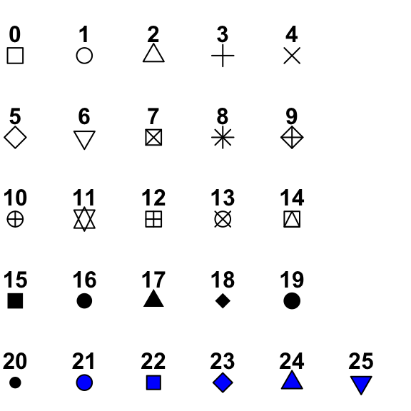



```{webr}
#| setup: true
#| exercise: 
#|  - ex_1
#|  - ex_2
#|  - ex_3
#|  - ex_4
#|  - ex_5
#|  - ex_6
#|  - ex_7
#|  - ex_8
#|  - ex_9

library(gapminder)
library(dplyr)
library(ggplot2)
library(colorspace)
library(RColorBrewer)

data('gapminder', package = 'gapminder')
dane2007 <- filter(gapminder, year==2007)
```

# Formatowanie wykresów

```{r}
library(ggplot2)
```

```{r}
data("gapminder", package = "gapminder")
dane2007 <- subset(gapminder, year==2007)
```

Elementy formatowania wykresów:

-   etykiety osi
-   tytuł wykresu
-   zmiana koloru, kształtu oraz wielkości punktów,
-   zmiana koloru, typu oraz grubości linii,

## Zmiana koloru, kształtu oraz wielkości punktów

W R sposób wyświetlania punktu (kształt) kodowany jest za pomocą numeru.

{width="220"}

```{r}
ggplot(data=dane2007, aes(x=gdpPercap, y=lifeExp)) +
  geom_point(size = 3, color = "red", shape = 15)
```

> Wyświetl wykres zależności zmiennych lifeExp od gdpPercap używając kształtu wypełnionego trójkąta o kolorze zielonym i wielkości 2.

```{webr}
#| exercise: ex_1

```

:::: {.solution exercise="ex_1"}
::: {.callout-tip title="Solution" collapse="false"}
Rozwiązanie:

``` r
ggplot(data=gapminder, aes(x=gdpPercap, y=lifeExp)) +
  geom_point(size = 2, color = "green", shape = 17) 
```
:::
::::

## Zmiana koloru oraz grubości linii

```{r}
ggplot(data = gapminder, aes(x = year, y = lifeExp)) + 
  stat_summary(fun = "mean", geom = "line", 
               color = "orange", linewidth = 2, linetype = "dotted" )
```

> Zmień kolor linii na zielony, typ: linia kreskowa, grubość (argument `linewidth`): 3

```{webr}
#| exercise: ex_2

```

:::: {.solution exercise="ex_2"}
::: {.callout-tip title="Solution" collapse="false"}
Rozwiązanie:

``` r
ggplot(data = gapminder, aes(x = year, y = lifeExp)) + 
  stat_summary(fun = "mean", geom = "line", 
               color = "darkgreen", linewidth = 3, linetype = "dashed" ) 
```
:::
::::

## Modyfikacja wykresu względem wartości zmiennej

Wykresy mogą być modyfikowane na podstawie wartości zmiennej. W tym celu można posłużyć się atrybutami:

-   kolor (*color*)
-   kształt (*shape*)
-   wielkość (*size*)

```{r}
ggplot(data=dane2007, aes(x=gdpPercap, y=lifeExp, shape = continent)) + 
  geom_point()
```

```{r}
ggplot(data=dane2007, aes(x=gdpPercap, y=lifeExp, color = continent)) + 
  geom_point()
```

```{r}
ggplot(data=dane2007, aes(x=gdpPercap, y=lifeExp, color = pop)) + 
  geom_point()
```

```{r}
ggplot(data=dane2007, aes(x=gdpPercap, y=lifeExp, size = pop)) + geom_point()
```

> Zwizualizować zależność między długością trwania życia a liczbą ludności w Azji w 1952 roku. Wykorzystaj zmienną gdpPercap do przypisania kolorów do poszczególnych punktów.

```{webr}
#| exercise: ex_3

```

:::: {.solution exercise="ex_3"}
::: {.callout-tip title="Solution" collapse="false"}
Rozwiązanie:

``` r
gapminder |> 
  filter(continent == 'Asia' & year == 1952) |> 
  ggplot(aes(x=lifeExp, y=pop, color = gdpPercap)) + 
  geom_point()
```
:::
::::

## Tytuł wykresu

Tytuł wykresu można dodać używając *ggtitle* lub argumentu *title* wewnątrz *labs*

```{r}
#| eval: false
ggplot(data=dane2007, aes(x=gdpPercap, y=lifeExp)) +
  geom_point() + 
  labs(x = "PKB na osobę (USD)", 
       y = "Oczekiwana dalsza długość trwania życia") + 
  ggtitle("Zależność między oczekiwaną długością trwania życia, a PKB w 2007 roku")
```

```{r}
ggplot(data=dane2007, aes(x=gdpPercap, y=lifeExp)) +
  geom_point() + 
  labs(x = "PKB na osobę (USD)", 
       y = "Oczekiwana dalsza długość trwania życia", 
       title = "Zależność między oczekiwaną długością trwania życia, a PKB w 2007 roku")
```

> Zwizualizować zależność między długością trwania życia a PKB używając danych z Europy i Azji. Wykorzystaj zmienną continent do przypisania kolorów do poszczególnych punktów. Dodaj odpowiedni tytuł do wykresu oraz podpisy osi. Czy po dodaniu koloru widać różnicę między kontynentami? Jak opisałbyś ją jednym zdaniem?

```{webr}
#| exercise: ex_4

```

:::: {.solution exercise="ex_4"}
::: {.callout-tip title="Solution" collapse="false"}
Rozwiązanie:

``` r
gapminder |> 
  filter(continent %in% c('Europe', 'Asia')) |> 
  ggplot(aes(x=gdpPercap, y=lifeExp, color = continent)) + 
  geom_point() + 
  labs(x = "PKB na osobę (USD)", 
       y = "Oczekiwana dalsza długość trwania życia", 
       title = "Zależność między oczekiwaną długością trwania życia, a PKB w Europie i Azji")
```
:::
::::

## Formatowanie osi

### Etykiety osi

Argument *labs* pozwala na dodanie do wykresów etykiet osi oraz tytułu.

```{r}
ggplot(data=dane2007, aes(x=gdpPercap, y=lifeExp)) +
  geom_point() + 
  labs(x = "PKB na osobę (USD)", y = "Oczekiwana dalsza długość trwania życia")
```

### Zakres

```{r}
#| message: false 
#| warning: false
ggplot(data=dane2007, aes(x=gdpPercap, y=lifeExp)) +
  geom_point() + 
  labs(x = "PKB na osobę (USD)", y = "Oczekiwana dalsza długość trwania życia") + 
  lims(x = c(0, 10000))
```

> Zwizualizować zależność między długością trwania życia a PKB w Azji w 1952 i 2007 roku. Wykorzystaj zmienną year do przypisania kolorów do poszczególnych punktów. Dodaj tytuł do wykresu, etykiety osi. Ogranicz zakres PKB do 60000

```{webr}
#| exercise: ex_5

```

:::: {.hint exercise="ex_5"}
::: {.callout-note collapse="false"}
## Hint

Zamień zmienną year na factor, aby przypisać kolor na podstawie roku 1952 i 2007. color = as.factor(year)
:::
::::

:::: {.solution exercise="ex_5"}
::: {.callout-tip title="Solution" collapse="false"}
Rozwiązanie:

``` r
gapminder |> 
  filter(continent == 'Asia' & year %in% c(1952, 2007)) |> 
  ggplot(aes(x=lifeExp, y=gdpPercap, color = as.factor(year))) + 
  geom_point() + 
  labs(x = "Oczekiwana dalsza długość trwania życia", 
       y = "PKB na osobę (USD)",
       title = "Zależność między oczekiwaną długością trwania życia a PKB w Azji w 1952 i 2007 roku") + 
  lims(y = c(0, 60000))
  
```
:::
::::

### Skale

```{r}
ggplot(data=dane2007, aes(x=gdpPercap, y=lifeExp)) +
  geom_point() + 
  scale_x_continuous(name = "PKB na osobę w USD", 
                     breaks = seq(0, 50000, 5000)) + 
  scale_y_continuous(name = "Oczekiwana długość trwania życia", 
                     limits = c(0, 100),
                     breaks = seq(0, 100, 20))
```

```{r}
ggplot(data=dane2007, aes(x = continent, y = lifeExp)) +
  geom_boxplot() + 
  labs(y = "Oczekiwana długość trwania życia") + 
  scale_x_discrete(name = "Kontynenty", 
                   labels = c(
                     "Africa" = "Afryka", 
                     "Americas" = "Ameryka Płn. i Płd.", 
                     "Asia" = "Azja", 
                     "Europe" = "Europa", 
                     "Oceania" = "Australia i Oceania"))
```

### Skala logarytmiczna

```{r}
ggplot(data = dane2007, aes(x = pop, y = lifeExp)) +
  geom_point() +
  labs(x = "Liczba ludności", y = "Oczekiwana długość trwania życia") + 
  scale_x_log10()
```

### Odwrócenie osi

```{r}
ggplot(data = dane2007, aes(x = continent)) +
  geom_bar() +
  coord_flip()
```

### Sortowanie

```{r}
library(forcats)
ggplot(data =dane2007, aes(x = fct_infreq(continent))) +
  geom_bar()
```

```{r}
ggplot(data = dane2007, aes(x = fct_reorder(continent, lifeExp, median), y = lifeExp)) +
  geom_boxplot()
```

## Skale kolorystyczne

### Skale kolorystyczne dla zmiennej jakościowej

Więcej: https://sjspielman.github.io/introverse/articles/color_fill_scales.html

-   `scale_color_manual` oraz `scale_fill_manual` pozwala na samodzielne zdefiniowanie kolorów. Można także przypisać wektor z nazwami kategorii - wtedy kolor zostanie przypisany do danej kategorii.

```{r}
ggplot(data=dane2007, aes(x=gdpPercap, y=lifeExp, color = continent)) +
  geom_point() + 
  labs(x = "PKB na osobę (USD)", y = "Oczekiwana dalsza długość trwania życia") + 
  scale_color_manual(values = c("orange", "darkgreen", "lightgreen","blue", "purple"))
```

```{r}
ggplot(data=dane2007, aes(x=gdpPercap, y=lifeExp, color = continent)) +
  geom_point() + 
  labs(x = "PKB na osobę (USD)", y = "Oczekiwana dalsza długość trwania życia") + 
  scale_color_manual(values = c("Africa" = "orange", 
                                "Americas" = "red",
                                "Asia" = "blue",
                                "Europe" = "purple",
                                "Oceania" = "green"))
```

```{r}
ggplot(data=dane2007, aes(x = continent, y = lifeExp, fill = continent)) +
  geom_boxplot() + 
  labs(x = "Kontynent", y = "Oczekiwana długość trwania życia") + 
  scale_fill_manual(values = c("blue", "orange", "magenta", "yellow", "green"))
```

> Zwizualizować zależność między długością trwania życia a PKB w Azji w 1952 i 2007 roku. Wykorzystaj zmienną year do przypisania kolorów do poszczególnych punktów. Przypisz kolor pomarańczowy do roku 1952 oraz kolor granatowy do roku 2007. Dodaj tytuł do wykresu, etykiety osi.

```{webr}
#| exercise: ex_6

```

:::: {.solution exercise="ex_6"}
::: {.callout-tip title="Solution" collapse="false"}
Rozwiązanie:

``` r
gapminder |> 
  filter(continent == 'Asia' & year %in% c(1952, 2007)) |> 
  ggplot(aes(x=lifeExp, y=gdpPercap, color = as.factor(year))) + 
  geom_point() + 
  labs(x = "Oczekiwana dalsza długość trwania życia", 
       y = "PKB na osobę (USD)",
       title = "Zależność między oczekiwaną długością trwania życia a PKB w Azji w 1952 i 2007 roku") + 
  scale_color_manual(values = c("1952" = "orange", 
                                "2007" = "blue"))
  
```
:::
::::

-   `scale_color_brewer` oraz `scale_fill_brewer` pozwalają na wykorzystanie jednej z palet dostarczanych przez pakiet `RColorBrewer`. Zestawienie wszystkich dostępnych palet wyświetla funkcja `RColorBrewer::display.brewer.all()`.

```{r}
#| eval: false
RColorBrewer::display.brewer.all()
```

```{r}
library(RColorBrewer)
ggplot(data=dane2007, aes(x=gdpPercap, y=lifeExp, color = continent)) +
  geom_point() + 
  labs(x = "PKB na osobę (USD)", y = "Oczekiwana dalsza długość trwania życia") + 
  scale_color_brewer(palette = "Set1")
```

```{r}
ggplot(data=dane2007, aes(x = continent, y = lifeExp, fill = continent)) +
  geom_boxplot() + 
  labs(x = "Kontynent", y = "Oczekiwana długość trwania życia") + 
  scale_fill_brewer(palette = "Set1")
```

```{r}
ggplot(data=dane2007, aes(x = continent, y = lifeExp, fill = continent)) +
  geom_boxplot() + 
  labs(x = "Kontynent", y = "Oczekiwana długość trwania życia") + 
  scale_fill_brewer(palette = "YlGn", direction = -1)
```

-   `scale_color_discrete_qualitative` oraz `scale_fill_discrete_qualitative` z pakietu `colorspace` (https://colorspace.r-forge.r-project.org/articles/ggplot2_color_scales.html)

```{r}
library(colorspace)
ggplot(data = dane2007, aes(x = gdpPercap, y = lifeExp, color = continent)) +
  geom_point() +
  scale_color_discrete_qualitative(palette = "Dynamic")
```

```{r}
ggplot(data=dane2007, aes(x = continent, y = lifeExp, fill = continent)) +
  geom_boxplot() + 
  labs(x = "Kontynent", y = "Oczekiwana długość trwania życia") + 
  scale_fill_discrete_qualitative(palette = "Harmonic")
```

> Wykonaj wykres pudełkowy dla zmiennej gdpPercap względem lat. Pokoloruj pudełka, podpisz osie oraz dodaj tytuł do wykresu.

```{webr}
#| exercise: ex_7

```

:::: {.solution exercise="ex_7"}
::: {.callout-tip title="Solution" collapse="false"}
Rozwiązanie:

``` r
ggplot(data = gapminder, aes(x = factor(year), y = gdpPercap, fill = factor(year))) +
  geom_boxplot() + 
  labs(
    x = "Rok",
    y = "PKB na osobę (USD)",
    title = "Wartość PKB w latach 1952–2007"
  ) + 
  scale_fill_brewer(palette = "Set3")
```
:::
::::

### Skale kolorystyczne dla zmiennej ilościowej

-   `scale_colour_gradient`

```{r}
ggplot(data=dane2007, aes(x=gdpPercap, y=lifeExp, color = pop)) +
  geom_point() + 
  labs(x = "PKB na osobę (USD)", y = "Oczekiwana dalsza długość trwania życia", color = "Liczba ludności") + 
  scale_colour_gradient(low = "orange", high = "brown")
```

-   `scale_color_continuous_sequential` z pakietu `colorspace`

```{r}
ggplot(data=dane2007, aes(x=gdpPercap, y=lifeExp, color = pop)) +
  geom_point() + 
  labs(x = "PKB na osobę (USD)", y = "Oczekiwana dalsza długość trwania życia") + 
   scale_color_continuous_sequential(palette = "YlOrRd")
```

```{r}
ggplot(data =dane2007, aes(x = gdpPercap, y = lifeExp, color = pop)) +
  geom_point() +
    labs(x = "PKB na osobę (USD)", y = "Oczekiwana dalsza długość trwania życia", color = "Liczba ludności") + 
  scale_color_continuous_sequential(trans = "log10", labels = scales::label_comma(), palette = "YlOrRd")
```

> Wykonaj wykres ilustrujący zależność między PKB na osobę, a długością trwania życia. Pokoloruj punkty względem zmiennej pop. Użyj dowolnej palety. Czy kolor dobrze pokazuje zróżnicowanie liczby ludności? Jeśli nie - co można zrobić, żeby wykres stał się czytelniejszy (podpowiedź: zobacz przykład ze skalą logarytmiczną powyżej)?

```{webr}
#| exercise: ex_8

```

:::: {.solution exercise="ex_8"}
::: {.callout-tip title="Solution" collapse="false"}
Rozwiązanie:

``` r
ggplot(data=dane2007, aes(x=gdpPercap, y=lifeExp, color = pop)) +
  geom_point() + 
  labs(x = "PKB na osobę (USD)", y = "Oczekiwana dalsza długość trwania życia") + 
   scale_color_continuous_sequential(palette = "Greens")
```
:::
::::

## Tekst na wykresach

```{r}
ggplot(data = dane2007, aes(x = gdpPercap, y = lifeExp, color = continent)) +
  geom_point() +
  geom_text(aes(label = country), check_overlap = TRUE)
```

```{r}
library(ggrepel)
ggplot(data = dane2007, aes(x = gdpPercap, y = lifeExp, color = continent)) +
  geom_point() +
  geom_text_repel(aes(label = country), max.overlaps = 3)
```

## Motywy

Motywy (ang. *theme*) pozwalają na modyfikację i dostosowanie komponentów wykresów, takich jak tytuł, etykiety, tło, wielkość czcionki, położenie legendy itd. Istnieją wbudowane rozwiązania, np. `theme_bw()`, `theme_classic()`, `theme_light()`, `theme_minimal()`. Można także użyć funkcji `theme()` i dowolnie zmodyfikować każdy element.

```{r}
ggplot(data=dane2007, aes(x=gdpPercap, y=lifeExp, color = continent)) +
  geom_point() + 
  labs(x = "PKB na osobę w USD", y = "Oczekiwana długość trwania życia", 
       title = "Zależność między oczekiwaną długością trwania życia\na PKB na osobę w 2007 roku") + 
  theme_bw()
```

```{r}
#| warning: false
#| message: false
ggplot(data=dane2007, aes(x=gdpPercap, y=lifeExp, color = continent)) +
  geom_point() + 
  labs(x = "PKB na osobę w USD", y = "Oczekiwana długość trwania życia", 
       title = "Zależność między oczekiwaną długością trwania życia\na PKB na osobę w 2007 roku") + 
  scale_color_brewer(name = "Kontynent", palette = "Set1", 
                     labels = c("Africa" = "Afryka", "Americas" = "Ameryka N/S", "Asia" = "Azja", "Europe" = "Europa", "Oceania" = "Australia i Oceania")) + 
  theme_bw() + 
  theme(text=element_text(size=13), 
        legend.position = "bottom", 
        legend.title = element_text(face = "bold"))
```

> Wykonaj wykres pudełkowy dla zmiennej gdpPercap w podziale na kontynenty. Zdefiniuj kolory, które mają być przypisane poszczególnym kontynentom. Podpisz osie oraz dodaj tytuł do wykresu. Wybierz motyw. Ustaw legendę na dole (pod wykresem). Zmień nazwy kontynentów na polskie nazwy.

```{webr}
#| exercise: ex_9

```

:::: {.solution exercise="ex_9"}
::: {.callout-tip title="Solution" collapse="false"}
Rozwiązanie:

scale_x_discrete: pozwala na zmianę etykiet osi x (z nazw angielskich na polskie) scale_fill_manual: formatowanie legendy oraz sposobu wyświetlania (values - przypisanie kolorów do kontynentów, labels - etykiety w legendzie) labs: formatowanie podpisów osi oraz tytułu wykresu

``` r
ggplot(data=gapminder, aes(x = continent, y = gdpPercap, fill = continent)) +
  geom_boxplot() + 
  labs(y = "PKB na osobę (USD)",
       x = "Kontynent",
       title = "Wartość PKB wg kontynentów") + 
  scale_x_discrete(labels = c("Africa" = "Afryka", 
                             "Americas" = "Ameryka N/S", 
                             "Asia" = "Azja", 
                             "Europe" = "Europa", 
                             "Oceania" = "Australia i Oceania")) + 
  scale_fill_manual(name = "Kontynenty", values = c("Africa" = "orange", 
                               "Americas" = "red",
                               "Asia" = "blue",
                               "Europe" = "purple",
                               "Oceania" = "green"),
                    labels = c("Africa" = "Afryka", 
                               "Americas" = "Ameryka N/S", 
                               "Asia" = "Azja", 
                               "Europe" = "Europa", 
                               "Oceania" = "Australia i Oceania")) + 
  theme_bw() + 
  theme(text=element_text(size=13), 
        legend.position = "bottom", 
        legend.title = element_text(face = "bold"))
```
:::
::::
