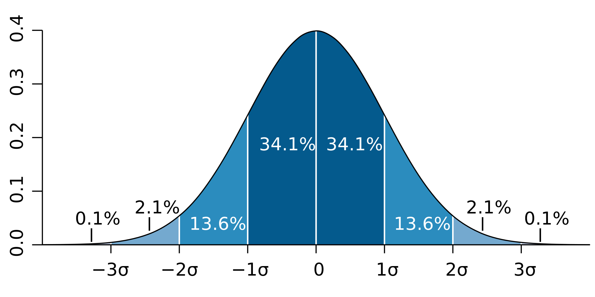
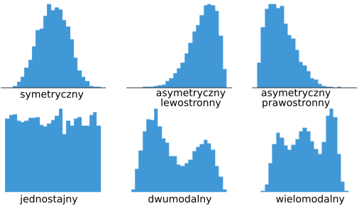
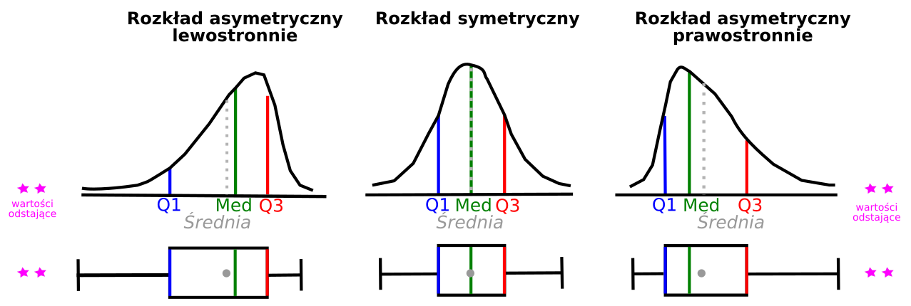
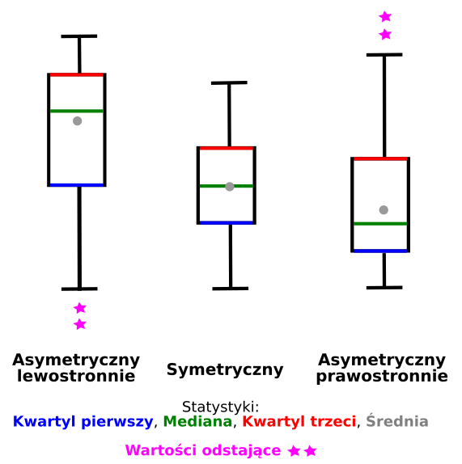



```{webr}
#| setup: true
#| exercise: 
#|  - ex_1
#|  - ex_2
#|  - ex_3
#|  - ex_4
#|  - ex_5
#|  - ex_6


library(gapminder)
library(tidyverse)
library(ggplot2)
library(e1071)

data('gapminder', package = 'gapminder')
```

# Rozkłady danych

## Podstawowe pojęcia

### Zmienne losowe

Zmienna losowa (ang. *random variables*) to wartość liczbowa, której wynik zależy od losu. Prawdopodobieństwo uzyskania danej wartości zależy od *gęstości prawdopodobieństwa* danej zmiennej $p(x)$ (lub $f(x)$).

-   Zmienne dyskretne

    -   Zmienne dyskretne przyjmują konkretną wartość liczbową (zliczenie)
    -   Przykładem zmiennych dyskretnych jest rzut monetą albo rzut kostką

-   Zmienne ciągłe

    -   zmienna ciągła może przyjmować wszystkie wartości z określonego przedziału liczbowego
    -   Przykładem zmiennych ciągłych jest wzrost, temperatura

## Rozkłady zmiennych losowych

Rozkłady zmiennych losowych można podzielić na:

-   rozkłady dyskretne
-   rozkłady ciągłe
-   ani dyskretne, ani ciągłe.

Rozkłady można także podzielić na **rozkłady teoretyczne** (tj. oparte o pewne założenia) oraz **rozkłady empiryczne** (tj. rozkład wartości oparty o obserwowane dane).

### Rozkłady dyskretne

-   Bernoulliego (zero-jedynkowy)
-   Dwumianowy
-   Poissona
-   Geometryczny
-   Hipergeometryczny

### Rozkłady ciągłe

-   Normalny
-   t-Studenta
-   Chi-kwadrat
-   Fishera

## Rozkłady danych w R

Dla każdego rozkładu danych dostępnego w R istnieją cztery funkcje, rozpoczynające się od kolejnych liter:

-   *d* - zwraca wartość funkcji gęstości rozkładu (pdf - probability density function)
-   *p* - zwraca wartości dystrybuanty
-   *q* - podaje jaki kwantyl znajduje się po lewej stronie wykresu gęstości
-   *r* - zwraca losowo wygenerowane wartości z danego rozkładu

```{r}
#| eval: false
?Distributions
```

wiecej informacji: <https://github.com/bearloga/tinydensR>

## Rozkład normalny

-   Zwany inaczej rozkładem Gaussa.
-   Opisywany jest za pomocą dwóch parametrów: średniej $\mu$ oraz wariancji $\sigma^2$ (odchylenie standardowe rozkładu jest określane przez $\sigma$).
-   Opisuje on sytuacje, gdy większość przypadków ma wartość zbliżoną do średniej, a im wartość jest dalsza od średniej tym jest ich coraz mniej.
-   Jeden z najważniejszych rozkładów prawdopodobieństwa, odgrywający ważną rolę w statystyce. Wykres funkcji prawdopodobieństwa tego rozkładu jest krzwą w kształcie dzwonu.
-   Znacenie tego rozkładu wynika z faktu, że często jest on obserwowany w naturze. Obserwacja wielu zjawisk przyrodniczych pozwoliła stwierdzić, że podlegają one prawu rozkładu normalnego lub bardzo zbliżonego do niego.

Rozkład normalny o średniej równej 0 a odchyleniu standardowym równym 1 nazywamy *standaryzowanym rozkładem normalnym* i oznaczamy N(0,1).

### Reguła trzech sigm

-   We wszystkich rozkładach normalnych funkcja gęstości jest symetryczna względem wartości średniej rozkładu.

-   Prawdopodobieństwo, że wartość zmiennej znajduje się w odległości nie większej (lub mniejszej):

    -   niż jedno odchylenie standardowe od średniej wynosi 68.3%;
    -   niż dwa odchylenia standardowe od średniejwynosi 95.5%;
    -   niż trzy odchylenia standardowe od średniej wynosi 99.7%.

{width="487"}

```{r}
rnorm(n = 10, mean = 0, sd = 1)
```

```{r}
hist(rnorm(n = 10000, mean = 0, sd = 1))
```

```{r}
#| fig_width: 400px

curve(dnorm(x, mean = 0, sd = 1), xlim = c(-5, 5))
abline(h = 0)
```

```{r}
## Probability of having a value *lower* than 90 in a normal distribution with a mean of 120 and sd of 20.
pnorm(q = 90, mean = 120, sd = 20, lower.tail = TRUE)
```

```{r}
#| fig_width: 400px
#| echo: false
curve(dnorm(x, mean = 120, sd = 20), xlim = c(0,200))
abline(h = 0)
sequence <- seq(0, 90, 0.1)
polygon(x = c(sequence,90,0),
        y = c(dnorm(c(sequence),120,20),0,0),
        col = "grey")
```

```{r}

## X-axis value *below* which the probability is 6%
qnorm(p = 0.0668072, mean = 120, sd = 20, lower.tail = TRUE)
```

```{r}
#| fig_width: 400px
#| echo: false
curve(dnorm(x, mean = 120, sd = 20), xlim = c(0, 200))
abline(h = 0)
sequence <- seq(0, 90, 0.1)
polygon(x = c(sequence,90,0),
        y = c(dnorm(c(sequence),120,20),0,0),
        col = "grey")

```

**Przykład**: Załóżmy, że wyniki z egzaminów wstępnych mają rozkład normalny, ze średnią 72 punktów oraz odchyleniem standardowym 15.2 Jaki procent studentów uzyska wynik 84 lub wyższy na egzaminie?

```{r}
pnorm(84, mean=72, sd=15.2, lower.tail=FALSE) 
```

Odpowiedź: Procent studentów z wynikiem 84 punkty lub większym wynosi 21,5%

### Test Shapiro-Wilka

-   służy do sprawdzenia czy analizowna zmienna ma rozkład zbliżony do rozkładu normalnego.
-   hipoteza zerowa testu: rozkład analizowanej zmiennej jest zbliżony do rozkładu normalnego.
-   istotny wynik testu Shapiro-Wilka ([***p-value \<0.05***]{.underline}) świadczy o tym, że rozkład zmiennej obserwowanej [**nie jest podobny**]{.underline} do rozkładu normalnego
-   w R obliczany za pomocą `shapiro.test()`
-   testowanie normalności rozkładu jest wymagane przy użyciu testów parametrycznych, np: testy t-Studenta, analiza wariancji, etc.
-   Alternatywą do testowania normalności rozkładu jest test Kołmogorowa-Smirnowa

```{r}
set.seed(123456)
x <- rnorm(1000, mean = 10, sd = 2)
```

```{r}
hist(x)
```

```{r}
shapiro.test(x)
```

Wartość p-value wynosi p-value = 0.7595 (jest większa od 0.05), zatem powyższy rozkład jest zbliżony rozkładu normalnego.

> Ze zbioru danych gapminder wyselekcjonować dane dla kontynentu Afryka. Wykonać histogram dla zmiennej lifeExp oraz test Shapiro-Wilka. Czy zmienna lifeExp dla kontynentu Afryka ma rozkład zbiżony do rozkładu normalnego?

```{webr}
#| exercise: ex_1

```

:::: {.solution exercise="ex_1"}
::: {.callout-tip title="Solution" collapse="false"}
Rozwiązanie:

Wynik testu (p-value < 0.05) wskazuje na odrzucenie hipotezy zerowej o zgodności z rozkładem normalnym. Dane nie mają rozkładu normalnego. 

``` r
library(dplyr)
afryka <- filter(gapminder, continent == 'Africa')
ggplot(afryka, aes(x = lifeExp)) + geom_histogram()
shapiro.test(afryka$lifeExp)
```
:::
::::

## Rozkład t-Studenta

-   Rozkład t-Studenta powstaje podczas pobierania próbek z populacji o rozkładzie normalnym, gdy wielkość próby jest mała, a odchylenie standardowe populacji jest nieznane.
-   Stosowany do estymacji średniej z populacji o rozkładzie normalnych w sytuacji, gdy wielkość próby jest niewielka a odchylenie standardowe populacji jest nieznane.
-   Rozkład ten zależy tylko od jednego parametru - liczby stopni swobody (parametrt $df$). Im więcej stopni swobody, tym rozkład bardziej zbliżony do rozkładu normalnego.
-   Rozkład t-Studenta jest symetryczny, dzwonowaty podobnie jak rozkład normalny, ale posiada więcej wartości dalej od średniej (tj. w pobliżu ogona)

```{r}
rt(10, df=1)
```

```{r}
#| fig_width: 400px
#| echo: false
# source: https://www.geeksforgeeks.org/understanding-the-t-distribution-in-r/
# Generate a vector of 100 values between -6 and 6 
x <- seq(-6, 6, length = 100) 
  
# Degrees of freedom 
df = c(1,4,10,30) 
colour = c("red", "orange", "green", "blue","black") 
  
# Plot a normal distribution 
plot(x, dnorm(x), type = "l", lty = 2, lwd = 2, xlab = "t-value", ylab = "Density",  
     main = "Porównanie rozkładów t-Studenta i normalnego", col = "black") 
  
# Add the t-distributions to the plot 
for (i in 1:4){ 
  lines(x, dt(x, df[i]), col = colour[i]) 
} 
  
# Add a legend 
legend("topright", c("df = 1", "df = 4", "df = 10", "df = 30", "normal"),  
       col = colour, title = "t-distributions", lty = c(1,1,1,1,2))
```

## Rozkłady empiryczne

Rozkład empiryczny - rozkład wartości oparty o obserwowane dane. Najczęściej jest przedstawiany za pomocą histogramu.

{width="458"}

```{r}
data("gapminder", package = "gapminder")
library(ggplot2)
```

### Histogram

-   **Rozkład oczekiwanej długości trwania życia**

```{r}
ggplot(data = gapminder, aes(x = lifeExp)) + geom_histogram(binwidth = 2) + theme_bw()
```

> Określ jaki rozkład ma oczekiwana długość trwania życia: symetryczny/asymetryczny lewostronnie/asymetryczny prawostronnie, jednomodalny/dwumodalny/wielomodalny?

-   **Rozkład produktu krajowego brutto (gdpPercap)**

```{r}
ggplot(data = gapminder, aes(x = gdpPercap)) + geom_histogram(binwidth=10000) + theme_bw()
```

> Określ jaki rozkład ma produkt krajowy brutto: symetryczny/asymetryczny lewostronnie/asymetryczny prawostronnie, jednomodalny/dwumodalny/wielomodalny?

> Wykonaj histogram dla zmiennej gdpPercap, ustaw szerokość przedziałów na 5000 (binwidth = 5000). Jaki rozkład ma zmienna gdpPercap?

```{webr}
#| exercise: ex_2

```

:::: {.solution exercise="ex_2"}
::: {.callout-tip title="Solution" collapse="false"}
Rozwiązanie:

Jest to rozkład asymetryczny, prawostronny. 
``` r
ggplot(data = gapminder, aes(x = gdpPercap)) + geom_histogram(binwidth=5000) + theme_bw()
```
:::
::::

> Wykonaj histogram dla zmiennej pop. Określ jaki rozkład ma zmienna pop: symetryczny/asymetryczny lewostronnie/asymetryczny prawostronnie, jednomodalny/dwumodalny/wielomodalny?

```{webr}
#| exercise: ex_3

```

:::: {.solution exercise="ex_3"}
::: {.callout-tip title="Solution" collapse="false"}
Rozwiązanie:

``` r
ggplot(data = gapminder, aes(x = pop)) + geom_histogram() + theme_bw()
```
:::
::::

-   **Rozkład oczekiwanej długości trwania życia (lifeExp) według kontynentów**

```{r}
ggplot(gapminder, aes(x = lifeExp)) + 
  geom_histogram() + 
  facet_wrap(~continent, ncol = 3) + 
  theme_bw()
```

> Określ jaki rozkład ma oczekiwana długość trwania życia na poszczególnych kontynentach: symetryczny/asymetryczny lewostronnie/asymetryczny prawostronnie, jednomodalny/dwumodalny/wielomodalny?

> Wykonaj histogram dla zmiennej gdpPercap w podziale na kontynenty oraz określ rozkład zmiennej gdpPercap dla każdego z kontynentów.

```{webr}
#| exercise: ex_4

```

:::: {.solution exercise="ex_4"}
::: {.callout-tip title="Solution" collapse="false"}
Rozwiązanie:

``` r
ggplot(data = gapminder, aes(x = gdpPercap)) +
  geom_histogram() +
  facet_wrap(~continent)
```
:::
::::

### Wykres pudełkowy

Wykres pudełkowy poza wizaulizacją statystyk opisowych pozwala także na określenie typu rozkładu danych (symetryczny, asymetryczny).

### Rozkład danych, a wykres pudełkowy.



-   **Rozkład symetryczny**

    -   mediana wypada na środku pudełka,
    -   wąsy równej długości po obu stronach pudełka

-   **Rozkład asymetryczny lewostronnie**

    -   mediana wypada bliżej górnej krawędzi pudełka,
    -   mediana \> średnia
    -   wąsy wychodzące z dolnej krawędzi pudełka są dłuższe.

-   **Rozkład asymetryczny prawostronnie**

    -   mediana wypada bliżej dolnej krawędzi pudełka,
    -   mediana \< średnia
    -   wąsy wychodzące z górnej krawędzi pudełka są dłuższe.

{width="353"}

**Wykres pudełkowy dla oczekiwanej długości trwania życia według kontynentów**

```{r}
ggplot(data = gapminder, aes(x = continent, y = lifeExp)) + 
  geom_boxplot() + 
  stat_summary(fun = mean, geom="point", shape=20, size=4) +
  labs(x = "Kontynent", 
       y = "Oczekiwana długość trwania życia", 
       title = "Zróżnicowanie oczekiwanej długości trwania życia na kontynentach") + 
  theme_bw() 
```

> Proszę wykonać wykres pudełkowy przedstawiający rozkład wartości gdpPercap według kontynentów. Jak określisz rozkłady danych na poszczególnych kontynentach?

```{webr}
#| exercise: ex_5

```

:::: {.solution exercise="ex_5"}
::: {.callout-tip title="Solution" collapse="false"}
Rozwiązanie:

``` r
ggplot(data = gapminder, aes(x = continent, y = gdpPercap)) +
  geom_boxplot()
```
:::
::::

## Miary asymetrii i koncentracji

### Miary asymetrii

Asymetrię rozkładu określa się za pomocą skośności.

-   skośność = 0 - rozkład symetryczny
-   skośność \< 0 - rozkład asymetryczny lewostronnie (rozkład ma dłuższy lewy ogon)
-   skośność \> 0 - rozkład asymetryczny prawostronnie (rozkład ma dłuższy prawy ogon)


```{r}
library(e1071)
skewness(gapminder$lifeExp)
```

### Miary koncentracji

Miary koncentracji opisują koncentrację wartości cechy wokół średniej. Jedną z miar koncentracji jest kurtoza.

-   K \> 0 - Im wyższa kurtoza, tym bardziej wysmukła jest krzywa liczebności,a zatem większa koncentracja wokół średniej
-   K \< 0 - rozkład bardziej spłaszczony niż rozkład normalny.


```{r}
library(e1071)
kurtosis(gapminder$lifeExp)
```

> Oblicz skośność oraz kurtozę dla zmiennej gdpPercap w zbiorze danych gapminder.

```{webr}
#| exercise: ex_6

```

:::: {.solution exercise="ex_6"}
::: {.callout-tip title="Solution" collapse="false"}
Rozwiązanie:

``` r
library(e1071)
skewness(gapminder$gdpPercap)
kurtosis(gapminder$gdpPercap)
```
:::
::::

## Porównanie rozkładów

W statystyce wykres kwantylowy (QQ-plot) jest wykresem prawdopodobieństwa, który porównuje (w graficzny sposób) 2 rozkłady prawdopodobieństwa przez wykreślenie ich kwantyli na przeciwnych osiach (x,y). Jeśli 2 porównywane rozkłady są podobne, punkty na wykresie kwantylowym ułożą się wzdłuż linii y=x Wykres normalności (Norm QQ Plot) porównuje rozkład próbki z rozkładem normalnym.

W R wykresy te można wykreślić używając funkcji `qqplot()` oraz `qqnorm()` z grafiki podstawowej. Wykonując wykres za pomocą pakietu `ggplot2` należy dodać geometrię `geom_qq`.

**Porównanie rozkładu zmiennej lifeExp dla kontynentu Afryka z rozkładem teoretycznym**.

```{r}
#wyselekcjonować dane dla kontynentu Afryka dotyczące średniej długości trwania życia
dane_Africa <- gapminder[gapminder$continent == 'Africa',]
```

```{r}
ggplot(data = dane_Africa, aes(sample = lifeExp)) + stat_qq()
```

## Dodatkowe materiały

-   Obliczanie prawdopodobieństwa z rozkładów

<https://gallery.shinyapps.io/dist_calc/>

-   Ilustracja wykresu kwantylowego

<https://xiongge.shinyapps.io/QQplots/>
