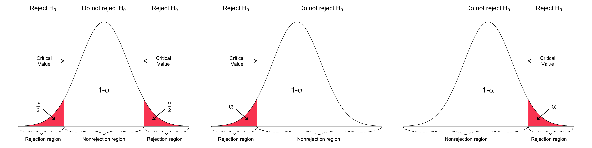

# Testowanie hipotez statystycznych

## Podstawowe pojęcia

-   **Testowanie hipotez** - sprawdzenie określonych założeń wysuniętych w stosunku do parametrów lub rozkładu populacji

-   **Hipotezy statystyczne** - sformułowane przypuszczenia dotyczące rozkładu populacji

    -   Hipotezy statystyczne mogą mieć różną postać. Stosowane są hipotezy **parametryczne** (precyzujące wartości parametrów populacji) i **nieparametryczne**

-   **Testy statystyczne** - określony schemat postępowania służący weryfikacji hipotez.

## Testowanie hipotez: (1) Formułowanie hipotez statystycznych

Chcemy sprawdzić, czy średnia populacji $\mu$ jest równa pewnej przyjętej wartości $\mu_0$.

-   sprawdzamy założenia testu

-   tworzymy hipotezę dwustronną:

    -   hipoteza zerowa: średnia populacji **jest równa** przyjętej wartości ($H_{0}: \mu = \mu_{0}$)
    -   hipoteza alternatywna: średnia populacji **nie jest równa** przyjętej wartości ($H_{0}: \mu \neq \mu_{0}$)

-   Ustalenie hipotezy statystycznej:

    -   Słownie: "Średnia populacji różni się od przyjętej średniej" (Obejmuje hipotezę alternatywną)
    -   Wyrażeniem: $H_0: \mu = \mu_0$ versus $H_A: \mu \neq \mu_0$

-   *Jako hipotezę zerową przyjmujemy tę której prawdziwość poddajemy w wątpliwość i którą chętniej jesteśmy skłonni odrzucić, jeśli tylko znajdziemy mocne uzasadnienie.*

-   *Ważniejsza jest dla nas hipoteza alternatywna, ponieważ celem większości analiz i badań jest odrzucenie hipotezy zerowej na korzyść przyjęcia alternatywnej.* Hipoteza alternatywna może być:

    -   dwustronna: $H_A: \mu \neq \mu_0$
    -   lewostronna: $H_A: \mu < \mu_0$
    -   prawostronna: $H_A: \mu > \mu_0$

## Testowanie hipotez: rozdzaje błędów

-   błąd I rodzaju - odrzucenie hipotezy zerowej, wtedy gdy jest ona prawdziwa
-   błąd II rodzaju - nie odrzucenie hipotezy fałszywej

## Testowanie hipotez: p-value

-   p-value - poziom istotności testu
-   Prawdopodobieństwo popełnienia błędu I rodzaju: wskazuje jak często popełnimy błąd, odrzucając daną hipotezę zerową, mimo, że jest ona prawdziwa (prawdopodobieństwo popełnienie tzw. błędu I rodzaju).
-   im mniejsza wartość poziomu istotności, tym mniejsza szansa, że $H_0$ jest prawdziwa
-   najczęściej przyjmowane wartości: 0.05, 0.01, 0.001. Np. poziom istotności 0,05 oznacza, że jesteśmy skłonni popełnić taki błąd 5 razy na 100 badań.

> Co oznacza poziom istotności 0,01, a co poziom istotności 0,001?

## Testowanie hipotez: określenie wyniku testu

-   Odrzucamy hipotezę zerową na korzyść hipotezy alternatywnej, gdy p-value jest mniejsze od przyjętego poziomu (tj. mniejsze od 0.05 lub 0.01 lub 0.001)

-   Nie udaje się nam odrzucić hipotezy zerowej (**Nigdy nie akceptujemy hipotezy zerowej!**)

-   Wynik statystycznie istotny oznacza, że różnica uzyskana w eksperymencie jest większa od tej, która może wynikać jedynie z przypadku

## Testowanie hipotez: obszar krytyczny

-   obszar znajdujący się zawsze na krańcach rozkładu.
-   Jeżeli obliczona przez nas wartość statystyki testowej znajdzie się w tym obszarze, to weryfikowaną przez nas hipotezę $H_0$ odrzucamy i przyjmujemy hipotezę alternatywną.
-   Wielkość obszaru krytycznego wyznacza dowolnie mały poziom istotności $\alpha$ , natomiast jego położenie określane jest przez hipotezę alternatywną.



Jeśli obliczona na podstawie próby wartość statystyki nie należy do obszaru krytycznego, to stwierdzamy, że **nie mamy podstaw do odrzucenia hipotezy zerowej**. **Nie odrzucenie hipotezy zerowej nie dowodzi jej prawdziwości**. Stąd wniosek, że hipoteza zerowa może, ale nie musi, być prawdziwa, a postępowanie nie dało żadnych dodatkowych informacji uprawniających do podjęcia decyzji o przyjęciu lub odrzuceniu hipotezy zerowej.

## Testowanie hipotez - alternatywnie

-   Hipoteza zerowa (obrońca)

-   Hipoteza alternatywna (oskarżyciel)

-   Odrzucenie hipotezy zerowej (winny)

-   Niemożność odrzucenia hipotezy zerowej (niewinny)

p-value (prawdopodobieństwo, że prawdziwie niewinny zbiór danych będzie wyglądał jak winny).


## Testowanie hipotez - przykład

Nieobciążona moneta powinna dawać 15 reszek w 30 rzutach. Rzucamy monetą 30 razy z czego 22 otrzymujemy reszkę. Czy to oznacza, że moneta jest obciążona? A może jest to przypadek?

-   Sformułowanie hipotez statystycznych

    -   $H_0:$ Moneta nie jest obciążona, ten wynik jest tylko przypadkiem
    -   $H_A:$ Moneta jest obciążona

```{r}
#| message: false
df = data.frame(reszka = rbinom(1000000, 30, 0.5))
library(ggplot2)
ggplot(df, aes(reszka, y = ..density..)) + 
  geom_histogram(binwidth = 1)
```

```{r}
ggplot(df, aes(reszka, y = ..density..)) + 
  geom_histogram(binwidth = 1) + 
  geom_vline(xintercept = 22, color = 'red')
```

```{r}
prob = pbinom(21, 30, 0.5, lower.tail = FALSE)
prob
```

Prawdopodobieństwo równe 0,8% (więc $p=0,008$), że moneta nie jest obciążona.

W efekcie odrzucamy $H_0$ i przyjmujemy $H_A$ ponieważ p (obliczone przez nas prob) jest mniejsze od przyjętego progu 0,05.

> Dane zawierają pomiary temperatur dla wybranego obszaru. Naszym zadaniem jest sprawdzenie, czy średnia temperatura będzie równa 8C, przy założeniu poziomu istotności 0,01. Sformułuj hipotezę zerową oraz hipotezy alternatywne (dwustronne, lewostronną i prawostronną). Co oznacza, poziom istotności 0,01?
