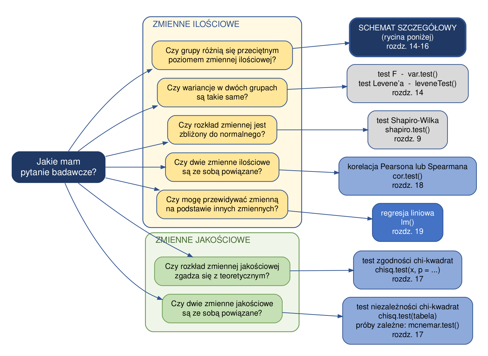
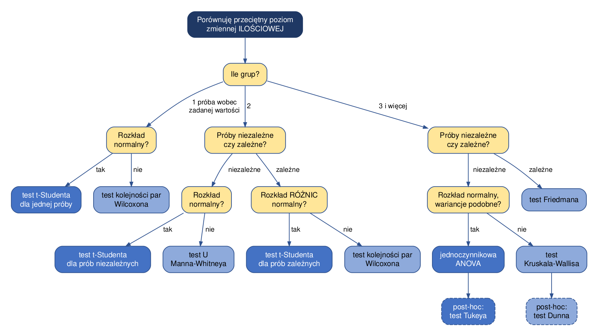

# Testy statystyczne

## Testy parametryczne vs nieparametryczne

Hipoteza jest to dowolna wypowiedź o rozkładzie zmiennej losowej:

-   **Hipoteza parametryczna** - dotyczy wartości parametru rozkładu (np. "średnia w populacji jest równa 8", "wariancje w obu grupach są równe"). Zakłada, że znamy postać rozkładu.

-   **Hipoteza nieparametryczna** - dotyczy samego rozkładu lub jego ogólnych własności, bez zakładania konkretnej postaci (np. "obie próby pochodzą z tego samego rozkładu", "rozkład jest symetryczny").

Do weryfikacji hipotez parametrycznych służą testy parametryczne, do nieparametrycznych - testy nieparametryczne.

+-----------------------------------------------------------------------------+--------------------------------------------------------------------------------------------------------+
| Testy parametryczne                                                         | Testy nieparametryczne                                                                                 |
+=============================================================================+========================================================================================================+
| większa liczba założeń do spełnienia:                                       | mniejsza liczba założeń do spełnienia:                                                                 |
|                                                                             |                                                                                                        |
| -   zmienne muszą być mierzone na skali ilościowej                          | -   mogą być stosowane do danych nieilościowych                                                        |
|                                                                             |                                                                                                        |
| -   zmienne mają rozkład normalny                                           | -   nie wymagają spełnienia założenia o normalności rozkładu                                           |
|                                                                             |                                                                                                        |
| -   równość wariancji                                                       |                                                                                                        |
+-----------------------------------------------------------------------------+--------------------------------------------------------------------------------------------------------+
| wymagają większej próby                                                     | stosowane dla prób o małej liczebności (do 100 obserwacji)                                             |
+-----------------------------------------------------------------------------+--------------------------------------------------------------------------------------------------------+
| większa moc testów                                                          | mniejsza moc testów                                                                                    |
+-----------------------------------------------------------------------------+--------------------------------------------------------------------------------------------------------+
| wykorzystują pełną informację liczbową z danych                             | wykorzystują tylko kolejność (rangi), część informacji jest tracona                                    |
+-----------------------------------------------------------------------------+--------------------------------------------------------------------------------------------------------+
| łatwiejsza interpretowalność uzyskanych wyników                             | trudniejsza interpretowalność uzyskiwanych wyników                                                     |
+-----------------------------------------------------------------------------+--------------------------------------------------------------------------------------------------------+
| testy t-Studenta, analiza wariancji, korelacja r-Pearsona, analiza regresji | test U Manna-Whitneya, test Kruskala-Wallisa, test niezależności chi-kwadrat, korelacja rang Spearmana |
+-----------------------------------------------------------------------------+--------------------------------------------------------------------------------------------------------+

## Jak wybrać odpowiedni test?

Wybór testu statystycznego wynika z trzech rzeczy: **jakie pytanie zadajemy**, **jakiego typu są zmienne** oraz **czy spełnione są założenia testu parametrycznego**. Poniższy schemat prowadzi od pytania badawczego do rodziny testów, a numery rozdziałów wskazują, gdzie każda metoda jest omówiona.



Pytania są pogrupowane według typu zmiennej, której dotyczą: żółte pola w górnej grupie odnoszą się do zmiennych **ilościowych** (mierzalnych, np. temperatura, suma opadów), zielone w dolnej - do zmiennych **jakościowych** (kategorii, np. prowincja, typ budynku). Pola szare po prawej oznaczają testy pomocnicze: nie odpowiadają one na pytanie badawcze, lecz sprawdzają założenia, od których zależy wybór testu właściwego.

## Próby niezależne i próby zależne

Zanim wybierzemy test porównujący grupy, musimy rozstrzygnąć, czy porównywane próby są **niezależne**, czy **zależne**. To rozróżnienie decyduje o wyborze testu, a pomyłka na tym etapie należy do najczęstszych błędów w analizie danych.

-   **Próby niezależne** - każda obserwacja należy do dokładnie jednej grupy, a wynik pomiaru w jednej grupie nie ma związku z wynikiem w drugiej. Grupy mogą mieć różną liczebność.

    Przykład: porównujemy średnią roczną temperaturę na Wyżynach Polskich i w Masywie Czeskim. To **inne stacje pomiarowe** - każda z nich należy do jednej tylko prowincji.

-   **Próby zależne** (inaczej *sparowane*) - obserwacje tworzą pary, ponieważ pochodzą od tego samego obiektu albo są ze sobą powiązane w naturalny sposób. Liczebności obu prób są wtedy z konieczności równe.

    Przykład: porównujemy maksymalną temperaturę kwietnia i września. Obie wartości pochodzą z **tej samej stacji pomiarowej** - tworzą parę.

**Jak to rozpoznać?** Zadaj sobie pytanie: czy potrafię wskazać, która obserwacja z pierwszej grupy odpowiada której obserwacji z drugiej? Jeśli tak - próby są zależne. Jeśli przyporządkowanie byłoby dowolne - próby są niezależne.

| Sytuacja | Rodzaj prób |
|----------|-------------|
| temperatura na stacjach dwóch różnych prowincji | niezależne |
| temperatura w kwietniu i we wrześniu na tych samych stacjach | zależne |
| oczekiwana długość życia w krajach Afryki i w krajach Azji | niezależne |
| oczekiwana długość życia w tych samych krajach w 1987 i w 2007 roku | zależne |
| tętno u 20 osób przed wysiłkiem i po wysiłku | zależne |
| ceny mieszkań w trzech dzielnicach Wrocławia | niezależne |

**Dlaczego to ma znaczenie?** Test dla prób zależnych analizuje **różnice wewnątrz par**, dzięki czemu usuwa z analizy zmienność między obiektami. Jeśli np. jedna stacja pomiarowa jest ogólnie cieplejsza od drugiej, to w teście sparowanym ta różnica nie zaburza wyniku - liczy się wyłącznie zmiana między kwietniem a wrześniem na każdej stacji z osobna. Dlatego test dla prób zależnych wykrywa różnice, których test dla prób niezależnych mógłby nie zauważyć. Zastosowanie testu dla prób niezależnych do danych sparowanych jest błędem - tracimy wtedy informację o powiązaniu obserwacji.

## Porównywanie grup - schemat szczegółowy

Najczęściej zadawane pytanie dotyczy tego, czy grupy różnią się przeciętnym poziomem pewnej zmiennej ilościowej. Odpowiadają na nie rozdziały *Testy parametryczne*, *Testy nieparametryczne* oraz *Testy dla wielu grup*, a wybór konkretnego testu zależy od trzech kolejnych pytań: ile grup porównujemy, czy próby są zależne, czy niezależne, oraz czy spełnione są założenia testu parametrycznego.



Kolory oznaczają: granatowy - punkt wyjścia, żółty - pytanie, ciemnoniebieski - test parametryczny, jasnoniebieski - test nieparametryczny. Pola obrysowane linią przerywaną to testy **post-hoc**, które wykonujemy dopiero wtedy, gdy test główny dał wynik istotny - wskazują one, **między którymi** grupami występują różnice.

## Zestawienie testów

| Sytuacja | Test | Funkcja R | Rozdział |
|----------|------|-----------|----------|
| **Sprawdzanie założeń** | | | |
| czy rozkład jest zbliżony do normalnego | test Shapiro-Wilka | `shapiro.test(x)` | 9 |
| czy wariancje w dwóch grupach są równe | test F | `var.test(y ~ grupa)` | 14 |
| czy wariancje w dwóch i więcej grupach są równe | test Levene'a | `leveneTest(y ~ grupa)` | 14 |
| **Jedna próba wobec zadanej wartości** | | | |
| rozkład zbliżony do normalnego | test t-Studenta dla jednej próby | `t.test(x, mu = ...)` | 14 |
| rozkład odbiega od normalnego | test kolejności par Wilcoxona | `wilcox.test(x, mu = ...)` | 15 |
| **Dwie grupy niezależne** | | | |
| rozkład w obu grupach zbliżony do normalnego | test t-Studenta dla prób niezależnych | `t.test(y ~ grupa)` | 14 |
| rozkład odbiega od normalnego | test U Manna-Whitneya | `wilcox.test(y ~ grupa)` | 15 |
| **Dwie grupy zależne (sparowane)** | | | |
| rozkład różnic zbliżony do normalnego | test t-Studenta dla prób zależnych | `t.test(x, y, paired = TRUE)` | 14 |
| rozkład różnic odbiega od normalnego | test kolejności par Wilcoxona | `wilcox.test(x, y, paired = TRUE)` | 15 |
| **Trzy grupy i więcej** | | | |
| niezależne, rozkład normalny, wariancje podobne | jednoczynnikowa ANOVA | `aov(y ~ grupa)` | 16 |
| test post-hoc do ANOVA | test Tukeya | `TukeyHSD(model)` | 16 |
| niezależne, założenia niespełnione | test Kruskala-Wallisa | `kruskal.test(y ~ grupa)` | 16 |
| test post-hoc do testu Kruskala-Wallisa | test Dunna | `dunn.test(y, grupa)` | 16 |
| pomiary powtarzane (te same obiekty, 3 i więcej pomiarów) | test Friedmana | `friedman.test()` | 16 |
| **Zmienne jakościowe** | | | |
| rozkład jednej zmiennej wobec teoretycznego | test zgodności chi-kwadrat | `chisq.test(x, p = ...)` | 17 |
| powiązanie dwóch zmiennych, próby niezależne | test niezależności chi-kwadrat | `chisq.test(tabela)` | 17 |
| powiązanie dwóch zmiennych, próby zależne | test McNemara | `mcnemar.test(tabela)` | 17 |
| liczebności oczekiwane mniejsze od 5 | dokładny test Fishera | `fisher.test(tabela)` | 17 |
| **Dwie zmienne ilościowe** | | | |
| zależność liniowa, rozkłady normalne | korelacja Pearsona | `cor.test(x, y)` | 18 |
| zależność monotoniczna, rozkłady skośne | korelacja Spearmana | `cor.test(x, y, method = "spearman")` | 18 |
| przewidywanie zmiennej na podstawie innych | regresja liniowa | `lm(y ~ x)` | 19 |

## Zadanie: dobierz test do sytuacji

Dla każdej z poniższych sytuacji wskaż: **(1)** jakiego typu są zmienne, **(2)** czy próby są zależne, czy niezależne, **(3)** jaki test należy zastosować i jaką funkcją R go wykonać. Korzystaj ze schematów i z tabeli powyżej.

> **1.** Chcemy sprawdzić, czy średnia roczna temperatura powietrza (*annual_tavg*) różni się między Wyżynami Polskimi a Masywem Czeskim. Dane pochodzą ze 179 stacji na Wyżynach i 81 stacji w Masywie Czeskim.

:::: {.callout-tip title="Odpowiedź" collapse="true"}
Zmienna *annual_tavg* jest **ilościowa**, porównujemy **dwie grupy**, a stacje w obu prowincjach to **różne obiekty** - próby są więc **niezależne**. Testem jest **test t-Studenta dla prób niezależnych**:

``` r
t.test(annual_tavg ~ prowincja, data = pomiary_pol2)
```

Uwaga: przy tak dużych próbach (179 i 81 obserwacji) test Shapiro-Wilka odrzuca hipotezę o normalności nawet przy niewielkich odstępstwach od niej. Test t-Studenta jest jednak na takie odstępstwa odporny, gdy próby są liczne - dlatego stosujemy właśnie jego. Przy małej próbie ten sam wynik testu normalności byłby sygnałem, żeby sięgnąć po test nieparametryczny.
::::

> **2.** U 20 osób zmierzono tętno przed krótkim wysiłkiem fizycznym i po nim (plik `tetno.csv`). Chcemy sprawdzić, czy wysiłek wpływa na tętno.

:::: {.callout-tip title="Odpowiedź" collapse="true"}
Tętno jest zmienną **ilościową**, porównujemy **dwa pomiary**, ale pochodzą one od **tych samych osób** - próby są **zależne (sparowane)**. Próba jest mała (20 osób), a rozkład różnic wyraźnie odbiega od normalnego, więc stosujemy test nieparametryczny: **test kolejności par Wilcoxona**:

``` r
wilcox.test(tetno$Tętno_1, tetno$Tętno_2, paired = TRUE)
```

Porównaj z sytuacją 1: tam próby były niezależne i liczne, tu są sparowane i nieliczne - oba czynniki prowadzą do innego testu.
::::

> **3.** Chcemy sprawdzić, czy ceny mieszkań różnią się między trzema dzielnicami Wrocławia (plik `daneMieszkania.csv`). Test Shapiro-Wilka wykonany osobno dla każdej dzielnicy nie daje podstaw do odrzucenia hipotezy o normalności.

:::: {.callout-tip title="Odpowiedź" collapse="true"}
Cena jest zmienną **ilościową**, porównujemy **trzy grupy**, a mieszkania w każdej dzielnicy to inne obiekty - próby są **niezależne**. Założenie normalności jest spełnione, więc stosujemy **jednoczynnikową analizę wariancji**, a po niej test post-hoc:

``` r
model <- aov(cena ~ dzielnica, data = mieszkania)
summary(model)
TukeyHSD(model)
```

Sama ANOVA powie tylko, że *któreś* dzielnice się różnią. Dopiero test Tukeya wskaże, **które** pary.
::::

> **4.** Chcemy sprawdzić, czy PKB na osobę (*gdpPercap*) różni się między kontynentami w 2007 roku. Rozkład tej zmiennej jest silnie prawoskośny.

:::: {.callout-tip title="Odpowiedź" collapse="true"}
Zmienna jest **ilościowa**, porównujemy **pięć grup**, kraje należą do jednego kontynentu - próby są **niezależne**. Rozkład jest jednak silnie skośny, więc założenia analizy wariancji nie są spełnione; stosujemy jej nieparametryczny odpowiednik - **test Kruskala-Wallisa** - a po nim **test Dunna**:

``` r
kruskal.test(gdpPercap ~ continent, data = gapminder2007)
dunn.test(gapminder2007$gdpPercap, gapminder2007$continent,
          kw = FALSE, method = "bonferroni")
```

Porównaj z sytuacją 3: układ danych jest taki sam (kilka niezależnych grup), a mimo to test jest inny - zdecydował o tym rozkład zmiennej.
::::

> **5.** Dane w pliku `plony.csv` zawierają klasę jakości gleby oraz klasę wielkości plonu dla 100 pól. Chcemy sprawdzić, czy wielkość plonu wiąże się z jakością gleby.

:::: {.callout-tip title="Odpowiedź" collapse="true"}
Obie zmienne są **jakościowe** (to klasy, a nie wartości liczbowe), a każde pole jest opisane jedną parą kategorii. Pytamy o powiązanie dwóch zmiennych jakościowych, więc stosujemy **test niezależności chi-kwadrat**:

``` r
tbl <- table(plony$jakosc_gleby, plony$plon)
chisq.test(tbl)
```

Pojęcie prób zależnych i niezależnych nie ma tu zastosowania w tej samej postaci, co przy porównywaniu średnich - istotne jest to, czy każda obserwacja trafia do tabeli tylko raz. Gdyby te same pola oceniano dwukrotnie (np. przed i po nawożeniu), właściwy byłby test McNemara.
::::

> **6.** Chcemy sprawdzić, czy minimalna i maksymalna temperatura powietrza we wrześniu (*tmin_9*, *tmax_9*) są ze sobą powiązane.

:::: {.callout-tip title="Odpowiedź" collapse="true"}
Obie zmienne są **ilościowe**, ale nie porównujemy tu grup - pytamy o **współwystępowanie dwóch zmiennych** mierzonych na tych samych stacjach. Stosujemy analizę korelacji:

``` r
plot(pomiary_pol$tmin_9, pomiary_pol$tmax_9)
cor.test(pomiary_pol$tmin_9, pomiary_pol$tmax_9)
```

O wyborze współczynnika decyduje wykres rozrzutu i rozkład zmiennych: przy zależności liniowej i rozkładach zbliżonych do normalnego - współczynnik Pearsona, przy rozkładach skośnych lub wartościach odstających - współczynnik Spearmana (`method = "spearman"`). Zwróć uwagę, że korelacja mówi o **współwystępowaniu**, a nie o tym, że jedna zmienna powoduje drugą.
::::

